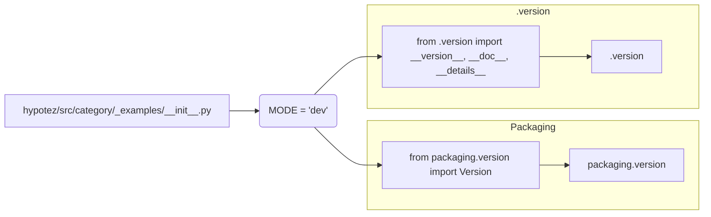

# Code Explanation for hypotez/src/category/_examples/__init__.py

## <input code>

```python
## \file hypotez/src/category/_examples/__init__.py
# -*- coding: utf-8 -*-
#! venv/Scripts/python.exe
#! venv/bin/python/python3.12

"""
.. module: src.category._examples 
	:platform: Windows, Unix
	:synopsis:

"""
MODE = 'dev'

"""
	:platform: Windows, Unix
	:synopsis:

"""


"""
	:platform: Windows, Unix
	:synopsis:

"""


"""
  :platform: Windows, Unix

"""
"""
  :platform: Windows, Unix
  :platform: Windows, Unix
  :synopsis:
"""MODE = 'dev'
  
""" module: src.category._examples """


""" @namespace src.category._examples """


""" """
...

from packaging.version import Version
from .version import __version__, __doc__, __details__
```

## <algorithm>

This file appears to be an initialization file for a module within a larger project (`hypotez`).  It sets up some constants, likely for controlling development mode, and imports necessary functions and variables from a `version.py` module.

There's no significant workflow beyond defining the constant `MODE` and importing the package information.

* **Step 1:** The code defines a constant `MODE` with the string value 'dev'.
* **Step 2:** Imports the `Version` class from the `packaging.version` module.
* **Step 3:** Imports `__version__`, `__doc__`, and `__details__` from a `.version` file (likely in the same directory).


## <mermaid>



**Dependency Analysis:**

* **`packaging.version`:**  This is an external library, likely used for managing and comparing software versions. It's not part of the project's source code.  This library is imported by the module.
* **`.version`:** This suggests a file named `version.py` (or similar) located in the same directory (`hypotez/src/category/_examples`) which likely contains the version details (`__version__`, `__doc__`, `__details__`). This file is imported in the initialization module.

## <explanation>

* **Imports:**
    * `from packaging.version import Version`: Imports the `Version` class from the `packaging` library, specifically the `version` module. This is essential for properly handling and comparing software version strings.

    * `from .version import __version__, __doc__, __details__`: Imports three names from a file named `version.py` (or similar) located in the same directory. These likely contain versioning information for the current module/package.
* **Classes:** No classes are defined in this file.
* **Functions:** No functions are defined in this file.
* **Variables:**
    * `MODE`: A string variable set to 'dev', likely used for configuration purposes in the project.  Its use in the project remains to be seen.
* **Potential Errors/Improvements:**
    * The `#!` lines (`#! venv/Scripts/python.exe`, `#! venv/bin/python/python3.12`) are likely interpreter directives, useful for running the file from a terminal, but are not actually part of Python's standard syntax and should not be included in a source code file unless there's a specific need for them (typically in very specific scripts that need to be run from a shell).

* **Relationships:** This `__init__.py` file acts as an entry point for the `_examples` submodule within the `category` module.  It likely imports components needed for the examples within that submodule. The `version.py` file, imported here, is likely part of a larger system for managing version information.

**Chain of Relationships:**

1. `hypotez/src/category/_examples/__init__.py` imports `packaging.version` and `._examples/version.py`.
2. `hypotez/src/category/_examples/version.py` likely contains the version information for the _examples module, perhaps related to tests or demos.
3. The `packaging` library manages version information handling.


**Overall:** The code sets up basic imports and a configuration variable for a python module. It's a typical initialization file for a Python module.