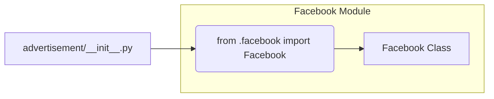

# Code Explanation for hypotez/src/endpoints/advertisement/__init__.py

## <input code>

```python
## \file hypotez/src/endpoints/advertisement/__init__.py
# -*- coding: utf-8 -*-\
#! venv/Scripts/python.exe
#! venv/bin/python/python3.12

"""
.. module: src.endpoints.advertisement 
	:platform: Windows, Unix
	:synopsis:

"""


from .facebook import Facebook
```

## <algorithm>

This file appears to be an initialization module for the `advertisement` endpoints.  It primarily serves as a point of entry for accessing sub-modules within the `advertisement` package.  The logic is straightforward and doesn't contain complex algorithm flow.

**Step-by-step Block Diagram:**

1. **Import:** The module imports the `Facebook` class from the `facebook.py` submodule within the `advertisement` package.

   * **Example:** `from .facebook import Facebook` imports the `Facebook` class.

2. **Initialization:** Defines a global variable `MODE` and sets it to `'dev'`.

   * **Example:** ``


## <mermaid>



**Dependency Analysis:**

*   `facebook.py`:  The `__init__.py` file depends on `facebook.py` to use the `Facebook` class.


## <explanation>

* **Imports:**
    * `from .facebook import Facebook`: This line imports the `Facebook` class from the `facebook.py` file located in the same directory. The `.` in front of `facebook` indicates that the file is in the immediate subdirectory of the `advertisement` package. This is a standard Python import practice for accessing related modules within a package.  The `facebook.py` file likely contains the implementation details for interacting with Facebook's advertising APIs.

* **Classes:**
    * `Facebook`: This class is imported but not defined within this file. Its implementation is handled in the `facebook.py` file. This likely represents a class used for interacting with the Facebook advertising platform. It likely has methods for tasks like creating campaigns, managing ads, or tracking performance.

* **Functions:**
    * There are no functions defined in this file. It's a simple import script.

* **Variables:**
    * `MODE`: A string variable holding the value `'dev'`.  This could be used for configuration purposes, potentially switching between development and production modes or other environments.  

* **Potential Errors/Improvements:**

    * **Missing Docstrings:** While the module docstring exists, specific docstrings for `MODE` would improve readability and understanding of its usage. This would describe the purpose of the `MODE` variable and explain why the `'dev'` value is selected in the initialization.
    * **Further initialization:** This `__init__.py` is minimal, and likely part of a larger project. It could benefit from importing and initializing other components of the advertising system, if any exist.


**Relationship to other parts of the project:**

The `advertisement` package likely interacts with other parts of the project for data fetching, storage, or other services.  The `facebook.py` file, in particular, would have dependencies on libraries like the Facebook API client. The `advertisement` package probably uses other components from the `hypotez` project for data modeling, or for managing user accounts and authentication.