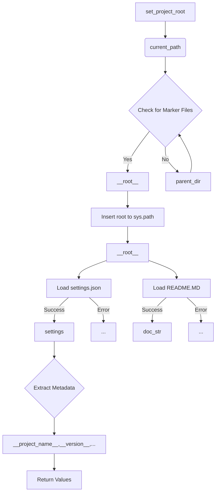

# Code Explanation for hypotez/src/endpoints/advertisement/facebook/header.py

## <input code>

```python
## \file hypotez/src/endpoints/advertisement/facebook/header.py
# -*- coding: utf-8 -*-\
#! venv/Scripts/python.exe
#! venv/bin/python/python3.12

"""
.. module: src.endpoints.advertisement.facebook 
	:platform: Windows, Unix
	:synopsis:

"""


import sys
import json
from packaging.version import Version

from pathlib import Path
def set_project_root(marker_files=('__root__')) -> Path:
    """
    Finds the root directory of the project starting from the current file's directory,
    searching upwards and stopping at the first directory containing any of the marker files.

    Args:
        marker_files (tuple): Filenames or directory names to identify the project root.
    
    Returns:
        Path: Path to the root directory if found, otherwise the directory where the script is located.
    """
    __root__:Path
    current_path:Path = Path(__file__).resolve().parent
    __root__ = current_path
    for parent in [current_path] + list(current_path.parents):
        if any((parent / marker).exists() for marker in marker_files):
            __root__ = parent
            break
    if __root__ not in sys.path:
        sys.path.insert(0, str(__root__))
    return __root__


# Get the root directory of the project
__root__ = set_project_root()
"""__root__ (Path): Path to the root directory of the project"""

from src import gs

settings:dict = None
try:
    with open(gs.path.root / 'src' /  'settings.json', 'r') as settings_file:
        settings = json.load(settings_file)
except (FileNotFoundError, json.JSONDecodeError):
    ...

doc_str:str = None
try:
    with open(gs.path.root / 'src' /  'README.MD', 'r') as settings_file:
        doc_str = settings_file.read()
except (FileNotFoundError, json.JSONDecodeError):
    ...


__project_name__ = settings.get("project_name", 'hypotez') if settings  else 'hypotez'
__version__: str = settings.get("version", '')  if settings  else ''
__doc__: str = doc_str if doc_str else ''
__details__: str = ''
__author__: str = settings.get("author", '')  if settings  else ''
__copyright__: str = settings.get("copyrihgnt", '')  if settings  else ''
__cofee__: str = settings.get("cofee", "Treat the developer to a cup of coffee for boosting enthusiasm in development: https://boosty.to/hypo69")  if settings  else "Treat the developer to a cup of coffee for boosting enthusiasm in development: https://boosty.to/hypo69"
```

## <algorithm>

**Step 1:** `set_project_root(marker_files)` function is called.

*   **Input:** A tuple of marker files (e.g., `('pyproject.toml', 'requirements.txt', '.git')`).
*   **Process:** It starts from the current file's directory and iterates upwards through its parent directories. For each parent, it checks if any of the specified marker files exist within that directory. If found, it updates `__root__` to that parent directory and breaks the loop. If no marker files are found, it returns the original `current_path`. If the root directory is not in sys.path it inserts the path.
*   **Output:** The `Path` object representing the project root directory.


**Step 2:** The project root is obtained using `__root__ = set_project_root()`.

*   **Input:** None (implicitly the current file path).
*   **Process:** Calls `set_project_root()` to get the project root.
*   **Output:** The `Path` object representing the project root.


**Step 3:** Loads settings and documentation.


*   **Input:** Path to `settings.json` and `README.MD` within the project root.
*   **Process:** Tries to open and load `settings.json` using `json.load()`. Handles `FileNotFoundError` and `json.JSONDecodeError`. If successful, assigns `settings` a dictionary containing project details.
    *   Similarly, it tries to load the content of `README.MD` in `doc_str`.
*   **Output:** `settings` dictionary (if loaded successfully), `doc_str` (if loaded successfully).


**Step 4:** Extracts project metadata.

*   **Input:** `settings` dictionary, `doc_str` string.
*   **Process:** Extracts project name, version, documentation, author, copyright, and coffee link.
*   **Output:** Values for `__project_name__`, `__version__`, `__doc__`, `__details__`, `__author__`, `__copyright__`, `__cofee__`.


## <mermaid>



**Dependencies Analysis:**

*   `sys`: Provides access to system-specific parameters and functions, including the `sys.path` list.
*   `json`: Used for handling JSON data (loading and potentially saving project settings).
*   `packaging.version`: Used for handling versioning information (though not directly used in this example, the import suggests handling versioning in the project).
*   `pathlib`: Used for working with file paths in an object-oriented way.
*   `src.gs`: This likely refers to a custom module or class within the `src` package that provides functionality related to getting the project root directory.


## <explanation>

**Imports:**

*   `sys`: Provides access to system parameters and functions, crucial for modifying the Python path.
*   `json`: Used to parse the `settings.json` file.
*   `packaging.version`: For robust version handling (not used directly here).
*   `pathlib`: For efficient and object-oriented file path manipulation.
*   `src import gs`: This import likely provides a `gs` module/class (possibly `GlobalSettings`) for accessing essential project information (root path).

**Classes:**

*   No classes are explicitly defined in this file.

**Functions:**

*   `set_project_root(marker_files)`: This function is crucial for finding the project root directory relative to the file where this function is called.  It searches upward from the current file's directory, checking for the presence of specified marker files (`pyproject.toml`, `requirements.txt`, `.git`). This is a robust approach to locate the project's base directory, regardless of the file structure.  It also handles the case where the root isn't already in `sys.path`. The function ensures that the root directory is accessible.

**Variables:**

*   `MODE`: A string variable, likely a configuration setting for the current mode (e.g., "dev", "prod").
*   `settings`: A dictionary containing project settings loaded from `settings.json`.
*   `doc_str`: A string containing the content of the project's `README.MD` file (if found).
*   `__root__`:  A `pathlib.Path` object containing the path to the project root.  Crucial for accessing other project files.
*   `__project_name__`, `__version__`, `__doc__`, `__details__`, `__author__`, `__copyright__`, `__cofee__`: These variables store project information, retrieved using `settings.get()`.  They are dynamically set from the `settings.json` if available or default to provided values.

**Potential Errors and Improvements:**

*   Error Handling: The `try...except` blocks for loading `settings.json` and `README.MD` are good.  However, consider logging the error for debugging purposes.


**Relationships:**

This file depends on `src.gs` (likely a utility or helper class/module) to get the project root path. It also relies on the existence of `settings.json` and `README.MD` within the project structure.  It loads and extracts data for variables needed for other modules or components within the project. In essence, this file provides essential metadata about the project. The file serves to initialize the project environment and make necessary components (e.g. various modules) available for use.


```