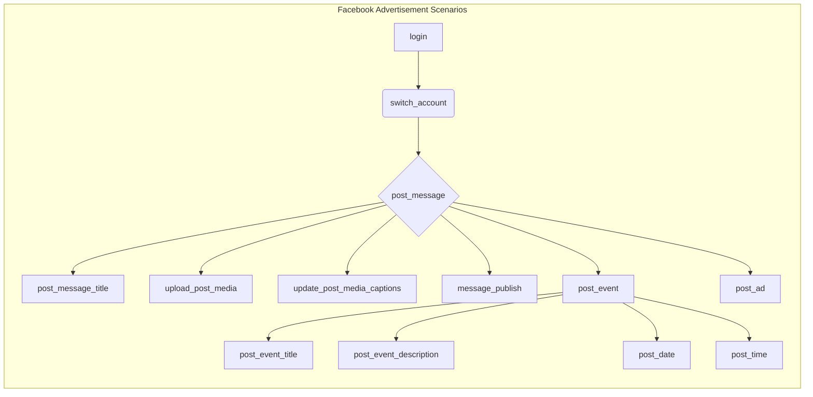

# Code Explanation for hypotez/src/endpoints/advertisement/facebook/scenarios/__init__.py

## <input code>

```python
# -*- coding: utf-8 -*-

#! venv/bin/python/python3.12

"""
.. module: src.endpoints.advertisement.facebook.scenarios 
	:platform: Windows, Unix
	:synopsis:

"""


from .login import login
from .post_message  import *
from .switch_account import switch_account
from .post_message import (post_title as post_message_title,   # <- заголовок
                           upload_media as upload_post_media, # <- изображения 
                           update_images_captions as update_post_media_captions, # <- подписи к изображениям 
                           publish as message_publish,
                           post_message,
                           )

from .post_event import (post_title as post_event_title,
                         post_description as post_event_description,
                         post_date,
                         post_time,
                         #send,
                         post_event
                         )

from .post_ad import post_ad
```

## <algorithm>

This file acts as an entry point for various Facebook advertisement-related functionalities. It imports necessary functions and classes from submodules.  There's no complex algorithm, rather a collection of functions for interacting with the Facebook API. The workflow is purely importing and making those functions accessible.


## <mermaid>



**Explanation of Dependencies:**

The mermaid diagram represents the relationship between the functions imported.  It implies a hierarchical structure where each module potentially depends on functionalities from other modules in the same directory.   However, without seeing the implementation details of the submodules, the dependencies remain implied rather than concrete.


## <explanation>

### Imports

- `from .login import login`: Imports the `login` function from the `login.py` module within the same directory. This module likely handles Facebook account login.
- `from .post_message import *`: Imports all functions from the `post_message.py` module. This implies various functions for posting messages.
- `from .switch_account import switch_account`: Imports the `switch_account` function. This function probably allows switching between different Facebook accounts.
- `from .post_message import ...`: Imports specific functions from the `post_message.py` module with aliases for better readability.
- `from .post_event import ...`: Imports functions for posting events.
- `from .post_ad import post_ad`: Imports the function for posting ads.


### Classes

There are no classes defined directly in this file. The functions imported are likely part of a class structure, or are standalone functions.   The lack of classes here suggests that the implementation of these functions is likely to be in other python files.

### Functions

- `login`: Likely takes authentication credentials as arguments (username, password, etc.) and returns a successful connection or an error message.
- `switch_account`: Takes account details (username, password, or other identifiers) and switches the active Facebook account.
- `post_message_title`, `upload_post_media`, etc.: All imported functions are for creating and posting different elements of an advertisement. The individual arguments and returns will likely be part of the actual `.py` files.


### Variables

- ``: A global variable likely used for setting the operational mode (development, testing, production, etc.).

### Potential Errors & Improvements

- **Missing error handling:**  The code doesn't show any explicit error handling within the imported functions, which could cause issues when interacting with the Facebook API (e.g., invalid credentials, network problems).
- **Unclear structure:** The imported functions are not grouped into classes, which could lead to better code organization and maintainability in larger projects.  A class structure could encompass more details of a particular advertisement.
- **Possible lack of documentation:**  While docstrings exist, more detailed documentation within the individual imported module is highly recommended, especially for the arguments and return values of imported functions.


### Relationships to Other Parts of the Project

The `endpoints` directory likely interacts with a business logic layer (e.g., to define how to create ads) or a data layer that stores advertisement campaign details.  The Facebook API calls themselves will represent a key dependency.  The `venv` structure implies a virtual environment, essential for managing project-specific dependencies and maintaining isolation from other projects.
```