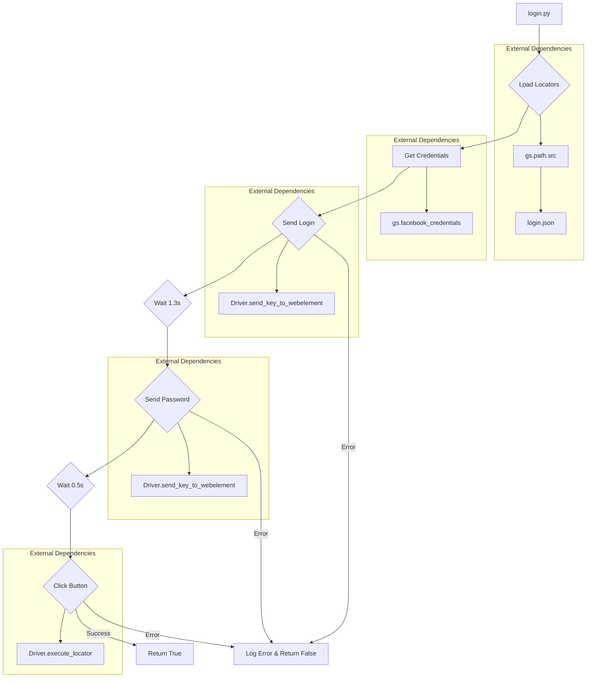

# <input code>

```python
## \file hypotez/src/endpoints/advertisement/facebook/scenarios/login.py
# -*- coding: utf-8 -*-\
#! venv/Scripts/python.exe
#! venv/bin/python/python3.12

"""
.. module: src.endpoints.advertisement.facebook.scenarios 
	:platform: Windows, Unix
	:synopsis: Facebook login scenario

"""


from pathlib import Path
from typing import Dict
from src import gs
from src.webdriver.driver import Driver
from src.utils.jjson import j_loads, j_loads_ns, j_dumps
from src.logger import logger

# Загрузка локаторов для авторизации Facebook
locators = j_loads_ns(
            Path(gs.path.src / 'endpoints' / 'advertisement' / 'facebook' / 'locators' / 'login.json'))
if not locators:
    logger.debug(f"Ошибка в файле локаторов")
    ...

def login(d: Driver) -> bool:
    """ Выполняет вход на Facebook.

    Функция использует переданный `Driver` для выполнения авторизации на Facebook, заполняя
    логин и пароль, а затем нажимает кнопку входа.

    Args:
        d (Driver): Экземпляр драйвера для взаимодействия с веб-элементами.

    Returns:
        bool: `True`, если авторизация прошла успешно, иначе `False`.

    Raises:
        Exception: Если возникает ошибка при вводе логина, пароля или нажатии кнопки.
    """
    credentials = gs.facebook_credentials[0]
    try:
        # Ввод логина
        d.send_key_to_webelement(locators.email, credentials.username)
    except Exception as ex:
        logger.error("Invalid login", ex)
        return False

    d.wait(1.3)
    try:
        # Ввод пароля
        d.send_key_to_webelement(locators['password'], credentials['password'])
    except Exception as ex:
        logger.error("Invalid login", ex)
        return False

    d.wait(0.5)
    try:
        # Нажатие кнопки входа
        d.execute_locator(locators['button'])
    except Exception as ex:
        logger.error("Invalid login", ex)
        return False

    return True
```

# <algorithm>

**Step 1: Load Locators**

- Load `login.json` file containing web element locators for Facebook login.
- Example: `login.json` contains `email`, `password`, and `button` keys mapping to selectors.
- If the file is not found or corrupted, a debug message is logged.

**Step 2: Login Function Execution**

- Takes a `Driver` object (`d`) as input. This object likely provides methods for interacting with the browser and web elements.
- Retrieves Facebook credentials from `gs.facebook_credentials`. Assumed to be a list containing dictionary or namedtuple.
- Uses a `try...except` block to handle potential exceptions during each step.
- Tries to send login credentials to the corresponding web elements (`locators.email`, `locators['password']`) using `d.send_key_to_webelement`.
- Waits for 1.3 seconds.
- Tries to click the login button (`locators['button']`) using `d.execute_locator`.
- Waits for 0.5 seconds.
- Returns `True` if all steps succeed; `False` otherwise.


# <mermaid>



**Dependencies Analysis:**

- `pathlib`: For working with file paths.
- `typing`: For type hinting.
- `src.gs`: Likely a module for global settings or constants, including `facebook_credentials` and `src.path`.
- `src.webdriver.driver`: A module providing a `Driver` class to interact with the web driver.
- `src.utils.jjson`: For handling JSON data (likely for loading and parsing `login.json`).
- `src.logger`: For logging errors and debug messages.

# <explanation>

**Imports:**

- `pathlib`: Used for handling file paths in a platform-independent manner, which is crucial for keeping the code portable.
- `typing`: Used to specify type hints for variables, parameters, and return values. This improves code readability and maintainability.
- `src`: Imports functions and objects from the "src" directory, which is a common practice for organizing Python modules.
- `src.gs`: Likely a global settings module, responsible for managing configurations, including facebook credentials.
- `src.webdriver.driver`: Contains a class (`Driver`) to manage browser interactions. It is related to the WebDriver library used for automating web browsers.
- `src.utils.jjson`: Contains functions for handling JSON data (loading, parsing, and potentially dumping).
- `src.logger`: Used for logging messages to the console, providing a way to track the execution flow and detect errors.  This is vital for debugging and monitoring.


**Classes:**

- No custom classes are defined in this file; it relies on the `Driver` class from `src.webdriver.driver`. This is a good practice, as it decouples this file from the specific web driver implementation.

**Functions:**

- `login(d: Driver) -> bool`: This function attempts to log in to Facebook using the provided `Driver` object.
    - Arguments: `d` (a `Driver` object), which is necessary to interact with the browser.
    - Return Value: `True` if the login is successful, `False` otherwise.
    - Handling Errors: It uses `try...except` blocks to catch potential exceptions (e.g., element not found, invalid credentials), logging the error and returning `False`. This is a good way to prevent the script from crashing.  Example Usage: Assuming a driver is initialized as `my_driver`, a call to `login(my_driver)` would attempt the login.

**Variables:**

- ``: A string defining the execution mode, which is a common approach for configuration settings.


**Potential Errors/Improvements:**

- **Error Handling:** The `try...except` blocks are good for error handling, but consider logging more specific information within the errors.
- **Explicit Error Types:**  Explicitly specify exception types caught in the `try...except` blocks (e.g., `NoSuchElementException`, `InvalidLoginException`) to refine error handling.
- **Input Validation:** Validate inputs (e.g., the existence of the `locators` dictionary, or the structure of `gs.facebook_credentials`).
- **Robust Logging:** Log more details about the login process (e.g., element IDs, whether the elements were found, the text entered, etc.) for enhanced debugging. This also applies to `gs.path.src`, verifying it exists and is a valid path.


**Relationships:**

- `login.py` depends on `gs.path.src` (likely a constant for the project's root folder).
- `login.py` depends on `login.json` and `facebook_credentials` (data from `src.gs`).
- `login.py` depends on the `Driver` class and related methods from `src.webdriver.driver`.


This file is part of a larger system, likely a web automation framework. The `login` function is a component in a workflow for automating tasks on Facebook, handling login actions specifically. The reliance on external libraries and data stores (`src.gs`, `login.json`) shows it's part of a larger system.