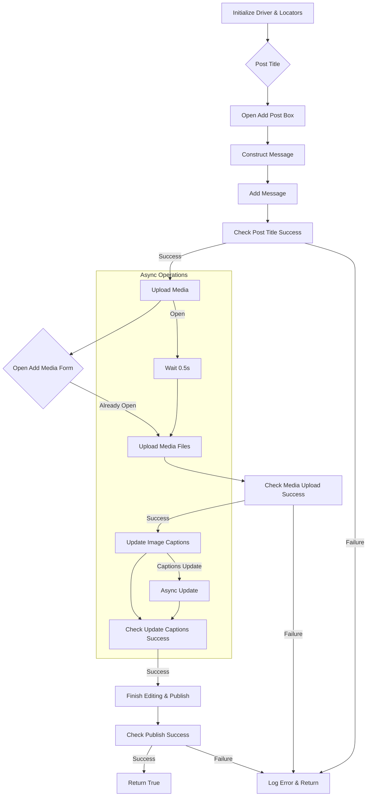
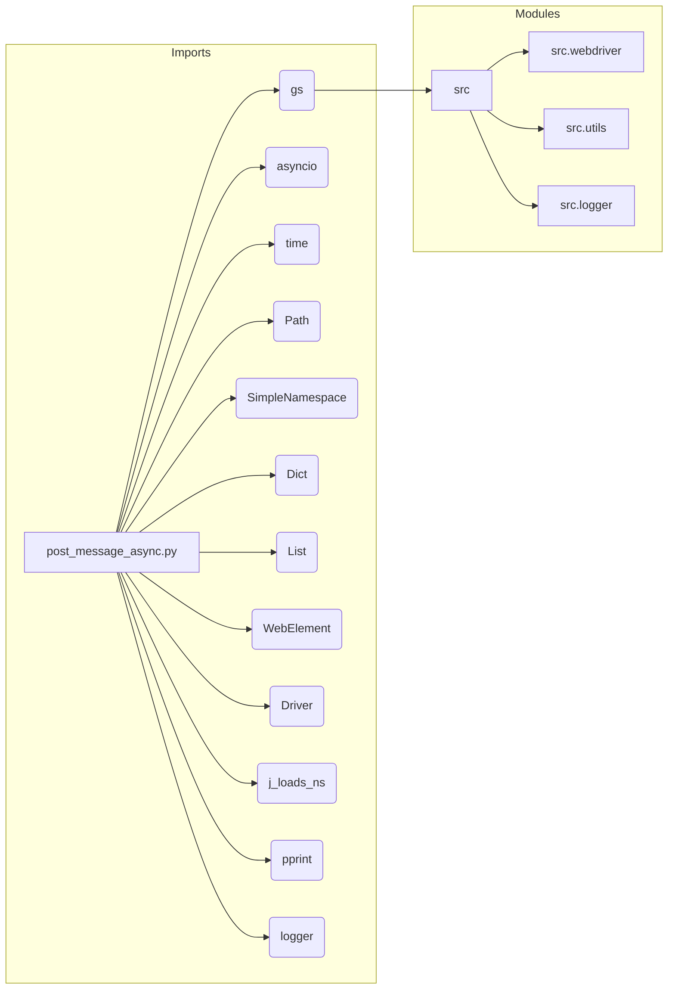

# Code Explanation: hypotez/src/endpoints/advertisement/facebook/scenarios/post_message_async.py

## <input code>

```python
## \file hypotez/src/endpoints/advertisement/facebook/scenarios/post_message_async.py
# -*- coding: utf-8 -*-\

#! venv/bin/python/python3.12

"""
.. module: src.endpoints.advertisement.facebook.scenarios 
	:platform: Windows, Unix
	:synopsis: Публикация сообщения из `aliexpress` промо

"""


import time
import asyncio
from pathlib import Path
from types import SimpleNamespace
from typing import Dict, List
from selenium.webdriver.remote.webelement import WebElement
from src import gs
from src.webdriver.driver import Driver
from src.utils.jjson import j_loads_ns, pprint
from src.logger import logger

# Load locators from JSON file.
locator: SimpleNamespace = j_loads_ns(
    Path(gs.path.src / 'endpoints' / 'advertisement' / 'facebook' / 'locators' / 'post_message.json')
)

def post_title(d: Driver, category: SimpleNamespace) -> bool:
    """ ... """
    # ... (function body)
    return True

async def upload_media(d: Driver, products: List[SimpleNamespace], no_video:bool = False) -> bool:
    """ ... """
    # ... (function body)
    return ret

async def update_images_captions(d: Driver, products: List[SimpleNamespace], textarea_list: List[WebElement]) -> None:
    """ ... """
    # ... (function body)
    # ... (async operations)

async def promote_post(d: Driver, category: SimpleNamespace, products: List[SimpleNamespace], no_video:bool = False) -> bool:
    """ ... """
    # ... (function body)
    return True
```

## <algorithm>



* **Examples:**
    * `A`:  `d = Driver(...)`, `locator = ...`
    * `B`: `category = SimpleNamespace(title="Title", description="Desc")`
    * `C`: interaction with the UI via Selenium `d.execute_locator(...)`
    * `D`: constructing a string for the message using the data from category variable.


## <mermaid>



**Dependencies Analysis:**

* `gs`: likely a module for accessing global configurations or settings. Its relationship with `src` suggests it's part of the `src` project's utilities.
* `asyncio`: allows for asynchronous operations, useful for handling potentially long-running tasks (like media uploads) without blocking the main thread.
* `time`: provides functions for working with time.
* `Path`: part of the `pathlib` module for working with file paths.
* `SimpleNamespace`: allows creating a namespace of attributes, useful for holding data for the post.
* `Dict`, `List`, `WebElement`: standard Python types, essential for data structures and interaction with the browser.
* `Driver`: custom class for interacting with the web driver. Located in `src.webdriver.driver`.
* `j_loads_ns`, `pprint`: likely for handling JSON data and output. Located in `src.utils.jjson`.
* `logger`: used for logging messages during the execution, potentially for debugging or tracking the process. Located in `src.logger`.

## <explanation>

* **Imports:**
    * `gs`: Provides access to global settings and paths.
    * `asyncio`: Enables asynchronous operations.
    * `time`: Useful for pausing execution.
    * `Path`: For working with file paths.
    * `SimpleNamespace`, `Dict`, `List`: Basic Python data structures.
    * `WebElement`: For interacting with elements on the webpage.
    * `Driver`: Custom class for handling web driver interactions. Part of the `src.webdriver` package.
    * `j_loads_ns`, `pprint`: Utilities for loading JSON and pretty printing. Part of the `src.utils` package.
    * `logger`: For logging information. Part of the `src.logger` package.
* **Classes:**
    * `Driver`: Likely a custom class for interacting with a web driver (Selenium).  Not directly defined in this file but imported from `src.webdriver.driver`.  Methods like `scroll`, `execute_locator` are expected to handle various web interactions.
* **Functions:**
    * `post_title`: Sends the title and description of a campaign to the Facebook post message box.
        * Args: `d`: `Driver` instance for interacting with the page; `category`: data for post title and description.
        * Returns: `True` if successful, `None` otherwise.
    * `upload_media`: Uploads media files (images/videos) to Facebook post and updates captions.
        * Args: `d`: `Driver` instance; `products`: list of `SimpleNamespace` objects with image/video paths and other details.
        * Returns: `True` if successful, `None` otherwise.
    * `update_images_captions`: Adds descriptions to uploaded media files asynchronously. Crucial for handling captions dynamically.
        * Args: `d`, `products`, `textarea_list`: Allows updates to the media captions using an async call.
    * `promote_post`: Main function to manage the entire post creation process.
* **Variables:**
    * `locator`: A `SimpleNamespace` containing locators (selectors) for various elements on the Facebook page, loaded from `post_message.json`.
    * `MODE`: A string variable set to 'dev'.  Likely a global setting, but its usage is not explicit.
* **Potential Errors/Improvements:**
    * **Error Handling:** While `logger` is used, more comprehensive error handling with try-except blocks could prevent the script from crashing on unexpected failures (e.g., file not found, incorrect selectors). Consider specific exceptions.
    * **Explicit Return Values:** `post_title` and `upload_media` return `None` on failure; it's better to explicitly return `False` or raise an exception to indicate failure.
    * **Robustness:** Handling cases where `execute_locator` returns an empty list, or multiple elements are found.
    * **Asynchronous Operations:**  The asynchronous operations are well-structured but could benefit from clearer error handling within the `asyncio` tasks.
    * **Data Validation:** Validating inputs (`products` list) to prevent unexpected behavior (e.g., ensuring `products` is a list).


**Relationship Chain:**

The script relies on data from JSON files (`post_message.json`, `translations.json`).
The `Driver` class communicates with the Facebook platform (website) using Selenium. The `src` package acts as a container for utility functions, `gs` provides configuration, and `logger` handles logging. `gs` is used for path access.

```
JSON files (locators, translations) -> post_message_async.py (parsing, processing) -> Driver (interaction with Facebook UI) -> Facebook UI
```
```
Config settings(gs) -> post_message_async.py (usage)
```
```
Other modules in src(logger, gs, utils) -> post_message_async.py (usage)