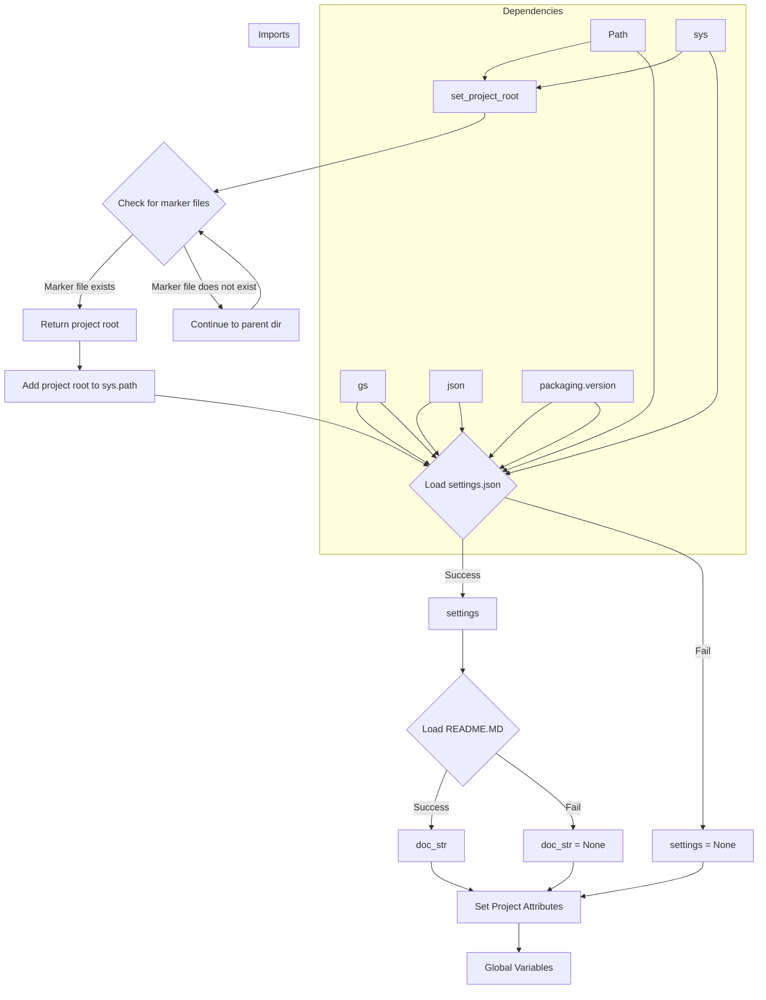

# Code Explanation for hypotez/src/endpoints/advertisement/header.py

## <input code>

```python
## \file hypotez/src/endpoints/advertisement/header.py
# -*- coding: utf-8 -*-\

#! venv/bin/python/python3.12

"""
.. module: src.endpoints.advertisement 
	:platform: Windows, Unix
	:synopsis:

"""


import sys
import json
from packaging.version import Version

from pathlib import Path
def set_project_root(marker_files=('__root__','.git')) -> Path:
    """
    Finds the root directory of the project starting from the current file's directory,
    searching upwards and stopping at the first directory containing any of the marker files.

    Args:
        marker_files (tuple): Filenames or directory names to identify the project root.
    
    Returns:
        Path: Path to the root directory if found, otherwise the directory where the script is located.
    """
    __root__:Path
    current_path:Path = Path(__file__).resolve().parent
    __root__ = current_path
    for parent in [current_path] + list(current_path.parents):
        if any((parent / marker).exists() for marker in marker_files):
            __root__ = parent
            break
    if __root__ not in sys.path:
        sys.path.insert(0, str(__root__))
    return __root__


# Get the root directory of the project
__root__ = set_project_root()
"""__root__ (Path): Path to the root directory of the project"""

from src import gs

settings:dict = None
try:
    with open(gs.path.root / 'src' /  'settings.json', 'r') as settings_file:
        settings = json.load(settings_file)
except (FileNotFoundError, json.JSONDecodeError):
    ...

doc_str:str = None
try:
    with open(gs.path.root / 'src' /  'README.MD', 'r') as settings_file:
        doc_str = settings_file.read()
except (FileNotFoundError, json.JSONDecodeError):
    ...


__project_name__ = settings.get("project_name", 'hypotez') if settings  else 'hypotez'
__version__: str = settings.get("version", '')  if settings  else ''
__doc__: str = doc_str if doc_str else ''
__details__: str = ''
__author__: str = settings.get("author", '')  if settings else ''
__copyright__: str = settings.get("copyrihgnt", '')  if settings else ''
__cofee__: str = settings.get("cofee", "Treat the developer to a cup of coffee for boosting enthusiasm in development: https://boosty.to/hypo69")  if settings else "Treat the developer to a cup of coffee for boosting enthusiasm in development: https://boosty.to/hypo69"
```

## <algorithm>

**Step 1:** `set_project_root()`

* **Input:** A tuple of marker files (e.g., `('pyproject.toml', 'requirements.txt', '.git')`).
* **Process:** Starting from the directory of the current file, it iterates upwards through parent directories.  For each parent directory, it checks if any of the marker files exist. If found, it returns the path to that parent directory. Otherwise, it continues the search.
* **Output:** A `Path` object representing the root directory of the project, and modifies `sys.path` to include it. 
* **Example:** If the current file is in `/home/user/project/src/endpoints/advertisement`, and `pyproject.toml` exists in `/home/user/project`, then `/home/user/project` is returned and added to `sys.path`.

**Step 2:**  Loading Settings from `settings.json`

* **Input:** Path to `settings.json` within the project root.
* **Process:** Reads the `settings.json` file.
* **Output:** A `dict` object representing the settings loaded from `settings.json`, or `None` if there's an error.
* **Example:** If `settings.json` has {"project_name": "MyProject", "version": "1.0.0"}, then `settings` will contain this data.

**Step 3:** Loading Documentation from `README.MD`

* **Input:** Path to `README.MD` within the project root.
* **Process:** Reads the `README.MD` file.
* **Output:** A `str` containing the content of `README.MD`, or `None` if there's an error.
* **Example:** If `README.MD` contains "This is the project description", `doc_str` will hold that string.


**Step 4:** Setting Project Attributes

* **Input:** `settings` dictionary, `doc_str` string.
* **Process:** Extracts various project attributes (project name, version, author, copyright, documentation, etc.) from the `settings` dictionary.  Uses default values if a key isn't present or if `settings` is `None`.
* **Output:** Assigns values to global variables (`__project_name__`, `__version__`, `__doc__`, etc.).
* **Example:** If `settings` has `"project_name":"MyProject"`, then `__project_name__` will be "MyProject".

## <mermaid>



**Dependencies Analysis:**

* **`sys`:** Provides access to system-specific parameters and functions, like `sys.path`.
* **`json`:** Used for loading and parsing the `settings.json` file.
* **`pathlib.Path`:** For working with file paths.
* **`packaging.version`:** Used for handling version strings, though not directly used in this specific instance.
* **`gs`:**  This is likely a custom module (import `from src import gs`). Its purpose is to provide the path to the project root (`gs.path.root`) which is crucial for relative file access.  Understanding `gs`'s role is critical to understand the overall project's structure.

## <explanation>

**Imports:**

* `sys`: Used to modify the system path, allowing the code to import modules from the project's root directory.
* `json`: Used to load JSON data from `settings.json`.
* `packaging.version`: Used for handling version strings, but not directly used in this specific code.
* `pathlib`: Used to work with file paths in a more object-oriented manner.  `Path` objects are used to construct file paths.
* `gs`: A custom module likely providing functions related to locating the project root directory and accessing resources within the project.


**Classes:**

* No classes are defined in this file.


**Functions:**

* `set_project_root(marker_files)`: This function is crucial for finding the project root directory. It takes a tuple of file/directory names (e.g., `pyproject.toml`, `requirements.txt`, or `.git`) as arguments. It starts from the current file's directory and recursively checks parent directories until one of the specified marker files exists.  It then adds the project root to `sys.path` so that modules within the project can be imported.  This function is critical because projects often have a structure with `pyproject.toml`, `requirements.txt` in the root. The function returns the `Path` object representing the root directory.

**Variables:**

* `MODE`: A string variable with the value 'dev'. Likely used for conditional logic or configuration.
* `__root__`: A `Path` object containing the project root directory. This is a key variable that allows for relative file paths within the project.
* `settings`: A dictionary variable storing the data from `settings.json` or `None` if the file cannot be read or parsed.
* `doc_str`: A string variable containing the content of `README.MD` or `None` if the file cannot be read.
* `__project_name__`, `__version__`, `__doc__`, `__details__`, `__author__`, `__copyright__`, `__cofee__`: String variables that store the project name, version, documentation, details, author, copyright, and coffee link.


**Potential Errors and Improvements:**

* **Error Handling:** The use of `try...except` blocks is good practice. However, consider adding more informative error messages within the `except` blocks.  For instance, `print(f"Error loading settings: {e}")` would provide more debugging information.
* **File Existence:**  The code currently assumes that `settings.json` and `README.MD` exist. If they are not found, empty values will be assigned to `settings` and `doc_str`, potentially leading to issues later on if these variables are used without checking for `None` values.
* **`gs` dependency:** The code relies on a `gs` module for determining the project root. This will fail if `gs` is not correctly imported or if it has different functionality than the developer expects. A more explicit error handling for the `gs` module would be useful.

**Relationship with other parts of the project:**

The file heavily relies on the `gs` module, presumably part of the `src` package, to obtain the path to the project root. This indicates a potential need for a consistent approach to accessing project resources across various parts of the project. The settings and documentation are likely consumed by other parts of the `endpoints/advertisement` package. The values stored are likely used in various aspects of the functionality exposed by the `endpoints/advertisement` module.