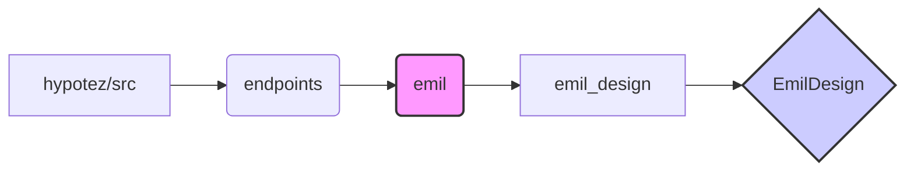

# Code Explanation for hypotez/src/endpoints/emil/__init__.py

## <input code>

```python
## \file hypotez/src/endpoints/emil/__init__.py
# -*- coding: utf-8 -*-\
#! venv/Scripts/python.exe
#! venv/bin/python/python3.12

"""
.. module: src.endpoints.emil 
	:platform: Windows, Unix
	:synopsis:

"""


from .emil_design import EmilDesign
```

## <algorithm>

This file appears to be an initialization file for a module named `emil` within the `endpoints` package.  It primarily imports a class, `EmilDesign`, from a submodule `emil_design`.  There is no algorithm or significant data flow within this `__init__.py` file itself, just the setup for importing other components.

```
[Start]
    -> Import EmilDesign class from emil_design module
    -> Set MODE variable to 'dev'
[End]
```

**Example:**

Assuming `emil_design.py` defines the `EmilDesign` class with necessary attributes and methods, this file would make them available for use in other parts of the project by importing them in this file.


## <mermaid>



**Dependency Analysis:**

* The diagram shows a clear hierarchical structure. `hypotez/src` is the top-level package.
* `endpoints` is a sub-package within `src`.
* `emil` is a sub-package within `endpoints`.
* `emil_design` is a module within the `emil` package.
* `EmilDesign` is a class defined within `emil_design`.


## <explanation>

* **Imports:** The only import is `from .emil_design import EmilDesign`.  This line imports the `EmilDesign` class from the `emil_design` module within the same directory. The `.` prefix in `.emil_design` indicates a relative import, meaning the module to import is in the same package as the current file.

* **Classes:** The `EmilDesign` class is declared in `emil_design.py`  and not defined within the current file (`__init__.py`).  The purpose of this class is unknown without the contents of `emil_design.py`.

* **Functions:** No functions are defined in this file; it's primarily concerned with import statements.

* **Variables:** ``:  This global variable likely controls operational mode (e.g., development, production).  This is a simple variable assignment.

* **Potential Errors/Improvements:**  While no explicit errors are apparent, a missing `__all__` variable within `__init__.py` might cause issues, as importing specific items without `__all__` could break future code additions, in this case you would have to add `__all__ = ['EmilDesign']` to the top of the `emil/__init__.py` file.

* **Relationships with Other Parts:** The `endpoints/emil` module is likely part of a larger project involving interaction with other components (potentially through other modules, views, and API calls), such as database interactions (if it is an application with database operations), and data exchange with other parts of the application, where `EmilDesign` could be an essential part of the workflow, making data accessible and performing certain tasks. The `emil_design` module would provide the necessary classes and functions to encapsulate the functionalities of the `EmilDesign` class.


```