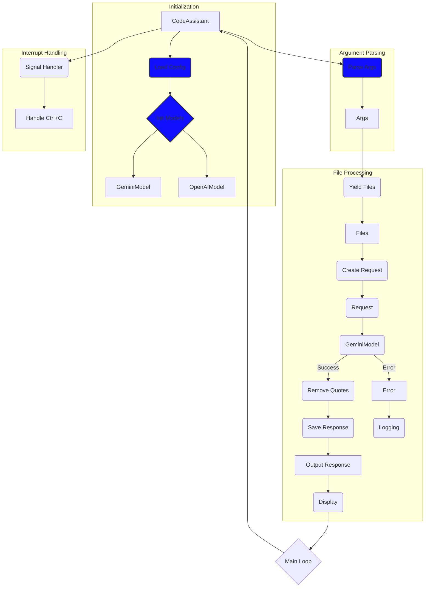

# Code Analysis of src.endpoints.hypo69.code_assistant.code_assistant.mmd

## <input code>

```%% module src.endpoints.hypo69.code_assistant.code_assistant
graph TD
    subgraph Инициализация
        A[CodeAssistant] --> B(Загрузка конфигурации)
        B --> C{Инициализация моделей}
        C --> D[GeminiModel]
        C --> E[OpenAIModel]
    end
    
    subgraph Разбор аргументов
        A --> F(parse_args)
        F --> G[Аргументы]
    end
    
    subgraph Обработка файлов
        G --> H(_yield_files_content)
        H --> I[Список файлов]
        I --> J(_create_request)
        J --> K(Запрос)
        K --> L(GeminiModel)
        L --> M(_remove_outer_quotes)
        M --> N(_save_response)
        N --> O[Сохранение ответа]
        O --> P(Вывод)
        
        subgraph alt [Ошибка]
            L --> Q[Ошибка ответа]
            Q --> R(Логирование)
        end
    end
    
    subgraph Обработка прерывания
        A --> S(_signal_handler)
        S --> T[Обработка Ctrl+C]
    end
    
    P --> U{Цикл обработки}
    U --> A
    
    style B fill:#11f,stroke:#333,stroke-width:2px
    style C fill:#11f,stroke:#333,stroke-width:2px
    style F fill:#11f,stroke:#333,stroke-width:2px
```

## <algorithm>

The code describes the workflow of a code assistant application, likely for processing files and generating responses.  The diagram illustrates a cyclical process with several key stages:

**1. Initialization:**
* CodeAssistant object is instantiated (A).
* Configuration is loaded (B).
* Models (GeminiModel and OpenAIModel) are initialized (C).

**2. Argument Parsing:**
* Arguments are parsed (F).
* Parsed arguments are stored as 'Arguments' (G).

**3. File Processing:**
* Content of files is yielded (H).
* A list of files is produced (I).
* Requests are created based on the file content (J).
* Requests are processed by GeminiModel (L).
* Error handling: If an error occurs in model processing, an error message is logged (Q, R).
* Response from the model is processed (_remove_outer_quotes), and saved (_save_response) (M, N).
* Response is output (O).

**4. Interrupt Handling:**
* Signal handler (_signal_handler) is triggered in response to interrupts (S).
* Interrupt processing logic is executed (T).

**5. Main Loop:**
* Cycle handling (U). The application enters a main loop.


## <mermaid>



Dependencies: The mermaid code itself does not import anything.  It's a tool for visualizing the code's structure.  Dependencies within the `src` package are implied by the function and class names (e.g., `GeminiModel`, `OpenAIModel`, `_yield_files_content`, `_save_response`) and would need to be determined from the actual Python code.


## <explanation>

**Imports:**  No imports are explicitly shown in the `mmd` code.  The implied imports would include modules for file processing, configuration loading, model interaction (Gemini and OpenAI libraries), and potentially signal handling (`signal`).  These would be from within the `src` package, implying a modular architecture.

**Classes:**
* `CodeAssistant`: This is the main application class, responsible for orchestrating the entire workflow.
* `GeminiModel`: likely a class for interacting with the Gemini AI model.
* `OpenAIModel`: Likely a class for interacting with the OpenAI model.
* The `alt` block in the graph defines a conditional branch (representing error handling) indicating a potential error during Gemini Model processing

**Functions:**
* `parse_args`: Parses command-line arguments.  Arguments are expected and are necessary for input parameters
* `_yield_files_content`: Yields content from files (likely part of the file processing stage).
* `_create_request`: Creates the request object to send to the AI model.
* `_remove_outer_quotes`: likely processes the raw response to remove any unwanted surrounding quotes.
* `_save_response`: Saves the response from the AI model.
* `_signal_handler`: Handles interrupt signals (e.g., Ctrl+C).

**Variables:**  No variables are explicitly named in this `mmd` format. Variable names would be located in the accompanying Python code.

**Potential Errors/Improvements:**

* **Error Handling:** The error handling (alt subgraph) is a good start, but more specifics about how errors are caught and how the application should respond (e.g., retry, logging specific error types) would improve robustness.
* **Input Validation:**  Validation of file types and contents would prevent unexpected behavior.
* **Performance:** The diagram doesn't specify performance bottlenecks.  Optimizations could be important if the file processing or model interaction is time-consuming.
* **Concurrency:** The diagram does not suggest any concurrency.  Using threads or asynchronous operations could speed up file processing if multiple files are handled in parallel.
* **Clearer Naming:** Using more descriptive names for functions (e.g., `process_file_content`) can improve readability and maintainability.


**Chain of Relationships:**  The relationship chain is established through the functions and classes called within the diagram. `CodeAssistant` calls `Load Config`, `Parse Args`, `Init Models`.  Each of these calls other functions, indicating a defined workflow.  A full understanding requires examining the corresponding Python code, and documentation within `src`.