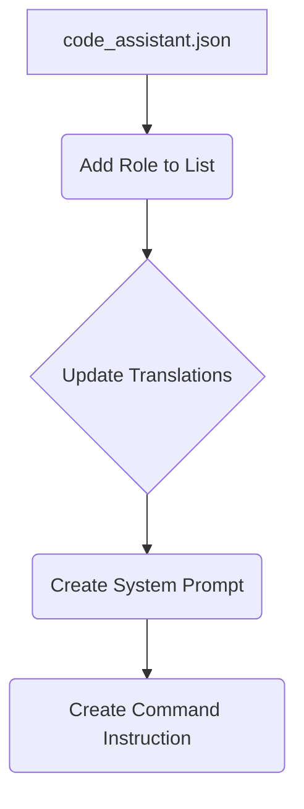

# Code Explanation for `create_role.mmd`

```%% порядок действий для создания новой роли
graph TD
    A[Файл `code_assistant.json`] --> B[Добавить роль в список ролей]
    B --> C[Добавить роль в файл переводов `translations/translations.json`]
    C --> D[Создать системный промпт в `ai/prompts/develpoper`]
    D --> E[Создать командную инструкцию в `instructions/...`]

    %% Настройка стилей блоков
    style A width: 300px
    style B width: 300px
    style C width: 300px
    style D width: 300px
    style E width: 300px
```

## <algorithm>

The provided code defines a workflow for creating a new role. It describes a sequence of steps using a graph-like structure. The steps are as follows:

1. **Start:** The process begins with a file named `code_assistant.json`.
2. **Add Role to List:** The role is added to a list of roles (likely within the `code_assistant.json` file).
3. **Update Translations:** The role is added to the translation file (`translations/translations.json`), allowing for localization and multilingual support.
4. **Create System Prompt:** A system prompt for the new role is generated and stored in the `ai/prompts/develpoper` directory. This prompt likely contains instructions for the AI model.
5. **Create Command Instruction:** A command instruction for the new role is created in the `instructions/...` directory. This likely defines how the user interacts with the role.
6. **End:** The process completes.

**Example Data Flow:**

If a new role "Developer" is being created:

* `code_assistant.json` contains a list of roles.  The new role is appended.
* `translations/translations.json` is updated with translations for the "Developer" role.
* A prompt file `ai/prompts/develpoper/developer_prompt.json` would contain instructions for the AI model regarding the developer role.
* `instructions/...` might contain a file like `instructions/developer_commands.txt` detailing commands for this role.

## <mermaid>



**Dependencies and Explanation:**

No explicit dependencies are declared. The code relies on the existence of files and directories (`code_assistant.json`, `translations/translations.json`, `ai/prompts/develpoper`, `instructions/...`) which imply an underlying project structure. This structure likely defines the paths where these files reside, ensuring the steps outlined in the `mmd` file can be executed correctly.

## <explanation>

**Imports:**

There are no imports in the provided code. This is a diagram, not executable code.

**Classes:**

There are no classes defined. The code describes a workflow without any object-oriented structure.

**Functions:**

The code doesn't define any functions.  It's a workflow diagram.

**Variables:**

No variables are defined.

**Potential Errors/Improvements:**

1. **Missing Error Handling:** The diagram doesn't specify how errors should be handled if any of the steps fail.  Adding error handling to the steps is critical to ensure robustness.
2. **Missing Input Validation:** The diagram doesn't outline validation of the input data (e.g., if `code_assistant.json` exists and if the role name is valid).
3. **Lack of Detail:** The diagram provides a high-level overview. A more detailed description would include specific data formats and the expected output of each step.


**Relationship with other parts of the project:**

The project likely has a structure for storing prompts (`ai/prompts`) and instructions (`instructions`).  The `code_assistant.json` file is likely part of a configuration system for the application, where roles are defined and used to control behavior. The `translations/translations.json` file implies that the application needs to be able to translate strings or messages based on the user's locale.  There's a strong dependency between a role and how it is represented in configuration, translations, prompts, and instructions.


In summary, this `mmd` file (which appears to be a markdown-based diagram language) provides a clear visual representation of the process for creating new roles within the application.  It needs to be integrated with the code in `code_assistant.json`, `translations/translations.json`, `ai/prompts`, and `instructions` to function properly.