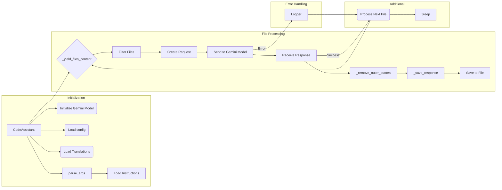

# Code Explanation for `hypotez/src/endpoints/hypo69/code_assistant/code_assistant.py`

## <input code>

```python
# ... (rest of the code)
```

## <algorithm>

The code implements a system for processing code files, interacting with an AI model (likely Gemini), and saving the results.

**Step 1: Initialization:**
* The `CodeAssistant` class is initialized with parameters like role, language, models, and starting directories.
* AI models (Gemini and potentially OpenAI) are initialized based on the specified `model` list.
* Translations from `translations.json` are loaded.
* Configuration is loaded from `code_assistant.json`.

**Step 2: Argument Parsing:**
* `parse_args()` parses command-line arguments for flexibility in running the assistant.

**Step 3: Instruction Loading:**
* `system_instruction` and `code_instruction` load instructions from files (e.g. `developer/code_checker_ru.md`) relevant to the role and language.  These instructions provide context for the AI model.

**Step 4: File Processing Loop:**
* `process_files()` iterates through files in the specified `start_dirs`.
* Each file is filtered based on `include_files` and `exclude_files` patterns from `code_assistant.json`.
* Files are skipped based on the current `start_file_number`.

**Step 5: Request Creation:**
* `_create_request()` constructs a structured request for the AI model, including the file content, role, language, and instructions.

**Step 6: Model Interaction:**
* `gemini_model.ask()` sends the request to the AI model.
* The response is captured.

**Step 7: Response Processing & Saving:**
* `_remove_outer_quotes()` cleans up the response (e.g. removing enclosing code blocks).
* `_save_response()` saves the processed response to a file in the appropriate directory structure ("docs/gemini"). The path is dynamically constructed to use information from the role, language, and `model_name`.

**Step 8: Error Handling:**
* Error handling using `try...except` blocks is crucial to prevent crashes during file reading, model interaction, and saving.
* Errors are logged using the `logger` module.
* Skipping files with errors is a good strategy.
* The system waits for 20 seconds before processing the next file – this should be configurable/tuned.


## <mermaid>



**Dependencies:**

* `asyncio`, `argparse`, `sys`: Standard Python libraries for asynchronous operations, command-line arguments, and system access.
* `pathlib`: For working with file paths.
* `typing`, `List`, `Optional`: For type hinting, enabling better code readability and maintainability.
* `types`, `SimpleNamespace`: For handling structured data.
* `signal`, `time`, `re`, `fnmatch`: For handling signals, time management, regular expressions, and filename matching.
* `header`, `gs`, `jjson`, `GoogleGenerativeAI`, `OpenAIModel`, `printer`, `path`, `logger`: Likely custom modules within the project. The relationships depend on the structure of `src`.


## <explanation>

### Imports

*   `asyncio`:  Used for asynchronous operations, which is important for potentially long-running tasks like interactions with AI models to prevent blocking the main thread.
*   `argparse`:  Facilitates command-line argument parsing for configuration, making it easier to run the script with different parameters.
*   `sys`:  Used for interacting with the Python interpreter system, and for exiting the application in the event of fatal errors.
*   `pathlib`:  Provides a more object-oriented approach to working with paths, improving code readability and safety.
*   `typing`:  Facilitates type hinting for better code maintainability and clarity.
*   `types`, `SimpleNamespace`: Allow handling structured data like configuration parameters and translations.
*   `signal`: For handling interruptions (like Ctrl+C) gracefully.
*   `time`: For time-related operations, likely used in conjunction with `asyncio`.
*   `re`, `fnmatch`: For matching files and directories based on patterns, enabling filtering and excluding certain files or directories.
*   `header`: This import likely provides functions or classes related to adding or checking file headers.
*   `gs`:  Likely a custom module related to getting paths to various resources within the project (e.g., configuration files, data files).
*   `jjson`, `j_loads`, `j_loads_ns`:  Likely custom functions to load JSON data.
*   `GoogleGenerativeAI`, `OpenAIModel`: Used for interacting with Gemini and potentially other AI models (e.g. OpenAI).
*   `pprint`, `get_relative_path`:  Likely custom helper functions for printing formatted output and getting the relative path for filenames.
*   `logger`: For logging and handling events for debugging, error detection, and program tracing.


### Classes

*   `CodeAssistant`: This is the main class responsible for managing the interaction with AI models and file processing.
    *   `role`, `lang`, `start_dirs`, `base_path`, `config`, `gemini_model`, `openai_model`: Attributes storing relevant configuration data. `start_file_number`: An attribute to resume from a previous interrupted run if needed.
    *   `__init__()`: Initializes the `CodeAssistant` object.
    *   `_initialize_models()`: Initializes the AI models (Gemini and OpenAI).
    *   `parse_args()`: Parses command-line arguments.
    *   `system_instruction`, `code_instruction`, `translations`: These properties retrieve instruction data and translation data from files. These are likely crucial for providing context to the AI model.
    *   `process_files()`: Implements the logic for processing files, calling the `_yield_files_content()` function, generating requests for AI models, saving responses, and error handling. This is the core method of the class.
    *   `_create_request()`: Generates the request object to be passed to the AI model.
    *   `_yield_files_content()`: Iterates over files and yields file paths and contents.
    *   `_save_response()`: Saves the response from the AI model to a file based on the configuration and role.
    *   `_remove_outer_quotes()`: Pre-processes the response from the AI model.
    *   `run()`: Starts the process, including file processing and signal handling.
    *   `_signal_handler()`: Handles interruptions (Ctrl+C).


### Potential Errors/Improvements

*   **Error Handling:** While error handling is present, it could be enhanced by providing more specific error messages and logging details to pinpoint issues more easily.
*   **Concurrency:** Consider using `asyncio` more extensively to parallelize file processing for increased performance.
*   **Configuration:** The configuration loading could benefit from more robust error handling and validation to catch issues with the structure or content of `code_assistant.json`.
*   **Robustness:** Error handling for invalid file paths or file content in the `_yield_files_content` function.
*   **Timeout Handling:** The code includes a sleep function; consider adding proper timeout handling for responses from the AI model, to prevent indefinitely blocking the process.


**Relationship with Other Parts of the Project:**

The code depends on the `src` package (likely containing the AI models, helper functions, and other essential components of the project).  `gs` is likely a module providing global paths, potentially a module that handles storing and retrieving paths to various project resources (`credentials`, `path`). The use of `jjson` imports indicates there are other data processing related libraries in the `src` package.


This detailed analysis provides a comprehensive understanding of the code's functionality and highlights potential areas for improvement. Remember that `...` within the code often indicates placeholders for functions/code sections not directly shown in this snippet.