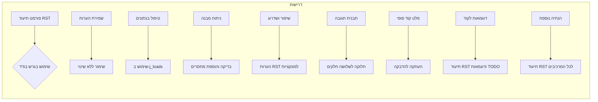

# <input code>

```
### דרישות עיקריות:

1. **פורמט תיעוד**:
   - השתמשו בפורמט **reStructuredText (RST)** לכל ההערות וה-Docstrings.
   - תמיד השתמשו בגרש בודד (`'`) בקוד Python במקום גרש כפול (`"`).

2. **שמירת הערות**:
   - כל ההערות הקיימות אחרי `#` חייבות להישמר ללא שינוי.
   - בלוקים של קוד שדורשים שינוי צריכים להיות מתועדים שורה אחר שורה עם סימן `#`.

3. **טיפול בנתונים**:
   - השתמשו ב-`j_loads` או `j_loads_ns` מתוך `src.utils.jjson` במקום `json.load` הסטנדרטי לקריאת קבצים.
   - השאירו כל `...` בקוד ללא שינוי כנקודות עצירה.

4. **ניתוח מבנה**:
   - בדקו והוסיפו מחסרים (imports) חסרים לקוד.
   - יישרו שמות פונקציות, משתנים ומחסרים בהתאם לקבצים שכבר טופלו.

5. **שיפור ושדרוג**:
   - הוסיפו הערות RST לכל הפונקציות, השיטות והמחלקות.
   - השתמשו ב-`from src.logger import logger` עבור תיעוד שגיאות.
   - הימנעו משימוש יתר בבלוקים של `try-except`, והעדיפו טיפול בשגיאות עם `logger.error`.

6. **תבנית תגובה**:
   - התגובה צריכה לכלול שלושה חלקים:
     - **Received Code** — הקוד המקורי ללא שינויים.
     - **Improved Code** — הקוד לאחר הוספת הערות ותיקונים.
     - **Changes Made** — רשימה מפורטת של כל השינויים שבוצעו.
   - אין להתחיל את התגובה עם `` ``` ``. יש להשתמש בסימון זה רק להקפת בלוקים של קוד.

7. **פלט קוד סופי**:
   - בסיום התגובה, יש לכלול את הקוד המלא (המקורי עם השיפורים) בתוך בלוק בודד, כך שניתן להעתיק ולהדביק אותו במקום הקוד המקורי.
   - כל חלק בקוד ששונה חייב להיות מתועד שורה אחר שורה עם סימן `#`.

8. **דוגמאות לקוד**:
   - יש לכלול דוגמאות לתיעוד בפורמט RST ולהצעות לשיפור בפורמט `TODO`.

9. **הנחיה נוספת**:
   - כל ההערות למודולים, פונקציות, שיטות ומשתנים צריכות להיכתב מחדש בפורמט **reStructuredText (RST)**. זה כולל:
     - תיאור המודול בתחילת הקובץ.
     - תיעוד עבור כל שיטה, פונקציה ומשתנה.
     - עמידה בסטנדרטים של תיעוד Python (למשל, עבור Sphinx).
     - דוגמה לפורמט תיעוד עבור פונקציות:

```python
def example_function(param1: str, param2: int) -> str:
    """
    מבצע משימה לדוגמה.

    :param param1: תיאור של פרמטר 1.
    :param param2: תיאור של פרמטר 2.
    :return: תיאור הערך המוחזר.
    """
    ...
```


---

### שפת פלט: HE (עברית)
**סיום הדרישות**
```

# <algorithm>

אין קוד להפעלה.  הקובץ מכיל רק דרישות.  אין פעולות אלגוריתמיות לתיאור.


# <mermaid>



# <explanation>

**Imports**: אין Imports בקטע הקוד. הקטע מכיל רק דרישות, לא קוד בפועל.

**Classes**: אין מחלקות בקטע הקוד.

**Functions**: אין פונקציות בקטע הקוד.

**Variables**: אין משתנים בקטע הקוד.

**Potential Errors/Improvements**:

- הקוד הוא לא קוד בפועל, אלא רק דרישות לפיתוח קוד.
- אין קוד לניתוח שגיאות או שיפורים.


**Relationship with other parts of the project**:  הדרישות מתייחסות לקוד Python שצריך לפתח, ולכן יש תלות בין הקטע הזה לקובצי Python אחרים בתוך `src`.  מכיוון שלא קיים קוד בפועל, אין  כאן  הצגת תלות ספציפית.