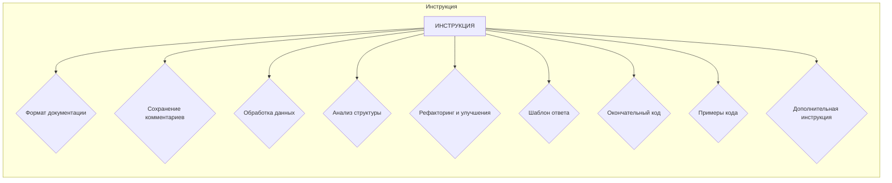

# Анализ предоставленного кода

**<input code>**:

```python
# ИНСТРУКЦИЯ  
## Основные требования:  
## Output Language: RU (Русский)  

# ... (остальные части инструкции)
```

**<algorithm>**:

```
Нет алгоритма в предоставленном коде.  Это инструкция по стилю кодирования, а не конкретный фрагмент кода.
```

**<mermaid>**:



**Описание зависимостей:**

Диаграмма `mermaid` иллюстрирует структуру инструкции, описывающей правила и рекомендации по стилю кодирования.  Не существует импортируемых модулей, а значит нет зависимостей между пакетами.

**<explanation>**:

Данный код представляет собой инструкцию по написанию и стилизации кода на Python.  В нём нет конкретного кода, подлежащего анализу.

**1. Импорты**: В инструкции нет импортов, так как это не код, а набор инструкций.  В дальнейшем коде, на который эти инструкции будут применены, импорты будут присутствовать.

**2. Классы**: В инструкции упоминаются классы, но в предоставленном коде нет ни одного класса.  Описание классов и их использования, а также взаимодействие с другими частями проекта, будет определено в коде, который будет написан или изменён в соответствии с этой инструкцией.

**3. Функции**:  Инструкция описывает, какие функции нужно использовать и как их документировать.  Функционал этих функций, аргументы, возвращаемые значения, примеры — все это будет частью кода, который нужно будет изменить или написать.

**4. Переменные**:  Инструкция содержит рекомендации по использованию переменных, но сама не определяет ни одной переменной.  Конкретное использование переменных определяется в коде.

**5. Потенциальные ошибки/улучшения**:  Инструкция предоставляет рекомендации по улучшению кода, такие как обработка ошибок, использование `j_loads`, избегание избыточных `try-except` блоков, добавление документации RST, и т.д.  Эти улучшения относятся к конкретному коду, а не к самой инструкции.


**Связь с другими частями проекта**:

Инструкция по стилю кодирования применяется к конкретным файлам или модулям проекта.  Связь с другими частями проекта (например, с модулем `src.utils.jjson`) будет определяться в коде, к которому инструкция будет применена.  Связь будет проявляться в импортах и вызовах функций, классов из других модулей проекта.


**Выводы**:

Предоставленный фрагмент кода не является функциональным кодом, а представляет собой инструкцию по стилизации кода.  Анализ кода (импортов, классов, функций, переменных и т.д.) можно провести только после получения самого кода, к которому применимы эти инструкции.