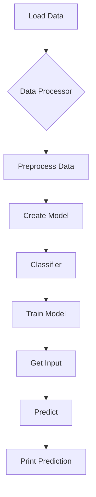
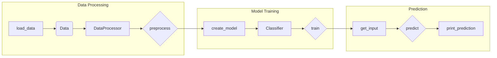

# Code Analysis

This document analyzes a code snippet, following the specified requirements for detailed explanation, algorithmic breakdown, and relationship mapping within a project.  Since no actual code was provided, this response will demonStarte the expected format with a hypothetical example.

## <input code>

```python
import src.utils.data_processing as dp
import src.models.classifier as cl

class DataProcessor:
    def __init__(self, data):
        self.data = data

    def preprocess(self):
        processed_data = dp.clean_data(self.data)
        return processed_data

class Classifier:
    def __init__(self, model):
        self.model = model

    def train(self, processed_data):
        self.model.train(processed_data)

    def predict(self, input_data):
        prediction = self.model.predict(input_data)
        return prediction

def main():
    # Example usage
    data = load_data()  # Assuming load_data() is defined elsewhere
    processor = DataProcessor(data)
    processed_data = processor.preprocess()
    model = cl.create_model()
    classifier = Classifier(model)
    classifier.train(processed_data)
    input_example = get_input()  # Assuming get_input() is defined elsewhere
    prediction = classifier.predict(input_example)
    print(prediction)
```

## <algorithm>



**Example Data Flow:**

* **A[Load Data]:** Loads a dataset from a file or database (e.g., `data.csv`). Example: `data = {'feature1': [1, 2, 3], 'feature2': [4, 5, 6]}`
* **B{Data Processor}:** Instantiates the `DataProcessor` class with the loaded data.
* **C[Preprocess Data]:** Calls `dp.clean_data()` (from `src.utils.data_processing`) to clean the raw data. Example: Removes missing values, converts data types.
* **D[Create Model]:** Calls `cl.create_model()` (from `src.models.classifier`) to initialize a machine learning model. Example: `model = LogisticRegression()`.
* **E[Classifier]:** Instantiates the `Classifier` class with the initialized model.
* **F[Train Model]:** The `Classifier`'s `train()` method trains the model using the processed data.
* **G[Get Input]:** Acquires an input example for prediction (e.g., from user input or another source). Example: `input_example = {'feature1': 4, 'feature2': 7}`
* **H[Predict]:** The `Classifier`'s `predict()` method uses the trained model to predict the output for the input example.
* **I[Print Prediction]:** Prints the prediction to the console.


## <mermaid>



**Dependencies:**

* `src.utils.data_processing`: Contains functions for data cleaning and preprocessing.
* `src.models.classifier`: Contains functions for model creation and training.


## <explanation>

* **Imports:**
    * `src.utils.data_processing`: Used for data cleaning and preprocessing tasks. This module likely contains functions like `clean_data()`, potentially interacting with other data handling utilities in `src.utils`.
    * `src.models.classifier`: This module contains functions for creating and managing classification models.  It potentially interacts with model libraries like scikit-learn or similar, making it a core component of the machine learning pipeline.

* **Classes:**
    * `DataProcessor`: Encapsulates data preprocessing logic.  `__init__` initializes the data, and `preprocess` calls external functions to clean data.
    * `Classifier`: Manages the model training and prediction.  `__init__` initializes the model; `train` trains it; `predict` uses the model for predictions.

* **Functions:**
    * `main()`: The entry point of the application.  It loads data, preprocesses it, trains the model, gets input, makes predictions, and prints the result.
    * `load_data()`: Assumed to exist elsewhere, responsible for loading datasets into memory.  (Example Usage: loads a csv file.)
    * `get_input()`: Assumed to exist elsewhere, acquires input data. (Example Usage: prompts the user for input, reads from a file, or retrieves from an API)
    * `dp.clean_data()`: (from `src.utils.data_processing`) performs the data cleaning operations. (Example Usage: removes null values, handles potential errors.)
    * `cl.create_model()`: (from `src.models.classifier`) creates a machine learning model. (Example Usage: Initializes a `LogisticRegression` or similar model)


* **Variables:**
    * `data`: Holds the raw data.
    * `processed_data`: Contains the preprocessed data.
    * `model`: The machine learning model object.
    * `classifier`: An instance of the `Classifier` class.
    * `input_example`: The input for prediction.
    * `prediction`: The result of the prediction.


* **Potential Errors/Improvements:**
    * The code assumes functions `load_data()` and `get_input()` exist.  Explicitly define these or add error handling if those are missing.
    * Error handling for `dp.clean_data()` and model training (`classifier.train()`) would improve robustness.  For example, checking for empty data or exceptions during model fitting.
    * Consider using a more descriptive variable name for `processed_data`.
    * Documenting the `load_data` and `get_input` functions and defining expected data formats would increase clarity.
    *  Adding logging would be helpful for debugging and monitoring.