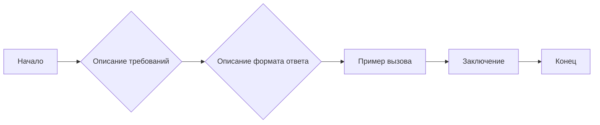

# Анализ кода

## <input code>

```
**Резюме для промпта:**

### Основные требования:
1. **Анализ кода**:
   - Предоставьте исходный код без изменений.
   - Опишите алгоритм работы кода в виде пошаговой блок-схемы, показывая перемещение данных между функциями или классами.
   - Объясните работу кода, включая импорты, классы, функции, переменные и их связи с другими частями проекта.
   - Укажите потенциальные ошибки или улучшения, если они есть.

2. **Формат ответа**:
   - **<input code>**: Исходный код без изменений.
   - **<algorithm>**: Пошаговое описание алгоритма работы кода с примерами.
   - **<explanation>**: Детальное объяснение кода, включая:
     - Импорты: их назначение и связи с другими модулями.
     - Классы: их назначение, атрибуты и методы, связи с другими компонентами.
     - Функции: описание назначения, аргументов и возвращаемых значений.
     - Переменные: описание типов и использования.
     - Связь с другими частями проекта и потенциальные ошибки или улучшения.

### Пример вызова:
Представлен код, который анализируется и объясняется в соответствии с инструкциями.

---

Этот промпт предназначен для детального анализа предоставленного кода с пояснением всех его аспектов, включая логику, структуру и потенциальные улучшения.
```

## <algorithm>

Этот код представляет собой описание требований к функции анализа кода.  Сам код не содержит реализацию, а лишь описывает функциональность и формат ответа.  Поэтому блок-схема будет простой, отображающей этапы работы:

```
[Начало] --> [Описание требований] --> [Описание формата ответа] --> [Пример вызова] --> [Заключение] --> [Конец]
```

**Пример данных:**

* **Описание требований:** "Анализ кода должен включать в себя блок-схему".
* **Описание формата ответа:** "Ответ должен быть в формате Markdown".
* **Пример вызова:**  "Код для анализа: `print('Hello')`".
* **Заключение:** "Промпт успешно сформулирован".


## <mermaid>



**Описание зависимостей:**

Код не содержит импортов, зависимостей, и не описывает конкретную функциональность. Он описывает *требования* к анализу кода.  Поэтому  зависимости анализируются только на уровне требований к программе,  которая будет этим кодом пользоваться.


## <explanation>

* **Импорты:**  Нет импортов.  Код не является исполняемым, это просто описание структуры работы для инструмента (например, промпта для чат-бота или для IDE).


* **Классы:** Нет классов. Код представляет собой текстовое описание задачи.


* **Функции:** Нет функций.


* **Переменные:** Нет переменных.


* **Связь с другими частями проекта:**  Нет прямой связи с другими частями.  Этот код описывает  структуру для  анализа  другого кода, но сам не является частью этого кода.


* **Потенциальные ошибки или улучшения:** Нет ошибок, так как код  — это не реализация, а спецификация.  В спецификации можно улучшить  ясность и точность требований к анализу, например, добавить более подробные примеры.


**Вывод:**

Данный текст — это  формализованное описание задачи анализа кода.  Он не является исполняемым кодом,  а представляет собой шаблон или требования к программному обеспечению, которое будет этим кодом пользоваться.