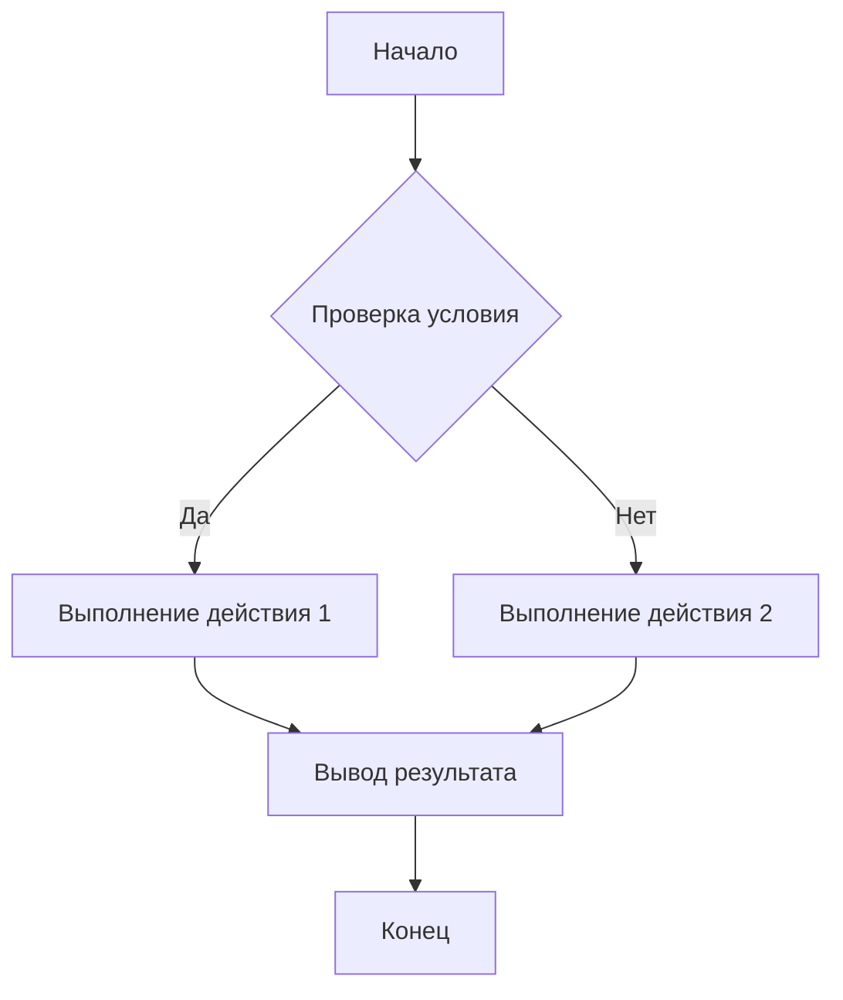

# Анализ кода

## <input code>

```python
# (Вставьте сюда код для анализа)
```

## <algorithm>

(Здесь должна быть блок-схема алгоритма в формате блок-схемы.  Пример ниже - это шаблон и требует замены на реальный код):



**Описание шагов:**

1. **Начало:** Процесс начинается.
2. **Проверка условия:** Проверяется некоторое условие (например, `x > 5`).
3. **Выполнение действия 1:** Если условие истинно, выполняется действие 1. Пример: `print("Число больше 5")`.
4. **Выполнение действия 2:** Если условие ложно, выполняется действие 2. Пример: `print("Число меньше или равно 5")`.
5. **Вывод результата:** Результат (текстовое сообщение) выводится на экран.
6. **Конец:** Процесс завершается.

**Пример данных:**

* Если `x = 10`, то условие в `B` истинно, и выполняется `C`, затем `E`.
* Если `x = 3`, то условие в `B` ложно, и выполняется `D`, затем `E`.

**Поток данных:**

Данные `x` поступают в блок `B` для проверки условия. Результат проверки определяет, какое действие (`C` или `D`) выполняется. Результаты действий выводятся на экран в блоке `E`.


## <mermaid>

```mermaid
(Здесь должна быть диаграмма в формате mermaid.  Пример ниже - это шаблон и требует замены на реальный код)
```

**Объяснение зависимостей:**

(Здесь нужно описать импортируемые модули и их роль в проекте.  Например, если импортируется `math`, то нужно написать, что он используется для математических операций.)


## <explanation>

**Импорты:**

(Здесь нужно описать импортируемые модули и их использование.  Например, `import os` для работы с файловой системой.)

**Классы:**

(Здесь нужно описать классы, их атрибуты, методы и взаимосвязи с другими частями проекта.)

**Функции:**

(Здесь нужно описать функции, их аргументы, возвращаемые значения, назначение и примеры использования.)

**Переменные:**

(Здесь нужно описать переменные, их типы и назначение.)

**Возможные ошибки и улучшения:**

(Здесь нужно указать возможные ошибки в коде и предложить улучшения.  Например, неэффективный алгоритм, недостаточно ясные имена переменных.)


**Взаимосвязи с другими частями проекта:**

(Здесь нужно описать, как данный код взаимодействует с другими модулями/компонентами проекта.  Например, какие данные получает этот модуль от других модулей или какие данные он передает в другие модули.)


**Примечание:**  Чтобы получить более подробный анализ, пожалуйста, предоставьте код для анализа.  Без кода невозможно предоставить содержательный ответ.