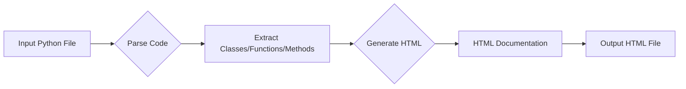

# Code Explanation

## <input code>

```html
<!-- INSTRUCTION -->

<p>Для каждого входного Python-файла создайте документацию в формате <code>HTML</code> для последующего использования. Документация должна соответствовать следующим требованиям:</p>

<ol>
  <li>
    <strong>Формат документации</strong>:
    <ul>
      <li>Используйте стандарт <code>HTML</code>.</li>
      <li>Каждый файл должен начинаться с заголовка и краткого описания его содержимого.</li>
      <li>Для всех классов и функций используйте следующий формат комментариев:</li>
        <pre><code>python
def function(param: str, param1: Optional[str | dict | str] = None) -> dict | None:
    """
    Args:
        param (str): Описание параметра `param`.
        param1 (Optional[str | dict | str], optional): Описание параметра `param1`. По умолчанию значение равно `None`.

    Returns:
        dict | None: Описание возвращаемого значения. Возвращает словарь или `None`.

    Raises:
        SomeError: Описание ситуации, в которой возникает исключение `SomeError`.
    """
</code></pre>
      <li>Используйте <code>ex</code> вместо <code>e</code> в блоках обработки исключений.</li>
    </ul>
  </li>

  <li>
    <strong>Оглавление (TOC)</strong>:
    <ul>
      <li>Включите раздел оглавления в начале каждого документа.</li>
      <li>Структура должна включать ссылки на все основные разделы документации модуля.</li>
    </ul>
  </li>

  <li>
    <strong>Форматирование документации</strong>:
    <ul>
      <li>Используйте правильный синтаксис <code>HTML</code> для всех заголовков, списков и ссылок.</li>
      <li>Для документирования классов, функций и методов включайте структурированные разделы с описаниями, деталями параметров, значениями возвращаемых данных и поднятыми исключениями.</li>
    </ul>
  </li>

  <li>
    <strong>Заголовки разделов</strong>:
    <ul>
      <li>Используйте заголовки первого уровня (<code>&lt;h1&gt;</code>), второго уровня (<code>&lt;h2&gt;</code>), третьего уровня (<code>&lt;h3&gt;</code>) и четвертого уровня (<code>&lt;h4&gt;</code>) последовательно по всему файлу.</li>
    </ul>
  </li>

  <li>
    <strong>Пример файла</strong>:
    <pre><code>html
<h1>Название модуля</h1>

<h2>Обзор</h2>
<p>Краткое описание назначения модуля.</p>

<h2>Классы</h2>

<h3><code>ClassName</code></h3>

<p><strong>Описание</strong>: Краткое описание класса.</p>

<p><strong>Методы</strong>:</p>
<ul>
  <li><code>method_name</code>: Краткое описание метода.</li>
</ul>

<h2>Функции</h2>

<h3><code>function_name</code></h3>

<p><strong>Описание</strong>: Краткое описание функции.</p>

<p><strong>Параметры</strong>:</p>
<ul>
  <li><code>param</code> (str): Описание параметра <code>param</code>.</li>
  <li><code>param1</code> (Optional[str | dict | str], optional): Описание параметра <code>param1</code>. По умолчанию значение равно <code>None</code>.</li>
</ul>

<p><strong>Возвращаемое значение</strong>:</p>
<ul>
  <li><code>dict | None</code>: Описание возвращаемого значения.</li>
</ul>

<p><strong>Исключения</strong>:</p>
<ul>
  <li><code>SomeError</code>: Описание ситуации, в которой возникает исключение <code>SomeError</code>.</li>
</ul>
</code></pre>
  </li>
</ol>

<p>Создайте соответствующую документацию для каждого входного Python-файла в формате <code>HTML</code>.</p>

<!-- END OF INSTRUCTION -->
```

## <algorithm>

The algorithm is to generate HTML documentation for Python files.  It involves creating a structured HTML file with headings, descriptions, and parameter/return/exception details for each class and function.  A table of contents (TOC) would also be generated to navigate the documentation.

**Step 1:** Input a Python file.

**Step 2:** Parse the Python code.

**Step 3:** Extract class, function, and method definitions.

**Step 4:** Generate HTML tags for each identified class, function, and method.

**Step 5:** Fill in the descriptions, parameters, return values, and exceptions, using the docstrings to guide the process.

**Step 6:** Construct HTML table of contents (TOC).

**Step 7:** Combine the HTML tags to create the complete HTML documentation file.

## <mermaid>



**Dependencies:**

This code snippet doesn't import any specific libraries, it's purely defining a documentation generation *process*.


## <explanation>

This code defines the *structure* and *format* of HTML documentation to be generated for Python code.  Crucially, it specifies how to structure documentation comments within the Python source code to be automatically used for the HTML output.  No actual code execution or external library imports are necessary for this section.  The instructions are descriptive, defining the desired format.  The main dependencies are the underlying Python interpreter and the ability to create HTML files.


* **Imports**: There are no imports.  The code is a set of instructions.
* **Classes**: No classes are defined. The code describes the *format* of classes and methods to be *documented*.
* **Functions**: No functions are defined.  The code *specifies the format* for documenting functions.
* **Variables**: No variables are defined. The code describes the desired structure of documentation, including examples for parameter descriptions and return values.
* **Potential errors/improvements**: The code does not contain runnable Python code.  To make this practical, one would need to translate the formatting requirements into a Python script that reads docstrings, extracts information, and generates HTML output.  This could potentially involve more error handling (checking if docstrings are present and follow the specified format).


**Chain of Relationships**:

This code defines the specifications for documentation generation.  This would need to be integrated with Python source code parsing and HTML generation scripts to become a functional, useful component.  The documentation would then be related to the source code it documents.