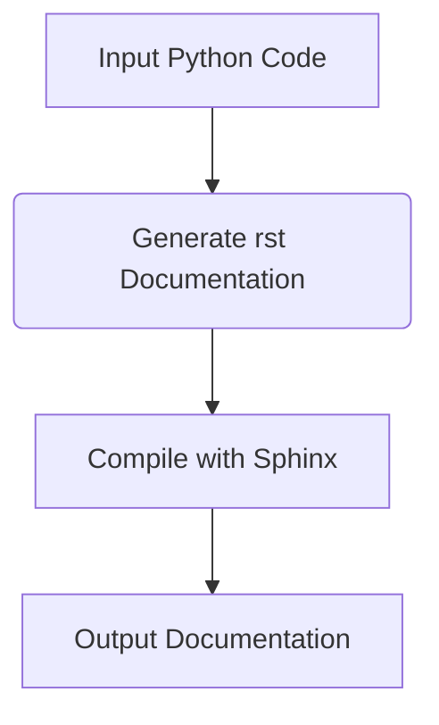

# Code Explanation

## <input code>

```plaintext
# הוראות
לכל קובץ Python קלט, צרו תיעוד בפורמט `rst` לצורך קומפילציה לאחר מכן עם Sphinx. התיעוד צריך לעמוד בדרישות הבאות:

1. **פורמט התיעוד**:
   - השתמשו בסטנדרט `reStructuredText (rst)`.
   - כל קובץ צריך להתחיל בכותרת ובתיאור קצר של התוכן שלו.
   - עבור כל המחלקות והפונקציות, השתמשו בפורמט ההערות הבא:
     ```python
     def function(param: str, param1: Optional[str | dict | str] = None) -> dict | None:
         """
         ארגומנטים:
             param (str): תיאור הפרמטר `param`.
             param1 (Optional[str | dict | str], optional): תיאור הפרמטר `param1`. ברירת המחדל היא `None`.

         ערך מוחזר:
             dict | None: תיאור הערך המוחזר. מחזיר מילון או `None`.

         יוצאים:
             SomeError: תיאור המצב שבו מתרחש החריג `SomeError`.
         """
     ```
   - השתמשו ב-`ex` במקום `e` בחסימות טיפול בחריגים.

2. **עץ תוכן (TOC)**:
   - כללו פרקים בתיעוד באמצעות `.. toctree::`.
   - מבנה הקובץ `index.rst` צריך לכלול קישורים לכל התיאורים של המודולים.

3. **עיצוב התיעוד**:
   - כל כותרות המחלקות, הפונקציות והשיטות צריכות להיות מתועדות באמצעות פקודות Sphinx (`autoclass`, `autofunction`).
   - דוגמה:
     ```rst
     .. automodule:: module_name
         :members:
         :undoc-members:
         :show-inheritance:
     ```

4. **כותרות פרקים**:
   - השתמשו בכותרות ברמה 1 (`=`), רמה 2 (`-`), רמה 3 (`~`) ורמה 4 (`^`).

5. **דוגמת קובץ**:
   ```rst
   שם המודול
   ===========\n

   .. automodule:: module_name
       :members:
       :undoc-members:
       :show-inheritance:

   פונקציות
   --------

   .. autofunction:: module_name.function_name
   ```

צור את התיעוד המתאים לכל קובץ Python קלט בפורמט `rst`.
# -------------------- סיום ההוראות -------------------------
```

## <algorithm>

This code describes a workflow for generating `reStructuredText (rst)` documentation from Python source code, using Sphinx. The algorithm is not an executable code block, but rather a set of instructions.  It outlines the steps required to produce the documentation.

1. **Input**: Python source code files.

2. **Generate Documentation**:  Create `rst` files that meet the specified format and content guidelines. 
    * Each file starts with a title and brief description.
    * Docstrings for functions and classes are formatted appropriately (including parameters, return values, and exceptions).
    * `reStructuredText` markup is used to format the text, including using `.. automodule::`, `.. autofunction::`, and `.. toctree::`.
    * Different heading levels (`=`, `-`, `~`, `^`) are used for structuring the documentation.

3. **Output**: `rst` files containing the generated documentation.

4. **Compilation**: The `rst` files are compiled using Sphinx to produce the final documentation.


## <mermaid>



**Dependencies:**

The mermaid code doesn't directly depend on any imports from any specific packages.  It's a generic description of the documentation process. The actual Python code that would generate the RST documentation from the Python code would have dependencies on tools like `sphinx`.


## <explanation>

* **Imports:**  There are no explicit import statements in the provided text.  However, if this were to be implemented, the code for generating the RST documentation would likely import the necessary Sphinx components and tools to generate the formatted output.  This text is just a set of instructions.

* **Classes:**  The text describes the structure and format that classes should have in the generated documentation, including a basic syntax example. The text also specifies the use of `sphinx` tools for auto-documenting classes using `autoclass`.

* **Functions:**  The text dictates how functions and their docstrings should be formatted in the `rst` files using `autofunction`, providing detailed guidelines and examples.

* **Variables:** There are no variables declared in the given text.

* **Potential Errors/Improvements:** The instructions are comprehensive, but to translate them into code, details on how the RST would be generated from the Python code (e.g., using Sphinx's API), error handling in the Python generating script, and  handling different types of source code (e.g., multiple files, modules, or packages) need to be provided.  The instructions mention various Sphinx directives, but the exact process of integration is missing.

* **Relationships:** The relationship is generating documentation from source code for later compilation. This involves Python source files as input and `rst` documentation files as output.  The compilation step itself is implicitly handled by Sphinx, forming a dependency.