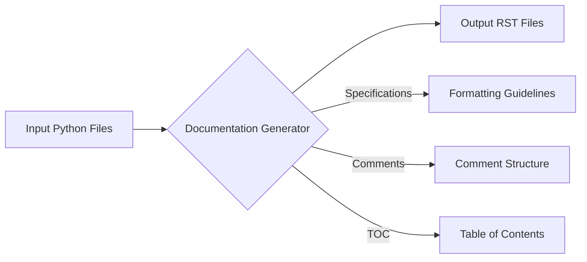

# <input code>

```python
# ИНСТРУКЦИЯ
Для каждого входного Python файла создайте документацию в формате `rst` для последующей компиляции с Sphinx. Документация должна соответствовать следующим требованиям:

1. **Формат документации**:
   - Используйте стандарт `reStructuredText (rst)`.
   - Каждый файл должен начинаться с заголовка и краткого описания его содержимого.
   - Для всех классов и функций используйте следующий формат комментариев:
     ```python
     def function(param: str, param1: Optional[str | dict | str] = None) -> dict | None:
         """
         Аргументы:
             param (str): Описание параметра `param`.
             param1 (Optional[str | dict | str], optional): Описание параметра `param1`. По умолчанию равно `None`.

         Возвращаемое значение:
             dict | None: Описание возвращаемого значения. Возвращает словарь или `None`.

         Исключения:
             SomeError: Описание ситуации, в которой возникает исключение `SomeError`.
         """
     ```
   - Используйте `ex` вместо `e` в блоках обработки исключений.

2. **Дерево оглавлений (TOC)**:
   - Включите разделы в документации с использованием `.. toctree::`.
   - Структура файла `index.rst` должна содержать ссылки на все описания модулей.

3. **Форматирование документации**:
   - Все заголовки классов, функций и методов должны быть задокументированы с использованием директив Sphinx (`autoclass`, `autofunction`).
   - Пример:
     ```rst
     .. automodule:: module_name
         :members:
         :undoc-members:
         :show-inheritance:
     ```

4. **Заголовки разделов**:
   - Используйте заголовки первого уровня (`=`), второго уровня (`-`), третьего уровня (`~`) и четвертого уровня (`^`).

5. **Пример файла**:
   ```rst
   Название модуля
   ==============

   .. automodule:: module_name
       :members:
       :undoc-members:
       :show-inheritance:

   Функции
   --------

   .. autofunction:: module_name.function_name
   ```

Сгенерируйте соответствующую документацию для каждого входного Python файла в формате `rst`.
# -------------------- КОНЕЦ ИНСТРУКЦИИ -------------------------
```

# <algorithm>

The algorithm described in the code is to generate reStructuredText (rst) documentation for Python files.  It specifies the format of the documentation, including:

- **Structure:**  Includes headings, descriptions, and using Sphinx directives (`automodule`, `autofunction`).
- **Comments:**  How to document functions and classes using a specific template.
- **Hierarchy:** Using `.. toctree::` to create a table of contents.

The core process is to analyze Python files (presumably input from external sources), and generate the corresponding rst documentation files. The files will follow the provided guidelines for formatting and structure. There is no particular iterative step or complex logic. It's purely a documentation generation directive.


# <mermaid>



**Dependencies:**

The code itself doesn't import any external libraries.  Therefore, no external dependencies are described. The necessary Sphinx directives to auto-generate the docs will be imported and invoked during Sphinx build process.


# <explanation>

- **Imports**: There are no explicit imports in the code snippet.  The implicit import of libraries needed to create the RST files will be handled by Sphinx.

- **Classes**: No classes are defined.  The code describes a high-level process for documentation generation and provides examples of how to document Python code using reStructuredText, without providing the implementation of these steps.


- **Functions**: The code focuses on detailing the *requirements* for documentation, not the functions themselves. The sample function demonStartes the required docstring format.

- **Variables**: No variables are declared.

- **Potential Errors/Improvements**: The code doesn't contain code to implement the outlined requirements. There would be no errors from this code alone, because it's an instruction set, not runnable Python code.  A complete implementation would need functions or scripts to parse Python files, extract class and function information, and format them into RST. Also, more robust error handling would be necessary in a production system.

- **Relationships with other project components**: The outlined requirements clearly show a connection between the given instructions and Sphinx, a documentation generation tool. The instructions describe how a tool like Sphinx should be used.  The intended application of this code snippet is to create Python documentation as input for a Sphinx based documentation system.