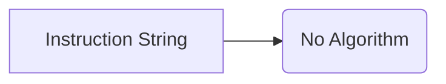

```MD
# Code Analysis of Instructions File

## <input code>

```
Здесь находятся инструкции по обработке кода проекта моделью
```

## <algorithm>

There is no code to analyze in the input.  The provided text is a simple string literal.  Therefore, a step-by-step algorithm cannot be created.  No data flow or function calls are present.


## <mermaid>



This is a very basic mermaid diagram.  It shows a single string (A) and the lack of a complex algorithm or data processing (B). There are no dependencies to illuStarte since there's no code.


## <explanation>

The provided text is not code; it's a string literal. It likely serves as a documentation comment or a placeholder in a file describing the intended behavior or task of some code.  It doesn't represent a class, function, import, or any other code elements.

* **Imports:**  No imports are present.
* **Classes:** No classes are present.
* **Functions:** No functions are present.
* **Variables:** No variables are present.
* **Potential Errors/Improvements:** No errors are present as there is no code to analyze. The comment could be made more specific or detailed to provide context to the code processing.


**Chain of Relationships:**

This string exists as a part of the `readme.md` file in the `hypotez/src/endpoints/hypo69/code_assistant/instructions` directory.  It's likely part of documentation for how a specific code processing model (e.g., a machine learning model) is meant to handle code within the `hypotez` project. This relates to the broader project by describing the processing instructions that guide the code processing part of the project.  It defines what the model is *supposed* to do with the code.  However, without the code being processed, there's no connection to other project components to analyze.