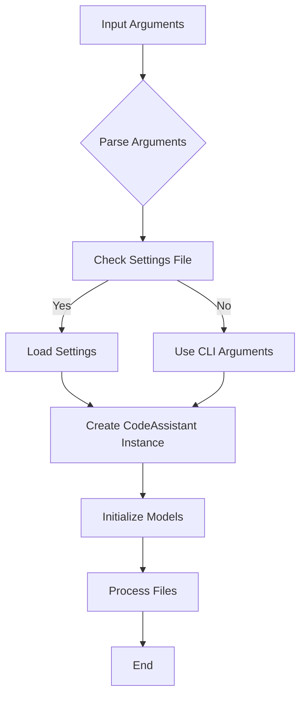
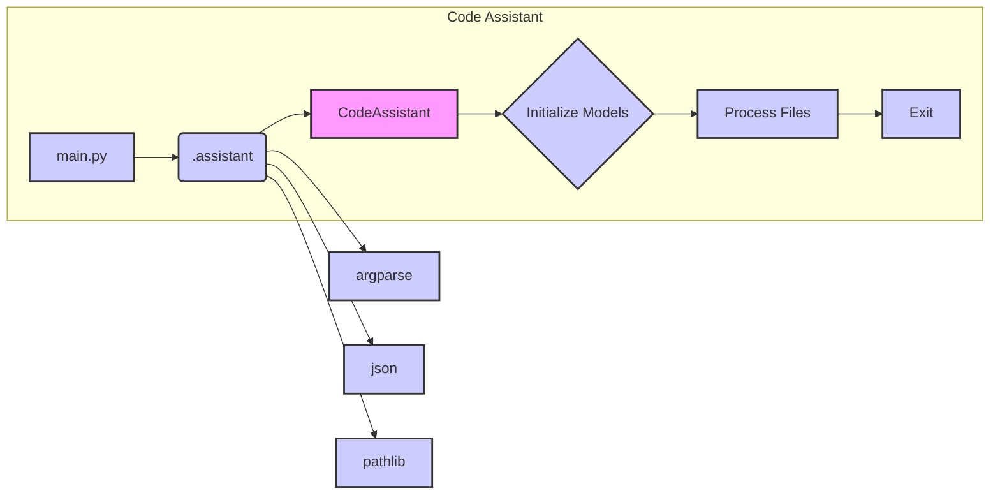

# Code Explanation for hypotez/src/endpoints/hypo69/code_assistant/main.py

## <input code>

```python
# -*- coding: utf-8 -*-\n#! venv/Scripts/python.exe\n#! venv/bin/python/python3.12\n\n"""\n.. module: src.endpoints.hypo69.code_assistant \n\t:platform: Windows, Unix\n\t:synopsis:\n\n\n\n\n\nПримеры запуска:\n1. Запуск с готовыми настройками:\n    python main.py --settings settings.json\n\n2. Запуск с указанием роли \'doc_writer\', языка \'ru\', моделей \'gemini\' и \'openai\', а также стартовых директорий:\n    python main.py --role doc_writer --lang ru --models gemini openai --start_dirs /path/to/dir1 /path/to/dir2\n\n3. Запуск с указанием роли \'code_checker\', языка \'en\' и только модели \'gemini\', а также стартовой директории:\n    python main.py --role code_checker --lang en --models gemini --start_dirs /path/to/dir\n\n4. Запуск с указанием роли \'doc_writer\', языка \'en\' и только модели \'openai\':\n    python main.py --role doc_writer --lang en --models openai\n"""\n\n\nimport argparse\nimport json\nfrom pathlib import Path\nfrom .assistant import CodeAssistant\n\n\ndef parse_args() -> dict:\n    # ... (argparse code)\n    return vars(parser.parse_args())\n\n\ndef main():\n    # ... (main function)\n\n\nif __name__ == '__main__':\n    main()\n```

## <algorithm>

**Workflow Diagram:**



**Examples:**

* **Input Arguments (A):** `python main.py --settings settings.json --role code_checker --lang en --models gemini --start_dirs /path/to/dir`
* **Parse Arguments (B):** Extracts `settings`, `role`, `lang`, `models`, and `start_dirs` from the command line.
* **Check Settings File (C):** Checks if the `settings.json` file exists.
* **Load Settings (D):** Parses the `settings.json` file into a Python dictionary.
* **Use CLI Arguments (E):** Uses the provided CLI arguments if no settings file is found.
* **Create CodeAssistant Instance (F):** Initializes `CodeAssistant` object with the extracted parameters.
* **Initialize Models (G):** Initializes the chosen language models.
* **Process Files (H):** Processes files in the specified directories based on the assigned role (e.g., checks code for errors, creates documentation).
* **End (I):** Exits the program.


## <mermaid>



**Dependencies Analysis:**

* `argparse`: Used for parsing command-line arguments.
* `json`: Used for handling JSON files (loading settings).
* `pathlib`: Used for working with file paths in a more object-oriented way.
* `.assistant`: Imports the `CodeAssistant` class from the `assistant.py` file within the same directory. This dependency is crucial for the Code Assistant functionality, defining its core logic.

## <explanation>

* **Imports:**
    * `argparse`: Used for parsing command-line arguments, enabling flexible configuration of the script.
    * `json`: Used to load settings from JSON files.
    * `pathlib`: Provides object-oriented way of interacting with paths making code more readable and robust.
    * `.assistant`: Imports the `CodeAssistant` class. This implies the existence of a file named `assistant.py` in the same directory, containing the `CodeAssistant` implementation.  This is a critical part of the code's modular design.

* **Classes:**
    * `CodeAssistant`: (Implied from `from .assistant import CodeAssistant`) This is the core logic of the code assistant. It likely contains methods to initialize models (like `initialize_models()`), process files (like `process_files()`), and potentially other functionalities related to the role, language, and models defined in `main.py`.  Further analysis of `assistant.py` is required for a complete understanding.

* **Functions:**
    * `parse_args()`: Takes command-line arguments and parses them into a dictionary (`args`).  Provides a structured way to get user input and configure the program's behavior.
    * `main()`: The main entry point of the program. It first calls `parse_args()` to retrieve arguments. Then, it either loads settings from a file or uses command-line arguments to initialize a `CodeAssistant` object.  Finally, it initializes models and processes files.

* **Variables:**
    * `MODE`: Likely used for configuration (e.g., 'dev', 'prod').
    * `args`: Stores the parsed command-line arguments or settings.
    * `settings`: Stores loaded settings from the JSON file.

* **Potential Errors/Improvements:**
    * Error handling could be improved when loading settings:  If `settings_path` doesn't exist, a more descriptive error message or handling could be implemented.  Also the `encoding='utf-8'` argument in `with open(...)` is important for proper file reading.
    * Input validation:  Adding input validation for the arguments to `parse_args` would prevent unexpected behavior or crashes.
    * Logging:  Adding logging would help with debugging and tracking the execution flow.
    * More Robust Error Handling:  Adding `try...except` blocks to handle potential exceptions during JSON loading would improve the program's robustness.

* **Relationships with Other Parts:**
    *  `CodeAssistant` class (in `assistant.py`) is a critical component of the application. It defines the actions to be performed on the code, which is crucial for a detailed analysis.  It likely depends on external language model libraries, though these imports aren't shown here.