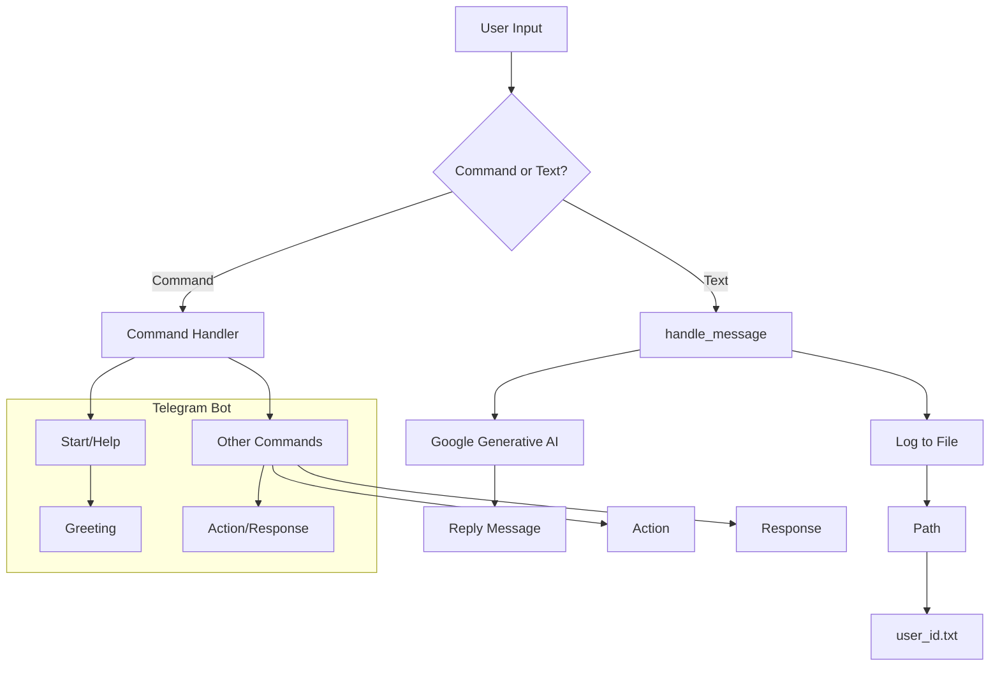

# PsychologistTelgrambot Code Explanation

## <input code>

```python
# ... (code from the file)
```

## <algorithm>

The workflow of the `PsychologistTelgrambot` can be summarized in the following steps:

1. **Initialization:**
    * The `PsychologistTelgrambot` class initializes with credentials, a driver, a language model, system instructions, a list of questions, and a timestamp.
    * It fetches the necessary information (token, system_instruction, questions_list) from configuration files (`gs.credentials`, `gs.path`).
    * It initializes the `GoogleGenerativeAI` model with the system instruction.
    * It registers handlers for different types of Telegram messages (commands, text, voice, documents).

2. **Command Handling:**
    * `/start` command: Sends a greeting message.
    * `/help` command: (Placeholder, not implemented)
    * Text message handling:
        * Extracts the user's input from the message (`update.message.text`).
        * Logs the user's input to a file (`gs.path.google_drive/bots/...`).
        * Asks the `GoogleGenerativeAI` model for a response to the user's input, using the user's previous interactions (`user_id.txt` history).
        * Sends the generated response back to the user.
    * URL handling (URL-based routing):
        * Checks if the user's input starts with any predefined URL patterns.
        * If a match is found, invokes the corresponding handler function (e.g., `handle_suppliers_response`).

3. **Specific Handler Functions:**
    * `handle_suppliers_response`: Uses an external `mexiron` service to handle URLs related to suppliers.
    * `handle_onetab_response`: (Placeholder, not implemented)
    * `handle_next_command`: Randomly selects a question from the `questions_list`, gets a response from the model, and sends both to the user.
    * `handle_document`: Handles document uploads, extracts their content, and sends a message confirming the receipt.

4. **Main Execution:**
    * Creates an instance of `PsychologistTelgrambot`.
    * Starts the Telegram bot using `asyncio.run(kt.application.run_polling())`.

**Example Data Flow:**

```
User input (text message) --> handle_message() --> log_path
                                                 |
                                                 V
                                  GoogleGenerativeAI model --> response
                                                 |
                                                 V
                                             Reply message
```


## <mermaid>



**Dependencies Analysis:**

The diagram shows dependencies on various modules, including `telegram`, `asyncio`, `pathlib`, `typing`, `dataclasses`, `random`, `src.gs`, `src.bots.telegram`, `src.webdriver.driver`, `src.ai.gemini`, `src.utils.file`, `src.utils.url`, `src.logger` etc. These dependencies represent the necessary libraries for message handling, asynchronous operations, file management, data types, etc.

## <explanation>

**Imports:**

- `asyncio`: Used for asynchronous operations, crucial for handling Telegram messages and other potentially blocking tasks.
- `pathlib`: Simplifies file path manipulation.
- `typing`, `dataclasses`: Provide type hints and dataclasses for improved code readability and maintainability.
- `random`: Used for selecting random questions in `handle_next_command`.
- `telegram`: The core Telegram API library, allowing interaction with the Telegram platform.
- `telegram.ext`: The Telegram bot library, providing tools for handling commands, messages, and other Telegram-related events.
- `src.*` modules: Custom modules, indicating the codebase's organization.
    - `gs`: Likely a global settings or configuration module.
    - `bots.telegram`: Custom Telegram bot logic.
    - `webdriver.driver`, `ai.gemini`, `utils.file`, `utils.url`, `logger`: Likely utilities for web interaction (via webdriver), AI models, file operations, URL validation, and logging, respectively.

**Classes:**

- `PsychologistTelgrambot(TelegramBot)`: Extends the `TelegramBot` class, adding custom behavior specific to the psychologist bot.
    - `token`, `d`, `model`, `system_instruction`, `questions_list`, `timestamp`: Attributes crucial for the bot's functionality, holding credentials, driver, language model, instructions, questions, and timestamps.
    - `__post_init__`: Initializes the `PsychologistTelgrambot` attributes with values from configuration and local files.
    - `register_handlers`: Sets up message handlers (for `/start`, `/help`, messages, voice messages, and documents) within the Telegram bot.
    - `start`, `handle_message`, `handle_voice`, `handle_document`: Methods to handle different types of messages, processing them and responding accordingly.
    - `handle_suppliers_response`, `handle_onetab_response`, and `handle_next_command`: Handle specific tasks that might require more complex handling, like routing URLs or randomly selecting questions. These functions use external dependencies that aren't detailed in this code snippet.


**Functions:**

- `start`, `handle_message`, `handle_document`: Asynchronous methods to handle commands and messages. They receive `Update` and `CallbackContext` objects from the Telegram API and generate appropriate responses.

**Potential Errors/Improvements:**

- **Error Handling:** While `handle_next_command` includes a `try-except` block, the handling of exceptions in other functions (e.g., those related to `mexiron`) might be missing or insufficient.  Comprehensive error handling is critical for robust applications.
- **`mexiron` Dependency:** The code interacts with an external library or service (`mexiron`). The code isn't clear on the definition or purpose of this external component. Missing details on `mexiron` functionality. Consider replacing magic strings like "Хуёвенько" etc, as this could cause issues when the code is deployed outside of the development environment.
- **Data Validation:**  Input validation (e.g., checking if the response is a valid URL) is crucial to prevent unexpected behavior.
- **File Handling:** The `save_text_file` function appends to a log file without any considerations of file size or potential overflow.
- **Configuration Management:** The use of `gs.credentials` suggests a global settings file. Consider using a dedicated configuration library (like `python-dotenv`) for better organization and security practices.
- **Code Clarity:** The use of hardcoded messages ("Hi!", "I am...") could be improved by creating a resource file to separate the message strings.

**Relationship with other parts of the project:**

The `PsychologistTelgrambot` relies on various other modules and classes within the `src` package, such as `gs` for configuration, `TelegramBot` for the base bot functionality, `GoogleGenerativeAI` for language model processing, `Driver` for web interactions, `utils.file` for file handling, and `logger` for error logging.
```