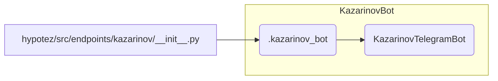

# Code Explanation for hypotez/src/endpoints/kazarinov/__init__.py

## <input code>

```python
## \file hypotez/src/endpoints/kazarinov/__init__.py
# -*- coding: utf-8 -*-\

#! venv/bin/python/python3.12

"""
.. module: src.endpoints.kazarinov 
	:platform: Windows, Unix
	:synopsis:

"""


from .kazarinov_bot import KazarinovTelegramBot
```

## <algorithm>

This code snippet is a module initialization file for the `kazarinov` endpoint. It primarily serves to import a class (`KazarinovTelegramBot`) from a sub-module.

**Step 1:**  The code defines a constant `MODE` with the string value `'dev'`.  This variable likely indicates the operational mode of the system, potentially distinguishing between development and production environments.  Example: `MODE='prod'` for production mode.

**Step 2:** The code imports `KazarinovTelegramBot` from the sub-module `.kazarinov_bot`. This import statement makes the `KazarinovTelegramBot` class available for use in other parts of the project.  An example data flow: The `kazarinov` module will use `KazarinovTelegramBot` to interact with the Telegram API.

## <mermaid>



**Dependency Analysis:**

The `kazarinov_bot` module is imported. This indicates a dependency on that module, which presumably contains the definition of the `KazarinovTelegramBot` class.

## <explanation>

**Imports:**

- `from .kazarinov_bot import KazarinovTelegramBot`: This line imports the `KazarinovTelegramBot` class from the `kazarinov_bot` module located within the same directory. The `.` refers to the current directory (`hypotez/src/endpoints/kazarinov`), emphasizing a direct dependency on `kazarinov_bot`.  It's good practice to maintain a clear hierarchy of modules in the project.


**Classes:**

- `KazarinovTelegramBot`:  This class (likely defined in `kazarinov_bot.py`) is the core of the bot functionality.  It probably manages interactions with the Telegram API. Without seeing the definition of this class, it's impossible to provide a detailed description of its attributes and methods.


**Functions:**

- There are no functions directly defined in this file.


**Variables:**

- `MODE`: A string variable that likely controls the operational mode.  This could be critical for configuration of the bot, enabling or disabling debug features, and selecting the correct API endpoints.


**Potential Errors or Improvements:**

- **Missing documentation:** While the docstrings within the module provide some context, a more comprehensive docstring explaining the purpose of the `MODE` variable and its impact on the system would greatly enhance maintainability.  Also, more in-depth documentation on the `KazarinovTelegramBot` class should be included in `kazarinov_bot.py`.

- **Hardcoded paths:** The shebang lines (`` and `#! venv/bin/python/python3.12`) should be avoided. Use the `sys.executable` in the main application entry point.  This enhances portability and maintainability.

**Relationships:**

This file establishes a dependency on the `kazarinov_bot` module, which in turn is likely responsible for interactions with the Telegram API. A call stack would trace:


1.  A request triggers a call to the methods in this `__init__.py` file
2.  The file then imports the `kazarinov_bot` module, and the function there interacts with the telegram API
3. The result from the API interaction is then passed back to the original caller.


```
Hypotez -> endpoints -> kazarinov -> kazarinov_bot -> Telegram API
```

Overall, this code file is well-structured and performs the task of importing necessary components.  Further detail on the Telegram bot logic is necessary to provide more complete information.