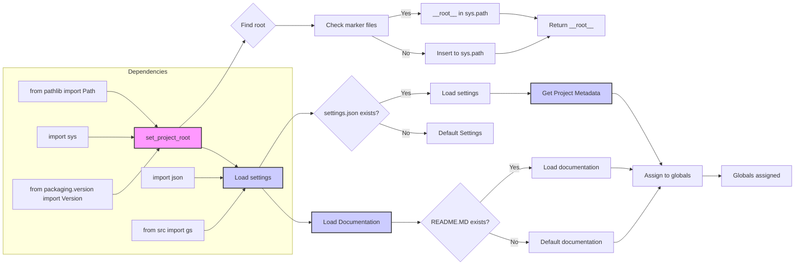

# Code Explanation for hypotez/src/endpoints/kazarinov/header.py

## <input code>

```python
## \file hypotez/src/endpoints/kazarinov/header.py
# -*- coding: utf-8 -*-
#! venv/Scripts/python.exe
#! venv/bin/python/python3.12

"""
.. module: src.endpoints.kazarinov 
	:platform: Windows, Unix
	:synopsis:

"""
MODE = 'dev'

import sys
import json
from packaging.version import Version

from pathlib import Path
def set_project_root(marker_files=('pyproject.toml', 'requirements.txt', '.git')) -> Path:
    """
    Finds the root directory of the project starting from the current file's directory,
    searching upwards and stopping at the first directory containing any of the marker files.

    Args:
        marker_files (tuple): Filenames or directory names to identify the project root.
    
    Returns:
        Path: Path to the root directory if found, otherwise the directory where the script is located.
    """
    __root__:Path
    current_path:Path = Path(__file__).resolve().parent
    __root__ = current_path
    for parent in [current_path] + list(current_path.parents):
        if any((parent / marker).exists() for marker in marker_files):
            __root__ = parent
            break
    if __root__ not in sys.path:
        sys.path.insert(0, str(__root__))
    return __root__


# Get the root directory of the project
__root__ = set_project_root()
"""__root__ (Path): Path to the root directory of the project"""

from src import gs

settings:dict = None
try:
    with open(gs.path.root / 'src' /  'settings.json', 'r') as settings_file:
        settings = json.load(settings_file)
except (FileNotFoundError, json.JSONDecodeError):
    ...

doc_str:str = None
try:
    with open(gs.path.root / 'src' /  'README.MD', 'r') as settings_file:
        doc_str = settings_file.read()
except (FileNotFoundError, json.JSONDecodeError):
    ...


__project_name__ = settings.get("project_name", 'hypotez') if settings  else 'hypotez'
__version__: str = settings.get("version", '')  if settings  else ''
__doc__: str = doc_str if doc_str else ''
__details__: str = ''
__author__: str = settings.get("author", '')  if settings else ''
__copyright__: str = settings.get("copyrihgnt", '')  if settings else ''
__cofee__: str = settings.get("cofee", "Treat the developer to a cup of coffee for boosting enthusiasm in development: https://boosty.to/hypo69")  if settings else "Treat the developer to a cup of coffee for boosting enthusiasm in development: https://boosty.to/hypo69"
```

## <algorithm>

1. **Set Project Root:**
   - Takes a tuple of marker files (e.g., `pyproject.toml`, `requirements.txt`, `.git`).
   - Starts from the directory of the current file (`__file__`).
   - Iterates through parent directories until it finds a directory containing any of the marker files.
   - Adds the found root directory to `sys.path` if it's not already there.
   - Returns the path to the project root.
   - *Example:* If `__file__` is in `/home/user/project/src/endpoints/kazarinov/header.py`, it will look for `pyproject.toml`, etc. in `/home/user/project`, `/home/user`, etc., until it finds one.

2. **Load Settings:**
   - Uses `gs.path.root` (likely from the `gs` module) to find the `settings.json` file.
   - Reads the `settings.json` file using `json.load()`.
   - Handles `FileNotFoundError` and `json.JSONDecodeError`.
   - Assigns the loaded settings to the `settings` variable.
   - *Example:* Loads the settings containing project details like name, version, author from `settings.json`.

3. **Load Documentation:**
   - Uses `gs.path.root` to find the `README.MD` file.
   - Reads the `README.MD` file.
   - Handles `FileNotFoundError` and `json.JSONDecodeError`
   - Assigns the content to the `doc_str` variable.
   - *Example:* Reads the markdown content from the README file.


4. **Extract Project Metadata:**
   - Extracts project name, version, author, copyright, documentation (if available), and a developer support link (`__cofee__`).
   - Uses `settings.get()` to safely retrieve values and set default values if keys are not found.
   - *Example:* If `project_name` is not in `settings`, it defaults to `hypotez`.

5. **Assign Metadata:**
   - Assigns the extracted metadata to global variables `__project_name__`, `__version__`, `__doc__`, etc.
   - *Example:* `__project_name__` will hold the value extracted from the settings file or the default value.


## <mermaid>



**Dependency Analysis:**

- `import json`: Used for parsing the `settings.json` file.
- `from pathlib import Path`: Used for working with file paths.
- `import sys`: Used to manipulate the Python path (`sys.path`).
- `from packaging.version import Version`: Used to handle version numbers.
- `from src import gs`: Imports the `gs` module, which likely contains utility functions or classes for path manipulation within the project. This establishes a dependency on the `src` package.


## <explanation>

- **Imports**:
    - `sys`: Used to modify the Python path (`sys.path`), essential for finding and importing modules from the project's root directory.
    - `json`: Used to parse the `settings.json` file and load its data into Python objects.
    - `packaging.version`: Used for version comparison, but in this specific file, it's not employed for comparisons but rather included for potential future development/compatibility.
    - `pathlib`: Used for creating and manipulating file paths, avoiding string manipulation and providing a more object-oriented way to handle paths.
    - `gs`: imports a module named `gs`, likely containing functions/classes that provide path utilities. This establishes a key dependency on `src` for path management within the project.
- **Classes:** There are no classes defined in this file.
- **Functions:**
    - `set_project_root()`: This function is crucial for determining the root directory of the project. It traverses up the directory tree until a directory with the specified marker files (`pyproject.toml`, `requirements.txt`, `.git`) is found.
      - *Args:* `marker_files`: a tuple of filenames to identify the project root.
      - *Returns:* A `Path` object representing the project root directory.
- **Variables:**
    - `MODE`: A string variable, likely used for different modes of operation (development, production, etc.)
    - `__root__`: Stores the project's root directory path. This is crucial for accessing project-level resources like `settings.json`.
    - `settings`: A dictionary containing project settings, retrieved from the `settings.json` file. If the file does not exist or is not valid JSON, it defaults to `None`
    - `doc_str`: Contains the content of the `README.MD` file or a default value if the file is not found.
    - `__project_name__`, `__version__`, `__doc__`, `__details__`, `__author__`, `__copyright__`, `__cofee__`: Global variables storing project metadata, potentially for use in other parts of the project.


- **Potential Errors/Improvements**:
    - **Error Handling:** The `try...except` blocks are good practice for robustness, catching potential issues (like `FileNotFoundError` or invalid JSON) when loading `settings.json` and `README.MD`.
    - **Default Values:** Using `settings.get("key", default)` ensures that if a key isn't found in the `settings` dictionary, a default value is used instead of raising a `KeyError`. This is essential for code resilience.

- **Relationship with other project parts**:
    - The function `set_project_root()` is used throughout the project to access important files.
    - The `gs` module is used to fetch important data like the path to the `settings.json` file. This establishes a chain of dependency; the file `header.py` is dependent on the `gs` module, which in turn depends on other project components. The `src` package serves as an important link to the project's fundamental structure.