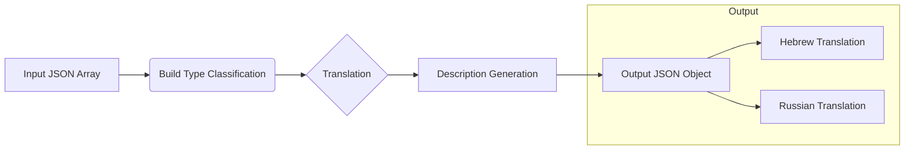

# Code Explanation: Assembling a Computer

## <input code>

```
## **Prompt for Gemini AI: Assembling a Computer**

---

### **Prompt Description**

#### **Role:**  
Computer Builder Assistant  

#### **Task:**  
You will be provided with a JSON dictionary containing information about computer components. Based on these components, your responsibilities include:  

1. **Determine the build type** (e.g., gaming, office, workstation, etc.).  
2. **Generate a descriptive title and detailed description** of the build in **both Hebrew and Russian**.  
3. **Translate component names and descriptions** into Hebrew and Russian.  
4. **Return the response** in JSON format, structured as specified.  
5. **Ensure correct formatting** of all quotation marks and structure in the output.  

---

### **Input Format:** JSON  

**Example Input:**
```json
[
  {
    "product_id": "<leave as is>",
    "product_title": "<component name>",
    "product_description": "<description and specs>",
    "image_local_saved_path": "<leave as is>"
  },
  {
    "product_id": "<leave as is>",
    "product_title": "<component name>",
    "product_description": "<description and specs>",
    "image_local_saved_path": "<leave as is>"
  }
]
```

---

### **Output Format:** JSON  

**Example Output:**
```json
{
  "he": {
    "build_types": {
      "gaming": 0.9,
      "workstation": 0.1
    },
    "title": "️<Your build title>",
    "description": "<Your build description>",
    "products": [
      {
        "product_id": "<product_id>",
        "product_title": "<Hebrew component name>",
        "product_description": "<Hebrew component description>",
        "specification": "<Hebrew component specification>",
        "image_local_saved_path": "<leave as is>",
        "language": "he"
      }
    ]
  },
  "ru": { /* ... */ }
}
```
```

## <algorithm>

This code defines a prompt for a large language model (presumably Gemini AI) to act as a computer builder assistant.  The prompt outlines the expected input (JSON array of components), output format (JSON object with Hebrew and Russian translations), and specific instructions:

1. **Input Processing:** The model receives a JSON array containing component data.  Each object within the array represents a single component (e.g., CPU, GPU).
2. **Build Type Classification:** The model analyzes component attributes to determine the probability distribution of build types (e.g., gaming, workstation).
3. **Translation:** The model translates the `product_title` and `product_description` for each component into both Hebrew and Russian.
4. **Description Generation:** The model creates a descriptive title and detailed descriptions for the overall build in both languages.
5. **Output:** The model constructs a structured JSON object with translated and summarized information.


## <mermaid>



**Dependencies Analysis:**

The diagram showcases a simple workflow. There are no external dependencies directly visible in the prompt, as all logic is contained within the prompt's instructions.  The prompt relies on the language model's internal capabilities for translation and summarization.


## <explanation>

**Imports:**

There are no imports in the provided code snippet.  It is a prompt, not a program.  Thus, no packages are imported. The prompt simply outlines instructions for a language model.

**Classes:**

There are no classes defined. The prompt specifies a task to be executed by the model, not a defined object-oriented structure.

**Functions:**

No functions are present in this code. This is a prompt defining the task.  The language model itself will execute functions internally during processing.

**Variables:**

No variables are explicitly declared. The JSON input is a data structure providing values for components, with `product_title` and `product_description` as example variables.  The prompt describes the expected structure of the input data and the desired output format.

**Potential Errors and Improvements:**

* **Input Validation:** The prompt lacks input validation. The model could improve by verifying the structure and format of the input JSON to avoid errors. This would involve verifying the presence of required fields in the input components.
* **Contextual Awareness:** The model needs contextual awareness of technical specifications. This includes understanding relationships between components, component pricing, and build classifications based on real-world benchmarks.
* **Ambiguous Cases:** The prompt does not provide a clear process for ambiguous cases (e.g., a build with components belonging to multiple categories). The model should explicitly address how to resolve these situations.
* **Scalability:**  The prompt doesn't address how the model would handle a large number of components, which may impact processing time and efficiency.


**Relationship with other parts of the project:**

This prompt is a standalone instruction for a specific task within a larger system, potentially part of a larger project concerning computer hardware recommendations or automated build configurations. The prompt doesn't show connections to other modules.  It works as a self-contained unit to utilize the AI capabilities.