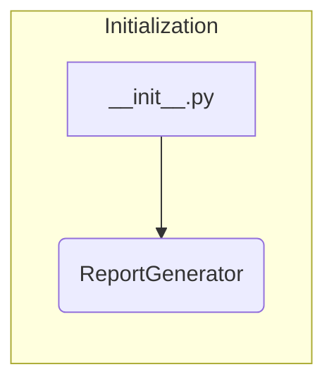

# Code Explanation for hypotez/src/endpoints/kazarinov/pricelist_generator/__init__.py

## <input code>

```python
## \file hypotez/src/endpoints/kazarinov/pricelist_generator/__init__.py
# -*- coding: utf-8 -*-\
#! venv/Scripts/python.exe
#! venv/bin/python/python3.12

"""
.. module: src.endpoints.kazarinov.pricelist_generator 
	:platform: Windows, Unix
	:synopsis:

"""


from .pricelist_generator import ReportGenerator
```

## <algorithm>

There is no algorithm present in this file.  It's an initialization file for a module.  Its primary function is to import the `ReportGenerator` class from an internal module (`pricelist_generator`).


## <mermaid>



This simple diagram shows the single import in the file.


## <explanation>

* **Imports:**
    * `from .pricelist_generator import ReportGenerator`: This line imports the `ReportGenerator` class from the `pricelist_generator` module within the same directory. The `.` in `from .pricelist_generator` indicates a relative import, essential for modular structure within Python packages. This is a critical step in allowing other parts of the project to utilize the functionality defined within the `ReportGenerator` class.  This implies the existence of a `pricelist_generator.py` file in the same directory (`hypotez/src/endpoints/kazarinov/pricelist_generator`) which likely defines the `ReportGenerator` class.

* **Classes (implied):**
    * `ReportGenerator`: This class, defined in `pricelist_generator.py`, is likely responsible for generating price lists.  Without seeing the contents of `pricelist_generator.py`, its methods and attributes are unknown. However, the import suggests this class likely holds methods to access and process data to construct reports.


* **Functions (implied):**
    *  No explicit function definitions are present in this file.  All the functionality would reside within the `ReportGenerator` class (methods within that class) in `pricelist_generator.py`.


* **Variables:**
    * ``:  This global variable likely controls configuration settings (e.g., development or production modes).  The exact implications depend on how it's used in the rest of the project.

* **Potential Errors/Improvements:**
    * **Missing Docstrings:** The `pricelist_generator.py` module (if it exists) and the `ReportGenerator` class should have docstrings.  Explaining the parameters, return values, and usage of the class and its methods would significantly enhance code readability and maintainability.

    * **Circular Dependencies:** Ensure there are no unintentional circular dependencies, where this file depends on other parts that depend on this one.  This could cause issues during module loading and use.


* **Relationships with other project parts:**

    This `__init__.py` file acts as an entry point for accessing the functionality of the `ReportGenerator` class. It is part of the  `endpoints`  module, implying that this pricelist generation service might be a part of a larger API or system within the `hypotez` project.  The precise relationships would be clearer with information about where this pricelist generation is used within the project (e.g., how other modules call the functions in the `ReportGenerator` class).