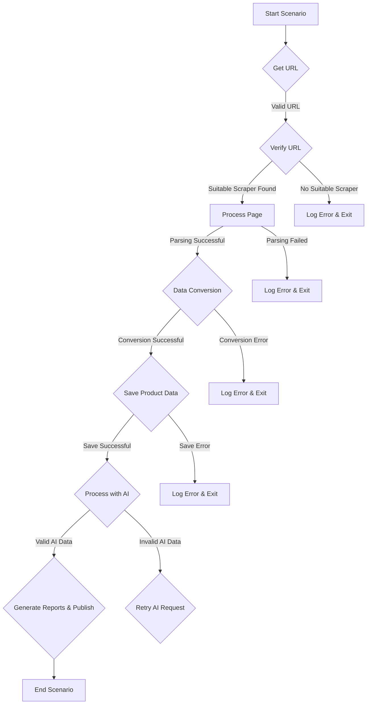

# Code Explanation for scenario_pricelist.mmd

## <input code>

```graph TD
    A[Старт сценария] -->|Получение URL| B[Проверка URL]\n
    B -->|Подходящий грабер найден| C[Обработка страницы]\n
    B -->|Грабер не найден| D[Лог ошибки и выход]\n
    C -->|Парсинг успешен| E[Конвертация данных продукта]\n
    C -->|Парсинг не удался| F[Лог ошибки и выход]\n
    E -->|Конвертация успешна| G[Сохранение данных продукта]\n
    E -->|Ошибка конвертации| H[Лог ошибки и выход]\n
    G -->|Сохранение успешно| I[Обработка данных через AI]\n
    G -->|Ошибка сохранения| J[Лог ошибки и выход]\n
    I -->|AI данные валидны| K[Создание отчетов и публикация]\n
    I -->|Ошибка AI данных| L[Повторный запрос AI]\n
    K --> M[Конец сценария]
```

## <algorithm>

The diagram represents a workflow for a price list scraping and processing scenario.  It's a sequential process with several conditional points.

**Step 1: Start Scenario (A)**

* **Input:** Initiates the scenario execution.
* **Example:** Triggered by a user request, scheduled task, or API call.

**Step 2: Fetch URL (A -> B)**

* **Input:**  The URL of a webpage containing product price data.
* **Example:** `https://example.com/products`.
* **Output:** The URL.

**Step 3: Check URL (B)**

* **Input:** The URL.
* **Logic:** Validates the URL format and availability.  Determines whether the correct web scraper is available.
* **Example:**  Checks if the URL is valid, attempts a connection to the site, checks for the availability of the specified web scraper.
* **Output:** Indicates if a suitable scraper is found or not.

**Step 4: Process Page (C) or Log Error & Exit (D)**

* **Input (C):** URL if a suitable scraper is found.
* **Logic (C):**  Fetches the webpage content, handles potential timeouts.
* **Logic (D):** Handles cases where a valid scraper is not found. Logs the error and stops processing.
* **Example (C):** Successful fetching and parsing the page content with a dedicated web scraper.

**Step 5: Successful Parsing (C -> E), Failed Parsing (C -> F)**

* **Input (E):** Parsed page content.
* **Logic (E):**  Converts extracted data into a suitable format for further processing. Handles potential errors during extraction.
* **Logic (F):** Handles parsing failures and logs errors.

**Step 6: Successful Conversion (E -> G), Conversion Error (E -> H)**

* **Input (G):** Processed data.
* **Logic (G):** Stores the converted product data in a database or storage system.
* **Logic (H):** Handles conversion errors and logs issues.


**Step 7: Successful Storage (G -> I), Storage Error (G -> J)**

* **Input (I):** Successfully stored data.
* **Logic (I):** Passes data for further AI processing.
* **Logic (J):** Handles storage errors and logs issues.

**Step 8: AI Processing Valid (I -> K), AI Data Error (I -> L)**

* **Input (K):**  Data processed by the AI.
* **Logic (K):**  Creates reports and publishes results based on the AI's output.
* **Logic (L):** Handles situations where AI processing returns invalid data and initiates a retry.


**Step 9: End Scenario (K -> M)**

* **Input:**  Successful processing and publishing of reports.
* **Output:**  Indicates the successful completion of the scenario execution.


## <mermaid>




## <explanation>

The diagram describes a sequence of steps for web scraping a price list, data conversion, AI processing, and report generation. This workflow is a common pattern for data extraction and analysis from web sources.


**Imports**:
No imports are specified in the provided graph.  This implies that the code utilizes functions/modules/classes defined within the same project or built-in libraries.

**Classes**:
No specific classes are defined within the graph; instead, it depicts functions and operations in a procedural manner.

**Functions**:
The graph represents various functions as logical blocks, which could be individual functions or parts of larger functions.


**Variables**:
The graph mentions variables such as "URL," "parsed page content," and "converted product data" without detailing their specific data types.


**Potential Errors and Improvements**:
- **Error Handling:** The flowchart demonStartes good error handling with branches for various failure cases (parsing errors, conversion errors, storage errors, AI errors). More specific error messages and logging would be helpful for debugging.
- **Retry Mechanism:** The "Retry AI Request" step suggests a mechanism to handle AI errors.  Adding more details about the retry logic (maximum retry attempts, delays between retries) would improve the robustness of the scenario.
- **Concurrency/Scalability:** The scenario is depicted sequentially. For high-volume data scraping, consider using asynchronous operations or threading to speed up the process.
- **Data Validation:**  The workflow doesn't show explicit validation steps after the AI processing. Validating the AI-processed data before reporting is essential.

**Relationships with Other Parts of the Project**:
The graph does not specify the dependencies on other parts of the project.  It's highly likely that the "Get URL," "Process Page," "Data Conversion," "Save Product Data," "Process with AI," and other blocks interact with other modules within the `hypotez` project for specific functionality (e.g., interacting with a database for storage, using a particular AI library).  To be certain, the actual code source would need to be examined.