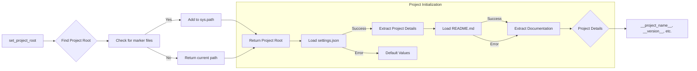

# Code Explanation for hypotez/src/endpoints/kazarinov/scenarios/header.py

## <input code>

```python
## \file hypotez/src/endpoints/kazarinov/scenarios/header.py
# -*- coding: utf-8 -*-\

#! venv/bin/python/python3.12

"""
.. module: src.endpoints.kazarinov.scenarios 
	:platform: Windows, Unix
	:synopsis:

"""


import sys
import json
from packaging.version import Version

from pathlib import Path
def set_project_root(marker_files=('__root__','.git')) -> Path:
    """
    Finds the root directory of the project starting from the current file's directory,
    searching upwards and stopping at the first directory containing any of the marker files.

    Args:
        marker_files (tuple): Filenames or directory names to identify the project root.
    
    Returns:
        Path: Path to the root directory if found, otherwise the directory where the script is located.
    """
    __root__:Path
    current_path:Path = Path(__file__).resolve().parent
    __root__ = current_path
    for parent in [current_path] + list(current_path.parents):
        if any((parent / marker).exists() for marker in marker_files):
            __root__ = parent
            break
    if __root__ not in sys.path:
        sys.path.insert(0, str(__root__))
    return __root__


# Get the root directory of the project
__root__ = set_project_root()
"""__root__ (Path): Path to the root directory of the project"""

from src import gs

settings:dict = None
try:
    with open(gs.path.root / 'src' /  'settings.json', 'r') as settings_file:
        settings = json.load(settings_file)
except (FileNotFoundError, json.JSONDecodeError):
    ...

doc_str:str = None
try:
    with open(gs.path.root / 'src' /  'README.MD', 'r') as settings_file:
        doc_str = settings_file.read()
except (FileNotFoundError, json.JSONDecodeError):
    ...


__project_name__ = settings.get("project_name", 'hypotez') if settings  else 'hypotez'
__version__: str = settings.get("version", '')  if settings  else ''
__doc__: str = doc_str if doc_str else ''
__details__: str = ''
__author__: str = settings.get("author", '')  if settings else ''
__copyright__: str = settings.get("copyrihgnt", '')  if settings else ''
__cofee__: str = settings.get("cofee", "Treat the developer to a cup of coffee for boosting enthusiasm in development: https://boosty.to/hypo69")  if settings else "Treat the developer to a cup of coffee for boosting enthusiasm in development: https://boosty.to/hypo69"
```

## <algorithm>

1. **`set_project_root` Function:**
   - Takes `marker_files` (e.g., `('pyproject.toml', 'requirements.txt', '.git')`) as input.
   - Starts at the current file's directory.
   - Iterates through parent directories until it finds a directory containing one of the marker files.
   - Adds the found root directory to `sys.path` if it's not already there.
   - Returns the path to the root directory.


2. **Initialization:**
   - Calls `set_project_root` to get the project root (`__root__`).
   - Reads settings from `gs.path.root / 'src' / 'settings.json'` into `settings` (handling potential `FileNotFoundError` or `json.JSONDecodeError`).
   - Reads documentation from `gs.path.root / 'src' / 'README.MD'` into `doc_str` (handling potential errors).

3. **Data Extraction:**
   - Extracts project name, version, and other details from the `settings` dictionary, falling back to default values if `settings` is not available.

## <mermaid>



**Dependencies Analysis:**

- `sys`: Provides access to system-specific parameters and functions.
- `json`: Used for working with JSON data.
- `packaging.version`: Used for working with software versions.
- `pathlib`: Used to work with file paths in an object-oriented way.
- `src.gs`: A module likely containing functions related to project file system navigation, expected to be from the `src` package, which the code relies on to locate project files.

## <explanation>

- **Imports:**
    - `sys`: Used to manipulate the Python path (`sys.path`).
    - `json`: Used for loading the `settings.json` file.
    - `packaging.version`:  Used for robust version handling.
    - `pathlib`: Used for more object-oriented path manipulation (e.g., `Path`).  This is a more modern and Pythonic approach than using string manipulation with `os.path`.
    - `src.gs`:  This is crucial for the project's architecture. It's likely a module within the `src` package (presumably within the same project) that provides functions and/or constants for getting file paths within the project's structure (e.g., `gs.path.root`).  This suggests a package structure where `gs` contains functionality for general file system operations within the project's structure.


- **Classes:** There are no classes in this file.


- **Functions:**
    - `set_project_root(marker_files)`: This function is critical for ensuring that the project's source code can be found regardless of how it's called within the project. It takes a tuple of file names/directories, walks up the directory tree, and returns the root of the project, adding it to the `sys.path`.  It helps avoid hardcoding paths and promotes modularity.


- **Variables:**
    - `MODE`: A string constant, likely for runtime configuration (e.g., 'dev', 'prod').
    - `settings`: A dictionary that holds project-specific settings loaded from `settings.json`.
    - `doc_str`: A string variable holding the content of the `README.MD` file.
    - `__root__`: A Path object representing the project root directory.
    - `__project_name__`, `__version__`, `__doc__`, etc.: Variables holding project information, obtained from `settings.json`.


- **Potential Errors/Improvements:**
    - The error handling (`try...except`) is good, but it could be improved by logging the errors instead of just using `...`.  Logging would allow for more detailed analysis of why the settings or README might not be found.
    - The use of default values for `__project_name__`, etc., if `settings` isn't found is a good defensive programming practice.


- **Relationships:**
    - This file relies heavily on `gs` from the `src` package.


**Overall:** This file is well-structured. It has good error handling and aims to find the project root dynamically. The use of `Path` objects instead of string manipulation for paths is a positive choice.  The file's responsibility is to initialize project-wide variables, ensuring that important data (e.g., project root, settings) are accessible throughout the application.