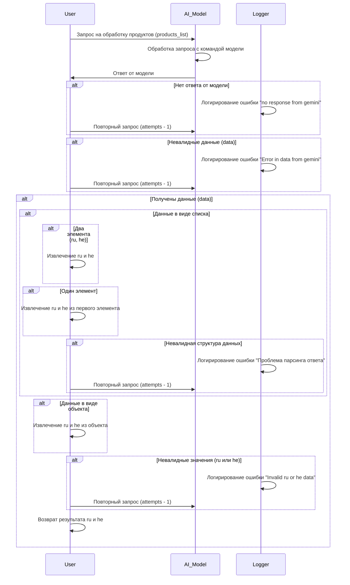
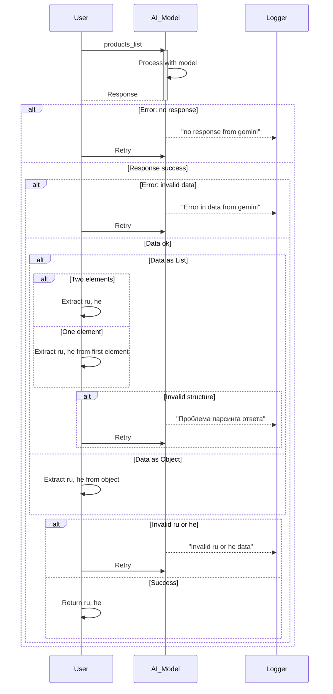

# Code Explanation

## <input code>



## <algorithm>

The algorithm describes the interaction between a User, an AI Model, and a Logger regarding processing a `products_list`. The flow is designed to handle potential errors and different data structures.

**Step 1:** User sends a request to the AI Model containing a `products_list`.

**Step 2:** The AI Model processes the request using its internal model.

**Step 3:** The AI Model returns a response to the User.

**Step 4:**  Error Handling:
* **No response:** The Logger logs an error ("no response from gemini"). The User retries the request (with reduced attempts).
* **Invalid data:** The Logger logs an error ("Error in data from gemini"). The User retries the request.
* **Invalid data structure:** The Logger logs an error ("Проблема парсинга ответа"). The User retries the request.
* **Invalid values (ru or he):** The Logger logs an error ("Invalid ru or he data"). The User retries the request.

**Step 5:** Successful Data Handling:
* **Data as a list:**
    * **Two elements (ru, he):** The User extracts the `ru` and `he` values directly.
    * **One element:** The User extracts `ru` and `he` from the first element of the list.
    * **Invalid structure:** The Logger logs an error and the User retries the request.
* **Data as an object:** The User extracts `ru` and `he` from the object.

**Step 6:**  Successful Result: The User returns the extracted `ru` and `he` values.


## <mermaid>



**Dependencies:**

The diagram implies dependencies on the `AI_Model`, `Logger`, and the `User` components, which are likely parts of the larger application.  No explicit imports are shown, as the diagram focuses on the interaction flow, not the implementation details.


## <explanation>

**Imports:**
There are no import statements shown in the code snippet.  The `sequenceDiagram` is a visualization tool, not actual code.

**Classes:**
No classes are explicitly defined.

**Functions:**
The code snippet depicts a flow, not specific functions. The "processing with model" step suggests a function (or method) within the AI Model.

**Variables:**
* `products_list`: Likely a variable holding the input data from the user.
* `attempts`: Variable likely controlling the retry logic.

**Potential Errors/Improvements:**
The diagram focuses on error handling and retry mechanisms. Areas for improvement include:
* **Specific error messages:** More detailed error messages within the `Logger` would be valuable for debugging.
* **Retry logic:** The retry logic (attempts -1) needs more detail;  a clear maximum number of retries is vital to avoid infinite loops.
* **Data validation:** Rigorous validation of incoming data before passing to the AI model could prevent unnecessary processing and errors.
* **Data structure handling:** The code lacks specific details on how the different data structures (list, object) are processed. The implementation should handle various cases properly to avoid unexpected behavior.


**Relationships:**
The `User` interacts with the `AI_Model`, which interacts with the `Logger`. The `Logger` likely logs information to an external system or file, and its role is for error tracking and system monitoring.
```