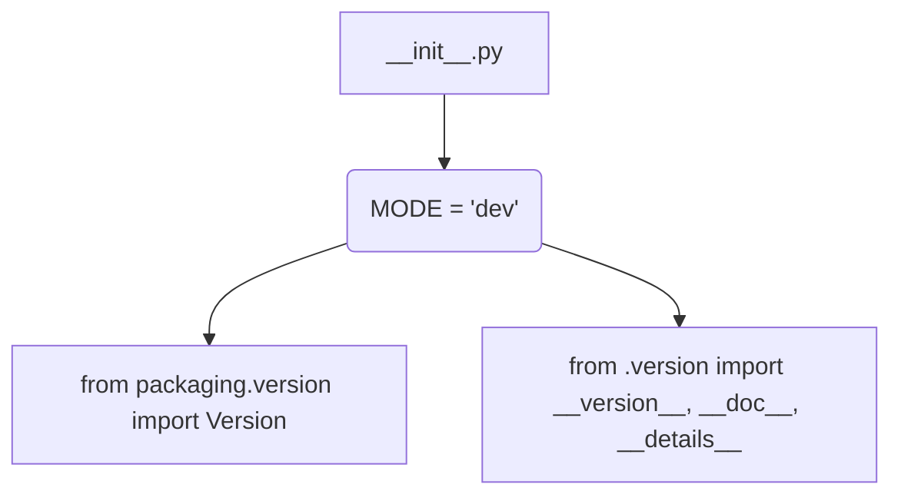

# Code Explanation for hypotez/src/endpoints/prestashop/_examples/__init__.py

## <input code>

```python
## \file hypotez/src/endpoints/prestashop/_examples/__init__.py
# -*- coding: utf-8 -*-
#! venv/Scripts/python.exe
#! venv/bin/python/python3.12

"""
.. module: src.endpoints.prestashop._examples 
	:platform: Windows, Unix
	:synopsis:

"""
MODE = 'dev'

"""
	:platform: Windows, Unix
	:synopsis:

"""


"""
	:platform: Windows, Unix
	:synopsis:

"""


"""
  :platform: Windows, Unix

"""
"""
  :platform: Windows, Unix
  :platform: Windows, Unix
  :synopsis:
"""MODE = 'dev'
  
""" module: src.endpoints.prestashop._examples """


from packaging.version import Version
from .version import __version__, __doc__, __details__
```

## <algorithm>

The code snippet does not exhibit a complex algorithm. It's primarily a module initialization file.  There's no significant data flow between functions or classes.  The process is:

1. **Module Initialization:** The file initializes a global variable `MODE` to 'dev'.
2. **Import Statements:** The file imports necessary modules from the `packaging` library and its internal `version` module.  These imports are crucial for managing and potentially utilizing version information.

## <mermaid>



**Dependencies Analysis:**

* **`packaging.version`**:  Likely used for version handling, comparison, and parsing within the `hypotez` project (or libraries used by `hypotez`).
* **`.version`**:  This suggests that a `version.py` file (likely within the `src/endpoints/prestashop/_examples` directory) is part of this package. It probably defines `__version__`, `__doc__`, `__details__`, crucial for managing version information for the package. This is a common practice for Python packages.

## <explanation>

* **Imports:**
    * `from packaging.version import Version`: Imports the `Version` class from the `packaging` library. This class is crucial for working with software versions in a way that supports a variety of formats and handles version comparisons correctly. `packaging` is a library focused on package metadata and compatibility, ensuring robust handling of versions across different software.

    * `from .version import __version__, __doc__, __details__`: Imports specific variables (`__version__`, `__doc__`, `__details__`) from a module named `version.py` located in the same directory as this `__init__.py`. This is a standard Python practice for importing variables that are intended to be part of the module's public interface. These are likely part of the module's metadata.


* **Variables:**
    * `MODE = 'dev'`: A global variable defining the current mode (e.g., development or production).  This is a common practice for configuration settings, allowing different behaviors based on whether the software is in a development or production environment.

* **Classes/Functions:** The file doesn't define any classes or functions beyond initializing a variable `MODE` and importing variables.

* **Potential Errors/Improvements:**
    * **Missing docstrings:** While the file includes docstrings, they are rather simple. Adding more detailed docstrings explaining the purpose of the `MODE` variable and the reason for the imports would improve readability and maintainability.


**Relationships with other parts of the project:**

The `__init__.py` file serves as a module entry point for other parts of the project. Imports from the `.version` module indicate a dependency on versioning information managed in a separate file within the same package.  This suggests that the `version.py` file contains information pertinent to the `prestashop` endpoints module and its compatibility across different contexts within the larger project. The file may provide versions and/or documentation for components within the `prestashop` endpoint implementation.
```