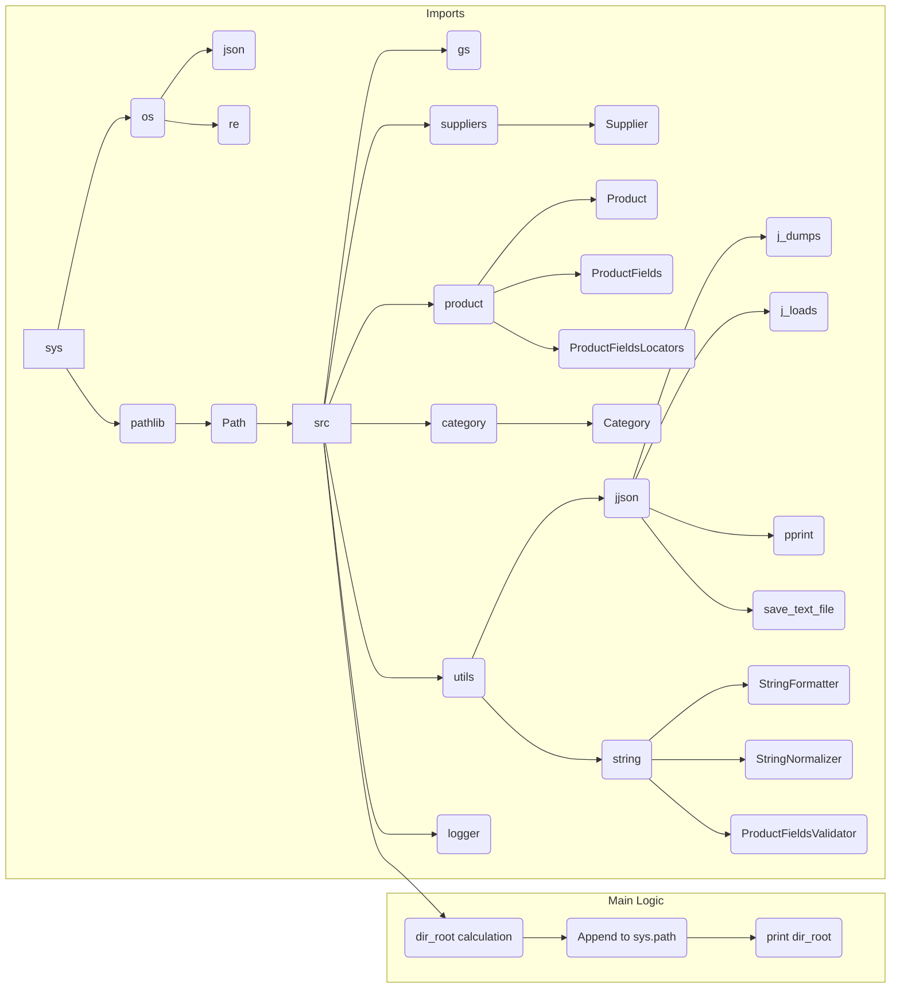

# Code Analysis of hypotez/src/endpoints/prestashop/_examples/header.py

## <input code>

```python
## \file hypotez/src/endpoints/prestashop/_examples/header.py
# -*- coding: utf-8 -*-
#! venv/Scripts/python.exe
#! venv/bin/python/python3.12

"""
.. module: src.endpoints.prestashop._examples 
	:platform: Windows, Unix
	:synopsis:

"""
MODE = 'dev'

"""
	:platform: Windows, Unix
	:synopsis:

"""


"""
	:platform: Windows, Unix
	:synopsis:

"""


"""
  :platform: Windows, Unix

"""
"""
  :platform: Windows, Unix
  :platform: Windows, Unix
  :synopsis:
"""MODE = 'dev'
  
""" module: src.endpoints.prestashop._examples """


import sys
import os
from pathlib import Path

dir_root : Path = Path (os.getcwd()[:os.getcwd().rfind('hypotez')+11])
sys.path.append (str (dir_root) )  # Добавляю корневую папку в sys.path
dir_src = Path (dir_root, 'src')
sys.path.append (str (dir_root) ) 
...

print(dir_root)
# ----------------
from pathlib import Path
import json
import re
# ----------------

from src import gs
from src.suppliers import Supplier
from src.product import Product, ProductFields, ProductFieldsLocators
from src.category import Category
from src.utils.jjson import j_dumps, j_loads,   pprint, save_text_file
from src.logger import logger
from src.utils.string import StringFormatter, StringNormalizer, ProductFieldsValidator
...
```

## <algorithm>

```mermaid
graph TD
    A[Import Modules] --> B{Calculate dir_root};
    B --> C[Append dir_root to sys.path];
    C --> D[Import from src packages];
    D --> E[Other Imports];
    E --> F[Main Logic];
    F --> G[Print dir_root];
    
    subgraph "Module Imports"
        D -- gs -- gs;
        D -- Supplier -- Supplier;
        D -- Product -- Product;
        D -- ProductFields -- ProductFields;
        D -- ProductFieldsLocators -- ProductFieldsLocators;
        D -- Category -- Category;
        D -- j_dumps -- j_dumps;
        D -- j_loads -- j_loads;
        D -- pprint -- pprint;
        D -- save_text_file -- save_text_file;
        D -- logger -- logger;
        D -- StringFormatter -- StringFormatter;
        D -- StringNormalizer -- StringNormalizer;
        D -- ProductFieldsValidator -- ProductFieldsValidator;
    end
```

## <mermaid>




## <explanation>

**Imports:**

* `sys`, `os`, `pathlib`: Standard Python modules for system interaction, file system manipulation, and path objects.  These are crucial for interacting with the operating system and file paths.  Crucially, they allow for constructing the file path `dir_root` relative to the current working directory.
* `json`, `re`:  Common modules for working with JSON data and regular expressions, which are often used for parsing or formatting.  The current file doesn't use `json` directly for analysis.
* `gs`, `Supplier`, `Product`, `ProductFields`, `ProductFieldsLocators`, `Category`, `j_dumps`, `j_loads`, `pprint`, `save_text_file`, `logger`, `StringFormatter`, `StringNormalizer`, `ProductFieldsValidator`: These imports suggest that the code interacts with a larger project that has its own custom modules (`src` package) related to product management, supplier data, and string formatting.


**Classes:**

The `src` package appears to contain custom classes designed for product management (`Product`, `Supplier`, `Category`), data representation (`ProductFields`, `ProductFieldsLocators`), and utility tasks.


**Functions:**

No explicit functions are defined in the provided code snippet.


**Variables:**

* `dir_root`: Represents the absolute path of the project root directory.

**Potential errors or areas for improvement:**

1. **Redundant `sys.path.append`:** The code appends `dir_root` to `sys.path` twice. This is likely an error; it would be better to append it only once, or to use a more robust method for adding to the path.
2. **Error Handling:** The code does not include any error handling for file path manipulations. If the `hypotez` directory isn't found, the code will fail.

**Relationship to Other Project Parts:**

The code strongly suggests the existence of a larger project structure, with the file being in the `endpoints/prestashop/_examples` directory, referencing classes and methods from a `src` package.  The `src` package likely contains core business logic, models, and utilities used by different parts of the project. The `endpoints` suggest a REST API or a similar application layer built on top of this `src` core functionality.

**Overall:** The code snippet sets up environment variables, likely for module imports, and then makes further imports from the project's `src` module, indicating that it's part of a larger project based on a data management framework.  The use of relative imports (`from src import ...`) implies that all imported modules are located under the `src` directory in the project structure.