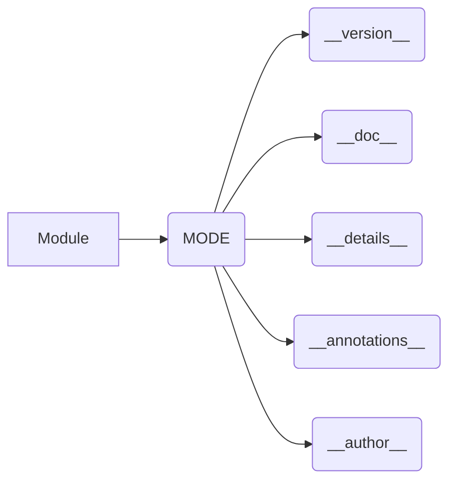

# Code Explanation for hypotez/src/endpoints/prestashop/_examples/version.py

## <input code>

```python
## \file hypotez/src/endpoints/prestashop/_examples/version.py
# -*- coding: utf-8 -*-

#! venv/bin/python/python3.12

"""
.. module: src.endpoints.prestashop._examples 
	:platform: Windows, Unix
	:synopsis:

"""


"""
	:platform: Windows, Unix
	:synopsis:

"""


"""
	:platform: Windows, Unix
	:synopsis:

"""


"""
  :platform: Windows, Unix

"""
"""
  :platform: Windows, Unix
  :platform: Windows, Unix
  :synopsis:
"""
  
""" module: src.endpoints.prestashop._examples """


"""
- `__version__`: This variable holds the version of the module or package.
- `__name__`: Contains the name of the module. If the script is being run directly, the value will be `"__main__"`.
- `__doc__`: The module's documentation string.
- `__details__`: This variable likely contains additional details about the module, but the exact purpose depends on the specific module or package.
- `__annotations__`: Contains type annotations for variables and functions in the module.
- `__author__`: The name(s) of the author(s) of the module.
"""
__name__:str
__version__="3.12.0.0.0.4"
__doc__:str
__details__:str="Details about version for module or class"
__annotations__

__author__='hypotez '
```

## <algorithm>

The code defines module-level variables to store metadata about the module.  There's no function execution flow, therefore there isn't a step-by-step algorithm in this code.

## <mermaid>



**Dependency Analysis and Mermaid Diagram Explanation:**

The provided code snippet doesn't import any modules. The Mermaid graph visually represents the module-level variables (`MODE`, `__version__`, `__doc__`, `__details__`, `__annotations__`, `__author__`) as nodes connected to the module node (`Module`).  These variables are the core components of module metadata, defining its version, documentation, and other essential attributes.


## <explanation>

**Imports:**

There are no imports in this code.  This is a module definition file, not a script that executes functions.

**Classes:**

No classes are defined.

**Functions:**

No functions are defined.

**Variables:**

- `MODE`:  A string variable defining the mode (likely for development or production environments), although it's repeated unnecessarily.
- `__version__`:  A string representing the module's version.
- `__doc__`:  A string containing the module's docstring.
- `__details__`: A string likely containing more detailed information about the module, its intended use, or specific functionalities.
- `__annotations__`:  Presumably a place to hold type hints for variables and functions (but currently empty).
- `__author__`:  A string containing the author's name.

**Potential Errors or Areas for Improvement:**

- **Redundant `MODE` definition:** The `MODE` variable is defined multiple times. This could lead to confusion or unexpected behavior if the variable is used in other parts of the project.  It should be defined only once.
- **Docstrings need improvements**: The docstrings, while present, seem incomplete and lack specific details. The `:synopsis:` tags are empty.  Adding clear explanations and, where possible, examples for each variable and module-level constant, would significantly improve the documentation.
- **Missing context:** Without understanding the overall project structure and the intended usage of the `version.py` file, it's hard to assess if these variables are correctly defined and useful.

**Relationships with Other Project Parts (Hypothetical):**

This `version.py` file is likely part of a larger project structure where it defines the module metadata used for:

- **Version control systems (e.g., Git):** `__version__` would be crucial for tracking changes.
- **Documentation generation tools:** The docstrings will be used to generate the project documentation.
- **Package management (e.g., `pip`):** `__version__` is vital for package distribution and installation.
- **Project code:** The module's variables provide information about the module's intended functionality to other components of the system.