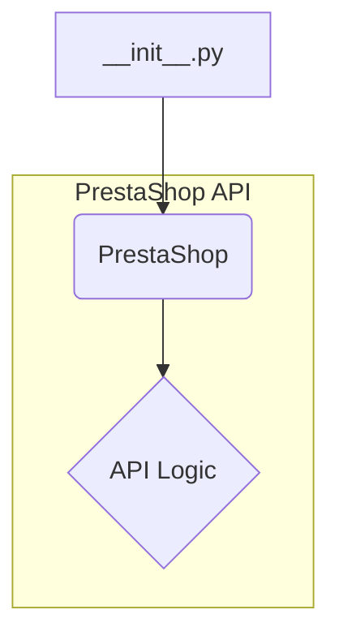

# <input code>

```python
## \file hypotez/src/endpoints/prestashop/api/__init__.py
# -*- coding: utf-8 -*-\

#! venv/bin/python/python3.12

"""
.. module: src.endpoints.prestashop.api 
	:platform: Windows, Unix
	:synopsis:

"""


from .api import PrestaShop
```

# <algorithm>

This file appears to be an initialization file for a PrestaShop API module within a larger project.  It likely acts as a starting point for accessing the PrestaShop API functionality.  The workflow is simple:

1. **Initialization**: The module sets a global variable `MODE` to 'dev'.  This likely controls configuration, such as whether the API is in development or production mode.


2. **Import**:  The module imports the `PrestaShop` class (or function) from the `.api` submodule within the same directory. This suggests that the core API logic is defined in a separate file named `api.py` located within the same `endpoints/prestashop/api` directory.

There is no actual processing or complex logic.  The `PrestaShop` class will be the primary component for interacting with the PrestaShop API.

# <mermaid>



**Explanation of Dependencies:**

The `PrestaShop` class, imported from `.api`, is the only external dependency. This suggests that the `api.py` file defines the API interaction, handling things like authentication, requests, and responses to the PrestaShop API.  The `__init__.py` file acts as a simple namespace import, pulling in the actual logic of handling these PrestaShop API calls.

# <explanation>

* **Imports:**
    * `from .api import PrestaShop`: This line imports the `PrestaShop` class (or function, but likely a class) from the `api.py` file located in the same directory. The `.` refers to the current directory, a common Python convention for importing modules. This import makes the `PrestaShop` class available for use in any code that imports this `__init__.py` file.


* **Classes:**
    * `PrestaShop`: This is the class imported and likely contains the methods for interacting with the PrestaShop API.  Details on its definition (attributes and methods) are not present in this file.


* **Functions:**
    * None. There are no function definitions in this file. The main role is importing necessary components.


* **Variables:**
    * ``: This variable is assigned the string value 'dev'. This variable is likely used for configuration, allowing different behaviors in development versus production environments.  It's a simple constant at this level.


* **Potential Errors or Improvements:**
    * The code is very basic and doesn't define any functionality itself; it only imports code from the `api` module. A more complete analysis would require examining the `api.py` file.


* **Relationships with Other Project Parts:**
    * This `__init__.py` file acts as a module interface. It likely exists in a larger project structure dealing with e-commerce interactions, possibly within a framework or application that uses the PrestaShop API. The relationships would depend on how the API and its functionalities are used in other parts of the project.  The structure would be something like `application --> API --> __init__.py --> api.py`


**In summary:** This is a simple Python module initialization file for a PrestaShop API. It imports the `PrestaShop` class, essential for API calls, which is presumably defined in the `.api` submodule (`api.py`).  To understand the full functionality of the PrestaShop interaction, the code in `api.py` must be examined.