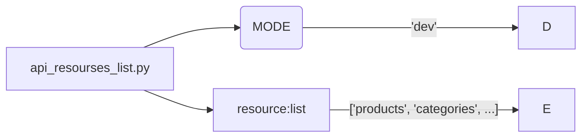

# Code Explanation: `hypotez/src/endpoints/prestashop/api_schemas/api_resourses_list.py`

## <input code>

```python
# -*- coding: utf-8 -*-\
#! venv/Scripts/python.exe
#! venv/bin/python/python3.12

"""
.. module: src.endpoints.prestashop.api_schemas 
	:platform: Windows, Unix
	:synopsis: Список всех доступных ресурсов для API вызовов

"""


resource:list = [
    'products',
    'categories',
    'attachments',
    'addresses',
    'carriers',
    'cart_rules',
    'carts',
    'countries',
    'content_management_system',
    'currencies',
    'customer_messages',
    'customer_threads',
    'customers',
    'customizations',
    'deliveries',
    'employees',
    'groups',
    'guests',
    'image_types',
    'customizations',
    'images',
    'languages',
    'manufacturers',
    'messages',
    'order_carriers',
    'order_cart_rules',
    'order_details',
    'order_histories',
    'order_invoices',
    'order_payments',
    'order_slip',
    'order_states',
    'orders',
    'price_ranges',
    'product_customization_fields',
    'product_feature_values',
    'product_features',
    'product_option_values',
    'product_options',
    'product_suppliers',
    'products',
    'search',
    'shop_groups',
    'shop_urls',
    'shops',
    'specific_price_rules',
    'specific_prices',
    'states',
    'stock_availables',
    'stock_movement_reasons',
    'stock_movements',
    'stocks',
    'stores',
    'suppliers',
    'supply_order_details',
    'supply_order_receipt_histories',
    'supply_order_states',
    'supply_orders',
    'tags',
    'tax_rule_groups',
    'tax_rules',
    'taxes',
    'translated_configurations',
    'warehouse_product_locations',
    'warehouses',
    'weight_ranges',
    'zones',
]
```

## <algorithm>

This file defines a list of resource names accessible via an API.  There is no significant algorithm in the current code. The function of this file is solely to declare the resource names for the API endpoints.

```
[Start] --> [Define resource list] --> [End]
```

Example:
```
[Start] --> ['products', 'categories', ...] --> [End]
```


## <mermaid>



**Dependency Analysis:**

This file doesn't import any modules; it's a simple list definition.  The mermaid diagram shows the direct relationship between the variable `resource:list` and the constant `MODE`.

## <explanation>

**Imports:**

No imports are present in this file.  This is a simple list definition.

**Classes:**

No classes are defined.

**Functions:**

No functions are defined.

**Variables:**

* `MODE`: A string variable, likely used to control the application mode (e.g., 'dev', 'prod').
* `resource:list`: A list variable containing strings, representing the different API resource names available.  The naming convention `:list` is unusual, Python doesn't require or use that notation. It's simply declaring a list.

**Potential Errors/Improvements:**

* **Type Hinting**:  Using `resource:list` as a type hint isn't incorrect, but it could be more explicitly Pythonic by just using `resource = []` and then populate with the elements.  Although this code is very simple, consider that in more complex projects, type hinting using `List[str]` or `List[typing.Literal['products', ...]]` could be useful for more static type checking.
* **Docstrings:** The docstrings provide context but could be more detailed.  Specifically mentioning the expected use cases, return types, or possible errors/exceptions would be valuable.
* **Readability:** Consider using a more structured way of declaring the resources (e.g., a dictionary with resource names as keys and related data) or use an external file for these data, if appropriate for the project.  For example, in a production-quality code base, we might store these values in a configuration file.


**Relationships with Other Parts:**

This file is likely part of a larger project that defines the API endpoints for accessing PrestaShop data.  The list of resources in `resource:list` will need to be used by other parts of the code (e.g., the API route definition in the controllers) to determine which endpoints are available. This code is a crucial piece in defining the structure and capability of the API interactions for PrestaShop data.
```