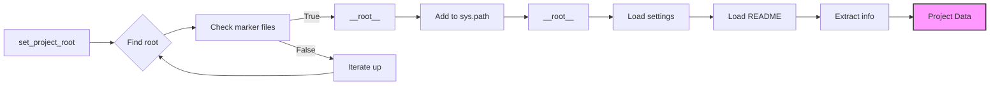

# Code Explanation: hypotez/src/logger/header.py

## <input code>

```python
## \file hypotez/src/logger/header.py
# -*- coding: utf-8 -*-\
#! venv/Scripts/python.exe
#! venv/bin/python/python3.12

"""
module: src.logger 
	:platform: Windows, Unix
	:synopsis: Модуль определяющий корневой путь к проекту. Все импорты строятся относительно этого пути.
    :TODO: В дальнейшем перенести в системную переменную"""
MODE = 'dev'

import sys
import json
from packaging.version import Version

from pathlib import Path
def set_project_root(marker_files=('pyproject.toml', 'requirements.txt', '.git')) -> Path:
    """
    Finds the root directory of the project starting from the current file's directory,
    searching upwards and stopping at the first directory containing any of the marker files.

    Args:
        marker_files (tuple): Filenames or directory names to identify the project root.
    
    Returns:
        Path: Path to the root directory if found, otherwise the directory where the script is located.
    """
    __root__:Path
    current_path:Path = Path(__file__).resolve().parent
    __root__ = current_path
    for parent in [current_path] + list(current_path.parents):
        if any((parent / marker).exists() for marker in marker_files):
            __root__ = parent
            break
    if __root__ not in sys.path:
        sys.path.insert(0, str(__root__))
    return __root__


# Get the root directory of the project
__root__ = set_project_root()
"""__root__ (Path): Path to the root directory of the project"""

from src import gs

settings:dict = None
try:
    with open(gs.path.root / 'src' / 'settings.json', 'r') as settings_file:
        settings = json.load(settings_file)
except (FileNotFoundError, json.JSONDecodeError):
    ...

doc_str:str = None
try:
    with open(gs.path.root / 'src' / 'README.MD', 'r') as settings_file:
        doc_str = settings_file.read()
except (FileNotFoundError, json.JSONDecodeError):
    ...


__project_name__ = settings.get("project_name", 'hypotez') if settings  else 'hypotez'
__version__: str = settings.get("version", '')  if settings  else ''
__doc__: str = doc_str if doc_str else ''
__details__: str = ''
__author__: str = settings.get("author", '')  if settings  else ''
__copyright__: str = settings.get("copyrihgnt", '')  if settings  else ''
__cofee__: str = settings.get("cofee", "Treat the developer to a cup of coffee for boosting enthusiasm in development: https://boosty.to/hypo69")  if settings  else "Treat the developer to a cup of coffee for boosting enthusiasm in development: https://boosty.to/hypo69"
```

## <algorithm>

1. **`set_project_root` function:**
   - Takes a tuple `marker_files` as input (defaults to `('pyproject.toml', 'requirements.txt', '.git')`).
   - Starts from the current file's directory (`__file__`).
   - Iterates through parent directories until it finds one containing any of the files in `marker_files`.
   - If found, sets `__root__` to that parent directory.
   - If the root directory isn't in `sys.path`, it adds it to the beginning of the path.
   - Returns the `__root__` Path object.

   *Example:* If `__file__` is `/path/to/project/src/logger/header.py`, and `/path/to/project/pyproject.toml` exists, `__root__` will be `/path/to/project/`.


2. **Initialization:**
   - Calls `set_project_root` to obtain the project root path.
   - Assigns the returned value to `__root__`.


3. **`settings` loading:**
   - Tries to read the `settings.json` file from the `src` folder under the project root.
   - Loads the JSON data into the `settings` dictionary.
   - If the file isn't found or parsing fails, assigns `None` to `settings`.


4. **`doc_str` loading:**
   - Tries to read the `README.MD` file from the `src` folder under the project root.
   - If successful, stores the content in the `doc_str` variable.
   - Handles `FileNotFoundError` or `json.JSONDecodeError` to prevent crashes.


5. **Project Information Extraction:**
   - Extracts project name, version, docstring, author, copyright, etc., from the `settings` dictionary (using `.get()` to handle missing keys gracefully).
   - Uses defaults if the keys are missing.


## <mermaid>



**Dependencies Analysis:**

- `sys`: Provides access to system-specific parameters and functions, like `sys.path`.
- `json`: Used for loading and parsing JSON data from `settings.json`.
- `packaging.version`: Used for potentially working with project versions, although not used directly in this code.
- `pathlib`: Used for working with file paths in a more object-oriented and robust way. `Path` object handles path construction and manipulation.
- `src.gs`: This is a custom module likely providing a `path` object with methods for working with the project root, which is referenced in the file paths. The `gs.path` object seems to be responsible for simplifying file path manipulation within the project.

## <explanation>

**Imports:**

- `sys`: For interacting with the Python interpreter's environment, including system paths.
- `json`: For handling JSON data, in this case to load project settings from `settings.json`.
- `packaging.version`: For potentially handling project versioning; though not directly used.
- `pathlib.Path`: For using an object-oriented approach to working with file paths. This leads to more readable and potentially less error-prone code.

**Classes:**

- No classes are defined.  `Path` from `pathlib` is a class representing paths.

**Functions:**

- `set_project_root(marker_files)`: This function is crucial for finding the project root directory. It's designed to handle projects in various locations.  The use of `marker_files` provides a robust way to identify the root—the function searches for one of several common project root indicators.  It also updates the `sys.path` to allow imports from the project's root directory.

**Variables:**

- `__root__`: Stores the path to the root directory of the project.
- `settings`: Stores the project settings loaded from `settings.json`.  Crucial for providing configuration data.
- `doc_str`: Stores the contents of the `README.MD` file.
- `MODE`: A variable containing the project mode ('dev').
- `__project_name__`, `__version__`, `__doc__`, `__details__`, `__author__`, `__copyright__`, `__cofee__`: These variables hold information about the project, extracted from the `settings.json` file.

**Potential Errors/Improvements:**

- **Error Handling:** The `try...except` blocks for loading `settings.json` and `README.MD` are good practice. However, consider more specific error handling (e.g., `FileNotFoundError` instead of a generic `Exception`).  Logging errors would be beneficial to understand problems during runtime.
- **`gs.path`:** It's unclear where `gs` and `gs.path` come from.  For better code maintainability, it's crucial to understand the structure of the `gs` module in the larger project.  Consider using a more descriptive name for `gs` (e.g., `project_utils` or `project_paths`).
- **`marker_files`:** The default values for `marker_files` are good choices, but considering more project specific markers would enhance robustness.

**Chain of Relationships:**

- `src.logger.header.py` depends on the `src` package (likely containing other modules/files) for the `gs` module.  Also, the `src` package may depend on other components as part of the larger project architecture.
- `settings.json` contains data crucial for the project configuration.
- `README.MD` contains project documentation and information.

```