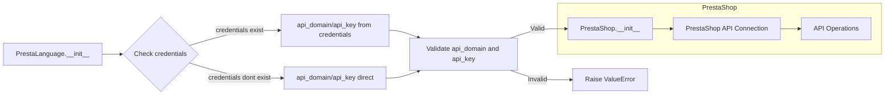

# Code Explanation for hypotez/src/endpoints/prestashop/language.py

## <input code>

```python
## \file hypotez/src/endpoints/prestashop/language.py
# -*- coding: utf-8 -*-\

#! venv/bin/python/python3.12

"""
.. module: src.endpoints.prestashop 
	:platform: Windows, Unix
	:synopsis:

"""


...
from types import SimpleNamespace
from .api import PrestaShop
from src import gs
from src.utils.printer import  pprint
from .api import PrestaShop
import header
from src.logger import logger
from src.logger.exceptions import PrestaShopException

from typing import Optional

class PrestaLanguage(PrestaShop):
    """ 
    Класс, отвечающий за настройки языков магазина PrestaShop.

    Пример использования класса:

    .. code-block:: python

        prestalanguage = PrestaLanguage(API_DOMAIN=API_DOMAIN, API_KEY=API_KEY)
        prestalanguage.add_language_PrestaShop('English', 'en')
        prestalanguage.delete_language_PrestaShop(3)
        prestalanguage.update_language_PrestaShop(4, 'Updated Language Name')
        print(prestalanguage.get_language_details_PrestaShop(5))
    """

    def __init__(self, 
                 credentials: Optional[dict | SimpleNamespace] = None, 
                 api_domain: Optional[str] = None, 
                 api_key: Optional[str] = None, 
                 *args, **kwards):
        """Инициализация класса PrestaLanguage.

        Args:
            credentials (Optional[dict | SimpleNamespace], optional): Словарь или объект SimpleNamespace с параметрами `api_domain` и `api_key`. Defaults to None.
            api_domain (Optional[str], optional): Домен API. Defaults to None.
            api_key (Optional[str], optional): Ключ API. Defaults to None.
        """

        if credentials is not None:
            api_domain = credentials.get('api_domain', api_domain)
            api_key = credentials.get('api_key', api_key)

        if not api_domain or not api_key:
            raise ValueError('Необходимы оба параметра: api_domain и api_key.')

        super().__init__(api_domain, api_key, *args, **kwards)


```

## <algorithm>

**Step-by-step workflow:**

1. **Initialization (PrestaLanguage):**  The `__init__` method initializes the `PrestaLanguage` class, taking optional `credentials`, `api_domain`, and `api_key` parameters. It handles cases where `credentials` are provided, prioritizing the values within the credentials object over explicitly supplied values.  **Example:** If `credentials = {'api_domain': 'example.com', 'api_key': '123'}` and `api_domain` is not supplied,  `api_domain` will be set to 'example.com'.
2. **Validation:** Checks if `api_domain` and `api_key` are present after possible updates from `credentials`. If either is missing, it raises a `ValueError`.
3. **Inheritance:** Calls the `__init__` method of the parent class (`PrestaShop`) to perform further initialization. This implies that the `PrestaShop` class exists and handles connection logic to the PrestaShop API.

## <mermaid>



**Dependency Analysis:**

* `types.SimpleNamespace`:  Provides a way to create simple objects with attributes, used for managing configuration data.
* `.api import PrestaShop`: Imports a class presumably related to making API requests to PrestaShop, defining the base structure for PrestaShop interactions (likely within the same directory `./api`).  This is a crucial dependency defining the parent class.
* `src import gs`: Imports a module (`gs`) from the `src` package, likely a utility library within the project.
* `src.utils.printer import pprint`: Imports a printing utility function likely for formatted output.
* `src.logger import logger`: Imports a logging module.
* `src.logger.exceptions import PrestaShopException`: Imports custom exceptions related to PrestaShop operations.
* `typing.Optional`:  From the standard library, used for optional type hints.
* `header`: Imports a potentially crucial module, likely containing configuration or import statements essential for the program's execution context.  **This requires further investigation to understand its exact role** within this file.


## <explanation>

* **Imports:**
    * `from types import SimpleNamespace`: Used to create namespace objects, allowing easy access to attributes.
    * `from .api import PrestaShop`: Imports the `PrestaShop` class from the `api.py` file in the same directory, showcasing a relationship. This is crucial as it forms the base functionality for interacting with the PrestaShop API.
    * `from src import gs`: Imports the `gs` module from the `src` package (other project modules).  This likely contains utility functions or data related to the application.
    * `from src.utils.printer import pprint`: Imports `pprint` for potentially pretty-printing data or logs.
    * `import header`: Imports a module crucial for initial setup and configuration.
    * `from src.logger import logger`: Imports a logging module likely providing structured logging.
    * `from src.logger.exceptions import PrestaShopException`: Imports custom exceptions that are likely tailored for PrestaShop-related errors in the application.
    * `from typing import Optional`: Enables optional type hints, improving code readability and maintainability.


* **Classes:**
    * `PrestaLanguage(PrestaShop)`: This class inherits from the `PrestaShop` class, likely containing fundamental methods for interacting with the PrestaShop API (e.g., making requests). The `PrestaLanguage` class adds methods to handle specific language-related operations within PrestaShop.


* **Functions:**
    * `__init__`: This is the constructor for the `PrestaLanguage` class.  It takes optional credentials, domain, and API key. The crucial step is validating that `api_domain` and `api_key` are provided.


* **Variables:**
    * ``: A constant likely defining the application's mode (development, production, etc.).


* **Potential Errors/Improvements:**
    * The `header` import is somewhat problematic without more context.  The code relies on this module for essential functionality, making the code dependent on external factors.  Identifying the purpose of this module would increase understanding and help ascertain potential dependencies.
    * The use of multiple `PrestaShop` imports in the same file is slightly unusual.  Check for a possible typo or duplication if there are any similar classes.
    * Consider better error handling.  While the code raises a `ValueError`, more context-specific exceptions might be preferable for better debugging.

**Relationship Chain:**

`language.py` relies on `api.py` for basic PrestaShop API interaction, which in turn depends on other parts of the `src` package (including, but not limited to, logging, utilities, and potentially data access layers). The `header` module acts as an intermediary, affecting the initialization of crucial project components (such as the initial configuration settings).  The chain further implies potential dependencies on external libraries or configuration files to work properly.