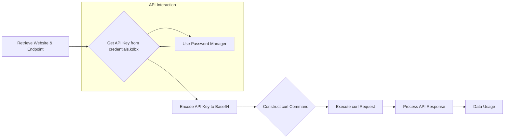

```MD
# Managing PrestaShop Websites

This README file explains the structure and usage of your PrestaShop websites, as well as the storage and use of API keys.

## <input code>

```
# Managing PrestaShop Websites

This `README` file explains the structure and usage of your PrestaShop websites, as well as the storage and use of API keys.

## Websites

Your PrestaShop websites:
1. [e-cat.co.il](https://e-cat.co.il)
2. [emil-design.com](https://emil-design.com)
3. [sergey.mymaster.co.il](https://sergey.mymaster.co.il)

Each of these websites uses APIs to interact with various parameters and functions.

## Storing API Keys

API keys for each website are stored in the `credentials.kdbx` file. This file is a secure password database and contains the following data for each website:
- Website URL
- API Key
- Additional metadata (if necessary)

To work with the keys from the file, use a password manager that supports the `.kdbx` format, such as [KeePass](https://keepass.info/) or [KeePassXC](https://keepassxc.org/).

## Example API Usage

To connect to the API of one of your websites, follow the template below:

### API Request Example

**API Request Template:**
```bash
curl -X GET 'https://<SITE_URL>/api/<endpoint>' \
-H 'Authorization: Basic <base64(API_KEY)>'
```

**Parameter Explanation:**
- `<SITE_URL>` — the website address, e.g., `e-cat.co.il`.
- `<endpoint>` — the API endpoint (e.g., `products`, `customers`).
- `<API_KEY>` — the API key, encoded in Base64.

### Example API Call
To fetch a list of products from `e-cat.co.il`:
```bash
curl -X GET 'https://e-cat.co.il/api/products' \
-H 'Authorization: Basic <base64(API_KEY)>'
```

## Security Recommendations

- Never share the `credentials.kdbx` file with others.
- Ensure the file is stored in a secure location accessible only to you.
- Regularly update your API keys and database passwords.

## Additional Resources

If you encounter any issues or have questions about connecting to the API, refer to the [official PrestaShop API documentation](https://devdocs.prestashop.com/), which provides information on available endpoints and how to interact with them.
```

## <algorithm>

This document describes the process of interacting with PrestaShop APIs, focusing on the steps involved in making API requests.  It doesn't outline an algorithm in a formal step-by-step flowchart manner, since there isn't a program or specific logic. The document provides a high-level overview.


1. **Identify the website:** Determine which PrestaShop website (e-cat.co.il, emil-design.com, etc.) requires an API call.

2. **Determine the API endpoint:**  Specify the desired function or data from the API. (e.g., 'products', 'customers').

3. **Retrieve API key:** Access the `credentials.kdbx` file to obtain the correct API key for the identified website.  Use a password manager to securely handle the sensitive information.

4. **Encode the API key:**  Convert the API key into Base64 format.

5. **Construct the API request:** Combine the website URL, endpoint, and Base64 encoded API key into the `curl` command format.

6. **Execute the API request:** Use `curl` (or a similar HTTP client) to send the constructed request to the PrestaShop API.

7. **Process the response:** Handle the response from the API (likely JSON or XML).  Extract the desired data from the response.


## <mermaid>



**Dependencies:**

The provided code doesn't use any specific imports or dependencies. The diagram illuStartes a high-level API interaction, not an implementation in any particular programming language.  It relies on the `curl` command-line tool for making HTTP requests.


## <explanation>

**Imports:**

There are no imports in the provided code (it's a README file).

**Classes:**

There are no classes in the provided code.


**Functions:**

The code describes steps in the process of making API calls. No actual functions are defined, it provides examples.


**Variables:**

The code doesn't define any variables.


**Potential Errors or Areas for Improvement:**

- **Security:**  Storing API keys in a `.kdbx` file is more secure than plain text, but a more modern approach would involve environment variables or dedicated secret management tools.

- **Error Handling:** The `README` lacks how to handle potential errors like network issues, invalid API keys, or incorrect endpoints, which is crucial in production systems.

- **Scalability:** The `curl` example is suitable for individual requests; for automated or scalable solutions, consider libraries/frameworks that handle API interactions.


**Relationships with other parts of the project:**

The README describes how to interact with the PrestaShop APIs, therefore, the relationships exist implicitly with the external PrestaShop system and potentially with any code that uses these APIs in a higher-level application. The provided code excerpt doesn't have any dependencies on any internal project files.