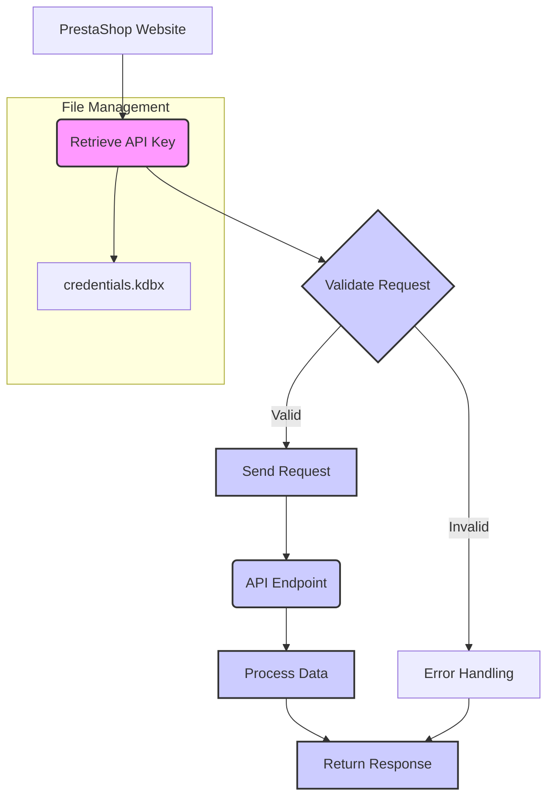

# Управление сайтами на PrestaShop

## <input code>

```
# Управление сайтами на PrestaShop

Данный `README` файл описывает структуру и способ работы с сайтами на платформе PrestaShop, а также хранение и использование ключей API.

## Сайты

Ваши сайты, работающие на PrestaShop:
1. [e-cat.co.il](https://e-cat.co.il)
2. [emil-design.com](https://emil-design.com)
3. [sergey.mymaster.co.il](https://sergey.mymaster.co.il)

Каждый из этих сайтов использует API для взаимодействия с различными параметрами и функциями.

## Хранение ключей API

Ключи API для каждого сайта хранятся в файле `credentials.kdbx`. Этот файл является защищенной базой данных паролей и содержит следующие данные для каждого сайта:
- URL сайта
- Ключ API
- Дополнительные метаданные (если необходимо)

Для работы с ключами из файла используйте менеджер паролей, поддерживающий формат `.kdbx`, например, [KeePass](https://keepass.info/) или [KeePassXC](https://keepassxc.org/).

## Пример использования API

Чтобы подключиться к API одного из сайтов, следуйте следующему шаблону:

### Запрос данных через API

**Шаблон API-запроса:**
```bash
curl -X GET 'https://<URL_сайта>/api/<endpoint>' \
-H 'Authorization: Basic <base64(API_KEY)>'
```

**Объяснение параметров:**
- `<URL_сайта>` — адрес сайта, например, `e-cat.co.il`.
- `<endpoint>` — конечная точка API (например, `products`, `customers`).
- `<API_KEY>` — ключ API, закодированный в формате Base64.

### Пример вызова API
Для получения списка продуктов на сайте `e-cat.co.il`:
```bash
curl -X GET 'https://e-cat.co.il/api/products' \
-H 'Authorization: Basic <base64(API_KEY)>'
```

## Рекомендации по безопасности

- Никогда не передавайте файл `credentials.kdbx` третьим лицам.
- Убедитесь, что файл находится в защищенном месте, доступном только вам.
- Регулярно обновляйте ключи API и пароли для базы данных.

## Дополнительно

Если у вас возникли вопросы или трудности с подключением, ознакомьтесь с [официальной документацией PrestaShop API](https://devdocs.prestashop.com/), где представлена информация о доступных конечных точках и способах работы с ними.
```

## <algorithm>

This document describes the process of interacting with PrestaShop APIs.  The algorithm focuses on how to access and utilize API keys for different PrestaShop sites.

**Step 1: Site identification and access.**

*   Identify the PrestaShop website (e.g., e-cat.co.il, emil-design.com).
*   Obtain the API key for the target website.


**Step 2: Retrieve API key from credentials.**

*   Access `credentials.kdbx` (encrypted password database).
*   Retrieve the API key and the website URL from the database for the target website.
*   Use a password manager (like KeePass or KeePassXC) to interact with the encrypted database.

**Step 3: Construct API request.**

*   Build the API request URL: `https://<URL_сайта>/api/<endpoint>`.
*   Encode the API key using Base64.
*   Include the encoded key in the Authorization header: `Authorization: Basic <base64(API_KEY)>`.
*   Example:  `https://e-cat.co.il/api/products` with the appropriate API key.

**Step 4: Execute API request.**

*   Use `curl` (or a similar tool) to send the GET request to the API endpoint.
*   The response (e.g., a list of products) is received.


## <mermaid>



**Dependencies and Explanation:**

*   No direct imports are present in this README, hence no dependencies. This is a usage guide, not a code module. The diagram shows the process flow for interacting with PrestaShop APIs, highlighting steps such as retrieving keys from a secure storage (`credentials.kdbx`).

## <explanation>

* **Imports:** There are no imports as this is a markdown file.
* **Classes:** There are no classes defined.
* **Functions:** No functions are defined.
* **Variables:** The code defines no variables, but it does use placeholders (e.g., `<URL_сайта>`) for dynamic values.
* **Potential errors or areas for improvement:**
    *   The document lacks detailed information about `credentials.kdbx` format, encryption method, or security measures.
    *   The use of Base64 encoding is mentioned but not explained in detail.
    *   The document doesn't specify how the `credentials.kdbx` file is generated, and how to access it safely in an application.

**Chain of Relationships:**

The relationships are implicit. This README describes how to use the PrestaShop API, which implies a relationship to the PrestaShop platform and the libraries/applications that interact with it. The document also implies a relationship with external tools like `curl` which would be used in an application to execute the API calls.  The core relationship is that the document explains how to use a system involving external APIs.