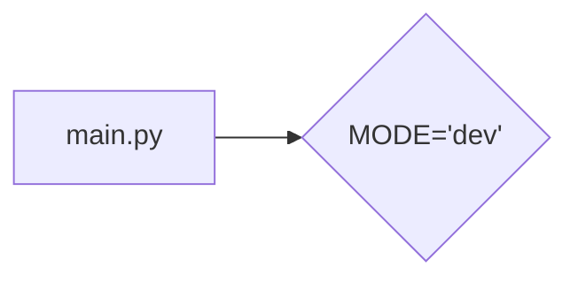

# Code Analysis of hypotez/src/fast_api/gemini/backend/main.py

## <input code>

```python
## \file hypotez/src/fast_api/gemini/backend/main.py
# -*- coding: utf-8 -*-\

#! venv/bin/python/python3.12

"""
.. module: src.fast_api.gemini.backend 
	:platform: Windows, Unix
	:synopsis:

"""


"""
	:platform: Windows, Unix
	:synopsis:

"""


"""
	:platform: Windows, Unix
	:synopsis:

"""


"""
  :platform: Windows, Unix

"""
"""
  :platform: Windows, Unix
  :platform: Windows, Unix
  :synopsis:
"""
  
""" module: src.fast_api.gemini.backend """


```

## <algorithm>

No algorithm is present. The code is a simple Python file containing comments and a single variable assignment.  There's no function or class definition, making a step-by-step workflow diagram impossible.

## <mermaid>



**Dependencies Analysis**:

No imports are present. The diagram shows a single variable assignment.


## <explanation>

* **Imports**: No imports are present in this file. This is a typical Python file structure. The comments at the beginning are used to document the module (but not functional).

* **Classes**: No classes are defined.

* **Functions**: No functions are defined.

* **Variables**:  `MODE`: A string variable assigned the value 'dev'.  This variable likely represents a mode or configuration setting for the application.  It's a simple global variable and its meaning depends entirely on the rest of the project's architecture.  Its usage will be found in other modules or functions.

* **Potential Errors or Areas for Improvement**:
    * **Missing Functionality**: The file has no meaningful functionality. It only defines a global variable.  The comments seem to indicate the intent is to use this variable for mode control, but no code exists to use this variable in this file.  This file will need to be connected to and called by other Python scripts within the project.

* **Relationship with other parts of the project**: The variable `MODE` will likely be used and interpreted by other parts of the `fast_api/gemini/backend` package and potentially other modules in the project.  Without more context (further code), it's impossible to give a specific explanation of how it's used. This variable's purpose is part of a larger project architecture and it's not self-contained. The file's purpose is to set this variable for later use by other parts of the application.