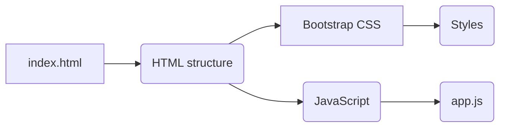

# Code Explanation for hypotez/src/fast_api/gemini/frontent/index.html

## <input code>

```html
## \file hypotez/src/fast_api/gemini/frontent/index.html
# -*- coding: utf-8 -*-\


""" module: src.fast_api.gemini.frontent """
MODE = 'debug'
<!DOCTYPE html>
<html lang="en">
<head>
    <meta charset="UTF-8">
    <meta name="viewport" content="width=device-width, initial-scale=1.0">
    <title>Chat with Generative AI</title>
    <link rel="stylesheet" href="/static/bootstrap.min.css">
    <style>
        body {
            padding: 2rem;
        }
    </style>
</head>
<body>
    <div class="container">
        <h1>AI Chat Interface</h1>
        <div id="chat-app"></div>
    </div>

    <script type="text/babel" src="/static/app.js"></script>
</body>
</html>
```

## <algorithm>

This code snippet is an HTML file, likely a template for a web application.  A step-by-step workflow diagram is not applicable as it's purely a front-end template. The code's structure is defined within the typical HTML structure.

## <mermaid>



**Explanation of Dependencies:**

*   **`index.html`**:  The main HTML file.
*   **`/static/bootstrap.min.css`**: This external stylesheet is linked, likely for standard styling.  This suggests a dependency on the Bootstrap CSS library.
*   **`/static/app.js`**: This JavaScript file is loaded, indicating it's likely responsible for the dynamic behavior of the chat application.  A dependency on this JavaScript file is implied, and it will likely make API calls to the backend.

## <explanation>

*   **Imports:** There are no explicit imports in the traditional programming sense. The HTML file uses external resources:
    *   `/static/bootstrap.min.css`: Imports the Bootstrap CSS for styling.
    *   `/static/app.js`: Imports the JavaScript source code for the application's logic and UI interactions.
*   **Classes:** There are no classes defined in this HTML file. HTML elements define structure, but are not objects with their own attributes and methods.
*   **Functions:** No functions are defined; this is HTML.
*   **Variables:**
    *   `MODE = 'debug'`:  A global variable within this HTML file and likely sets the mode for the application, probably useful for debugging purposes (e.g. logging).
*   **Potential Errors or Improvements:**
    *   **Missing JavaScript Logic:** The script tag loading `/static/app.js` is crucial; without it, the client-side logic won't work.
    *   **Server-Side Rendering:**  The `/static` directory is needed on the server, and it suggests a possible server-side rendering (SSR) environment with routing.  The `` comment in the file header suggests a Python/Flask (or similar) backend.
    *   **Dynamic Content:**  The `<div id="chat-app"></div>` element is meant to be dynamically populated with data by the JavaScript file `app.js`. This will likely perform AJAX or similar requests to the backend (`src.fast_api.gemini.backent`) for dynamic updates to the chat interface.

**Relationships with Other Project Components:**

This HTML file relies on the following components of the larger project.

1.  **`/static/bootstrap.min.css`**: This file should be generated by the `src.fast_api.gemini` package or have a reference to it.
2.  **`/static/app.js`**: This JavaScript file is a key component of the client-side application logic and will interact with the backend (`src.fast_api.gemini.backend`).
3.  **`src.fast_api.gemini.backend`**: The backend is expected to handle requests from the frontend. The `/static/app.js` file will send requests to the backend via JavaScript.  These calls will likely fetch data about the chat, or send messages to the backend to be processed.

This HTML file is a template for a dynamic UI.  The JavaScript (`app.js`) will manipulate the DOM and communicate with the backend, likely implemented with Python's FastAPI, to render the dynamic parts of the chat interface.