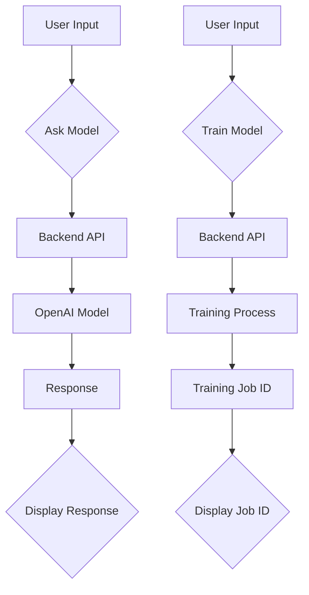

# Code Explanation for hypotez/src/fast_api/html/openai/index.html

## <input code>

```html
<!-- Code from the provided HTML file -->
```

## <algorithm>

A step-by-step workflow diagram is difficult to represent in a textual format for this HTML. The HTML primarily serves as a user interface for interacting with a backend API (likely a FastAPI application). The backend API would handle the logic for asking the model and training it.  The algorithm is essentially driven by user interactions on the frontend (via JavaScript).


## <mermaid>



**Dependencies Analysis:**

* **Bootstrap:** The HTML imports Bootstrap for styling. This is a CSS framework, and no direct dependencies with `src` package exist.
* **AngularJS:** AngularJS is used for handling client-side logic, specifically for dynamic updates of the UI. No direct dependency with `src` package.
* **jQuery, Popper, Bootstrap JS:** jQuery and Popper.js provide necessary functionality for Bootstrap's JavaScript components. The Javascript components interact with the AngularJS controllers to update the user interface. No direct dependency with `src` package.


## <explanation>

This HTML file serves as a frontend interface for interacting with an OpenAI model through a FastAPI backend.  Let's break down the components:

**Imports:**

* `https://stackpath.bootstrapcdn.com/bootstrap/4.5.2/css/bootstrap.min.css`: Bootstrap CSS framework for styling.  This is an external resource, not a dependency within the `src` package.
* `https://code.angularjs.org/1.8.2/angular.min.js`: AngularJS JavaScript framework. Used for handling client-side logic.  External resource, not part of the `src` package.
* Other JavaScript libraries (`jquery`, `popper.js`, `bootstrap js`) for handling interactions on the web page, and part of the bootstrap framework are also imported as external resources.


**Classes:**

* There are no classes defined within this HTML file in the conventional OOP sense.  AngularJS `ng-controller` creates a controller which is not strictly a class, and functions as a scope object for the HTML structure.


**Functions (within the JavaScript part of the HTML):**

* `vm.askModel()`: This function handles interaction for asking the model. It takes the user's message and optional system instruction as arguments, makes an HTTP POST request to the `/ask` endpoint (likely on the backend), receives a response, and updates the UI to display the result. The handling of the error response is included in the `catch` block.
* `vm.trainModel()`: This function handles training the model. It takes the user's training data (as a CSV string) and sends a POST request to the `/train` endpoint on the backend.  It expects a `job_id` to be returned. The `positive` boolean is also passed to the backend, likely for training type (positive examples).


**Variables:**

* `vm.message`, `vm.systemInstruction`, `vm.trainingData`, `vm.response`, `vm.jobId`: These variables store user inputs (message, instruction, and training data) and responses/results from the backend API calls, and the job id when training the model.  They are declared within the `MainController` using AngularJS.  Their type is determined by the AngularJS framework, and values are dynamically updated.


**Potential Errors/Improvements:**

* **Error Handling:** While the code includes error handling for both `askModel` and `trainModel`, the error messages could be more informative (showing the specific error from the API).  Consider using more detailed error handling (e.g., catching specific exceptions and logging more specific information).
* **Input Validation:**  The HTML should validate the training data (e.g., ensure it's a valid CSV format) before sending it to the backend to prevent potential errors on the backend.  Validate the data on the frontend (using JavaScript) to improve the robustness of the app.

**Relationships with other parts of the project:**

* This HTML file is tightly coupled with a backend FastAPI application (which is not included here but is essential for processing the model requests and training). The `/ask` and `/train` endpoints on the backend are crucial.  The backend is responsible for handling communication with the OpenAI API (likely through the `openai` python library) and handling the training of the model, while this file acts as an intermediary. The backend would likely need a separate model handling service (class/module) for managing communication with OpenAI.  Therefore the dependencies should be analyzed by understanding the roles of the FastAPI modules and services being used as the back-end layer of the application.

**Chain of Relationships:**
1. User interacts with the front end HTML.
2. JavaScript in the HTML constructs the necessary input data.
3. JavaScript makes a POST request to a FastAPI backend endpoint.
4. FastAPI backend processes the request, potentially communicating with an OpenAI API.
5. FastAPI returns a response (or a job ID).
6. The response is received by the JavaScript in the HTML, and updates the UI.