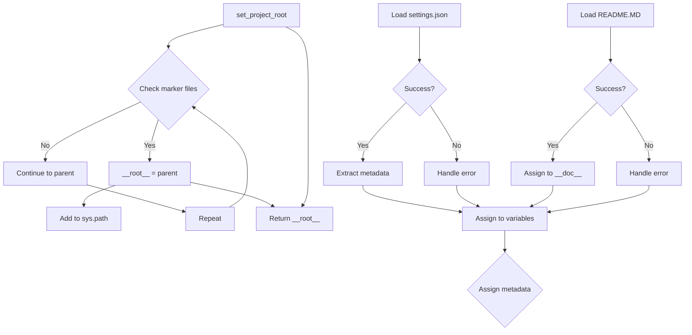

# Code Explanation for hypotez/src/goog/drive/header.py

## <input code>

```python
# -*- coding: utf-8 -*-\
#! venv/Scripts/python.exe
#! venv/bin/python/python3.12

"""
.. module: src.goog.drive 
	:platform: Windows, Unix
	:synopsis:

"""


import sys
import json
from packaging.version import Version

from pathlib import Path
def set_project_root(marker_files=('__root__')) -> Path:
    """
    Finds the root directory of the project starting from the current file's directory,
    searching upwards and stopping at the first directory containing any of the marker files.

    Args:
        marker_files (tuple): Filenames or directory names to identify the project root.
    
    Returns:
        Path: Path to the root directory if found, otherwise the directory where the script is located.
    """
    __root__:Path
    current_path:Path = Path(__file__).resolve().parent
    __root__ = current_path
    for parent in [current_path] + list(current_path.parents):
        if any((parent / marker).exists() for marker in marker_files):
            __root__ = parent
            break
    if __root__ not in sys.path:
        sys.path.insert(0, str(__root__))
    return __root__


# Get the root directory of the project
__root__ = set_project_root()
"""__root__ (Path): Path to the root directory of the project"""

from src import gs

settings:dict = None
try:
    with open(gs.path.root / 'src' / 'settings.json', 'r') as settings_file:
        settings = json.load(settings_file)
except (FileNotFoundError, json.JSONDecodeError):
    ...

doc_str:str = None
try:
    with open(gs.path.root / 'src' / 'README.MD', 'r') as settings_file:
        doc_str = settings_file.read()
except (FileNotFoundError, json.JSONDecodeError):
    ...


__project_name__ = settings.get("project_name", 'hypotez') if settings  else 'hypotez'
__version__: str = settings.get("version", '')  if settings  else ''
__doc__: str = doc_str if doc_str else ''
__details__: str = ''
__author__: str = settings.get("author", '')  if settings else ''
__copyright__: str = settings.get("copyrihgnt", '')  if settings else ''
__cofee__: str = settings.get("cofee", "Treat the developer to a cup of coffee for boosting enthusiasm in development: https://boosty.to/hypo69")  if settings else "Treat the developer to a cup of coffee for boosting enthusiasm in development: https://boosty.to/hypo69"
```

## <algorithm>

1. **`set_project_root` Function:**
   - Takes a tuple of marker files as input.
   - Starts from the current file's directory.
   - Traverses up the directory tree.
   - Checks if any of the marker files exist in the current directory.
   - If found, sets `__root__` to the current directory and breaks the loop.
   - If not found, continues to the parent directory.
   - Adds the found root directory to `sys.path` if it's not already present.
   - Returns the root directory.

   **Example:**
   - Input: `marker_files = ('pyproject.toml', 'requirements.txt')`
   - Current file location: `/path/to/project/goog/drive/header.py`
   - The algorithm traverses `/path/to/project/goog/drive`, `/path/to/project/goog`, `/path/to/project`, until it finds a directory with `pyproject.toml` or `requirements.txt`.
   - Output: `/path/to/project`

2. **Getting Project Settings:**
   - Calls `set_project_root` to get the project root directory.
   - Tries to load settings from `gs.path.root / 'src' / 'settings.json'`.  Handles `FileNotFoundError` and `json.JSONDecodeError` gracefully.
   - Tries to load documentation string from `gs.path.root / 'src' / 'README.MD'`. Handles `FileNotFoundError` and `json.JSONDecodeError` gracefully.

   **Example:**
   - Project root is `/path/to/project`.
   - `settings.json` might contain the project name and version.
   - `README.MD` contains the project documentation.

3. **Extracting Metadata:**
   - Extracts `project_name`, `version`, `doc`, `author`, `copyright`, `cofee` from `settings` or default values if `settings` is missing or keys are missing.
   - Assigns these to respective variables `__project_name__`, `__version__`, `__doc__`, and so on.


## <mermaid>



**Dependencies:**

- `sys`: Provides access to system-specific parameters and functions.
- `json`: Used for handling JSON data.
- `packaging.version`: Used for handling and comparing software versions.
- `pathlib`: Provides object-oriented way of working with paths.
- `gs`: A package (likely within the `src` directory), probably a wrapper for Google Drive functionalities; the imported `gs.path` implies file handling that is presumably tailored to the specific Google Drive integration.


## <explanation>

- **Imports:**
    - `sys`: Used to add the project root directory to the Python path (`sys.path`). This is crucial for importing modules from the project's source directory, especially when running the script from a different directory than the project's root.
    - `json`: Used for loading and parsing the project's settings from `settings.json`.
    - `packaging.version`: Used for version handling in a structured manner, enabling comparison and validation of project versions.
    - `pathlib`: Used for creating and manipulating file paths in a platform-independent way.
    - `gs`: This is a custom package (likely part of the `src` module structure). Its `gs.path` submodule likely contains functions for handling file paths related to Google Drive integration.

- **Classes:**  No classes are defined in this file.

- **Functions:**
    - `set_project_root(marker_files)`: This function is crucial for locating the project root directory. It searches upwards from the current file's location until it finds a directory containing any of the specified marker files (e.g., `pyproject.toml`, `requirements.txt`, `.git`). It returns the found root directory. This function adds the root directory to `sys.path` to enable importing modules from the project.

- **Variables:**
    - `MODE`: A string defining the current mode (e.g., 'dev', 'prod').
    - `__root__`: A `pathlib.Path` object holding the absolute path to the project root directory.
    - `settings`: A dictionary containing project settings loaded from `settings.json`.
    - `doc_str`: Contains the documentation string from the README.md file, useful for project information.
    - `__project_name__`, `__version__`, `__doc__`, `__details__`, `__author__`, `__copyright__`, `__cofee__`: Variables holding extracted metadata about the project from the `settings.json` file. They are set to default values in case the `settings.json` doesn't exist or relevant keys are missing.

- **Potential Errors/Improvements:**
    - Error Handling: The `try...except` blocks for loading settings and the README file are good, but could be made more specific.  Instead of catching `json.JSONDecodeError`, it's probably better to catch `json.JSONDecodeError`. This would make it easier to debug problems with the JSON structure.
    - `gs.path.root`: The use of `gs.path.root` assumes a specific structure for file paths and Google Drive integration.
    -  Logging: Adding logging to the `set_project_root` function could provide more information about the search path. Logging errors encountered when loading `settings.json` and the `README.MD` could also aid in debugging.

- **Relationships:**
   - This file relies heavily on the `src` package, specifically the `gs` module, to handle Google Drive-related operations and finding the project root directory. The `settings.json` and `README.MD` files contain metadata that are expected to exist in the project's root directory for this script to function properly.