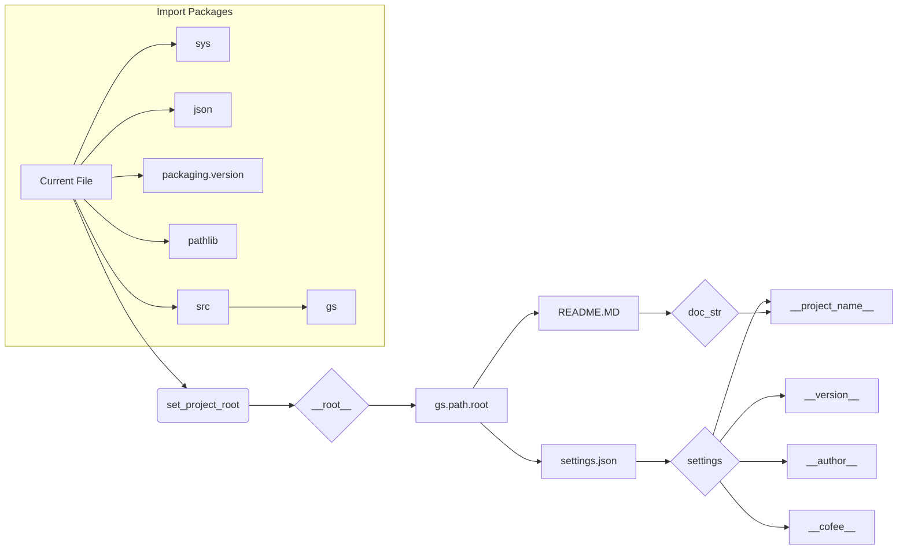

```MD
# Code Explanation: hypotez/src/goog/gtranslater/header.py

## <input code>

```python
## \file hypotez/src/goog/gtranslater/header.py
# -*- coding: utf-8 -*-\n#! venv/Scripts/python.exe
#! venv/bin/python/python3.12

"""
.. module: src.goog.gtranslater 
	:platform: Windows, Unix
	:synopsis:

"""


"""
	:platform: Windows, Unix
	:synopsis:

"""


"""
	:platform: Windows, Unix
	:synopsis:

"""


"""
  :platform: Windows, Unix

"""
"""
  :platform: Windows, Unix
  :platform: Windows, Unix
  :synopsis:
"""
  
""" module: src.goog.gtranslater """

import sys
import json
from packaging.version import Version

from pathlib import Path
def set_project_root(marker_files=('__root__','.git')) -> Path:
    """
    Finds the root directory of the project starting from the current file's directory,
    searching upwards and stopping at the first directory containing any of the marker files.

    Args:
        marker_files (tuple): Filenames or directory names to identify the project root.
    
    Returns:
        Path: Path to the root directory if found, otherwise the directory where the script is located.
    """
    __root__:Path
    current_path:Path = Path(__file__).resolve().parent
    __root__ = current_path
    for parent in [current_path] + list(current_path.parents):
        if any((parent / marker).exists() for marker in marker_files):
            __root__ = parent
            break
    if __root__ not in sys.path:
        sys.path.insert(0, str(__root__))
    return __root__


# Get the root directory of the project
__root__ = set_project_root()
"""__root__ (Path): Path to the root directory of the project"""

from src import gs

settings:dict = None
try:
    with open(gs.path.root / 'src' /  'settings.json', 'r') as settings_file:
        settings = json.load(settings_file)
except (FileNotFoundError, json.JSONDecodeError):
    ...

doc_str:str = None
try:
    with open(gs.path.root / 'src' /  'README.MD', 'r') as settings_file:
        doc_str = settings_file.read()
except (FileNotFoundError, json.JSONDecodeError):
    ...


__project_name__ = settings.get("project_name", 'hypotez') if settings  else 'hypotez'
__version__: str = settings.get("version", '')  if settings  else ''
__doc__: str = doc_str if doc_str else ''
__details__: str = ''
__author__: str = settings.get("author", '')  if settings  else ''
__copyright__: str = settings.get("copyrihgnt", '')  if settings  else ''
__cofee__: str = settings.get("cofee", "Treat the developer to a cup of coffee for boosting enthusiasm in development: https://boosty.to/hypo69")  if settings  else "Treat the developer to a cup of coffee for boosting enthusiasm in development: https://boosty.to/hypo69"
```

## <algorithm>

1. **Import Modules:** Import necessary modules like `sys`, `json`, `Path`, `Version`, and potentially others from within the `src` packages.  
2. **`set_project_root` function:**
   - Takes a tuple of marker files (e.g., `pyproject.toml`, `requirements.txt`) as input.
   - Resolves the current file's path and starts searching upward through parent directories. 
   - Checks if any of the marker files exist in the current directory or any parent directory.
   - If a marker file is found, it sets `__root__` to the parent directory and exits the loop.
   - Adds the `__root__` to `sys.path`.
   - Returns the `__root__`. 
   
3. **Project Root Retrieval:** Calls `set_project_root` to get the project's root directory and stores it in `__root__`.
4. **Settings Retrieval:** Tries to load settings from `gs.path.root / 'src' / 'settings.json'`. Uses a `try-except` block to handle potential `FileNotFoundError` or `json.JSONDecodeError` issues.
5. **Documentation Retrieval:** Tries to load documentation from `gs.path.root / 'src' / 'README.MD'`. Uses a `try-except` block to handle potential `FileNotFoundError` or `json.JSONDecodeError` issues.
6. **Setting Global Variables:** Extracts values from the `settings` dictionary or sets default values if `settings` is `None`.

Example data flow:

```
[current_file_path] --> set_project_root() --> __root__
__root__ --> gs.path.root --> settings.json --> settings
settings --> project_name --> __project_name__
```

## <mermaid>



Dependencies analysis:


- `sys`: Provides access to system-specific parameters and functions.
- `json`: Used for handling JSON data (likely for loading configuration files).
- `packaging.version`: Used for handling version numbers, probably to ensure consistent version management.
- `pathlib`: For handling file paths in a more object-oriented way.
- `src`: A package containing other sub-packages, potentially including `gs` (presumably related to general system functionalities).
- `gs`: Likely a package containing methods related to finding the project root.


## <explanation>

**Imports:**
- `sys`: Provides access to system-specific parameters and functions,  crucial for manipulating the Python runtime environment, including adding directories to `sys.path`.
- `json`: For handling JSON data, likely for loading configuration files.
- `packaging.version`: Handles version numbers, common in managing package dependencies and versions across libraries and applications.
- `pathlib`: Offers an object-oriented approach to working with file paths, enhancing code clarity and reducing potential errors related to path manipulation.
- `src`: A package likely containing other modules and sub-packages, including `gs`. 


**Classes:**  None defined directly in this file.


**Functions:**
- `set_project_root(marker_files)`:  This function is crucial for locating the project's root directory.  It's a common practice in larger Python projects, especially when modules are organized within sub-directories. The function iteratively checks parent directories for specific marker files to determine the project's root, useful for determining where to find critical files like configuration data.  Error handling (using `try-except`) for loading settings and documentation would prevent crashes if these files are missing or have invalid formats. 


**Variables:**
- `MODE`: A string variable, likely holding a mode (e.g., 'dev', 'prod') for the application.
- `__root__`:  A `Path` object representing the root directory of the project, determined by `set_project_root`. 
- `settings`: A dictionary containing project settings, loaded from `settings.json`.
- `doc_str`: Contains the content of the project's documentation (likely README.md).  
- `__project_name__`, `__version__`, `__doc__`, `__details__`, `__author__`, `__copyright__`, `__cofee__`: Variables derived from settings and representing meta-information about the project.


**Potential Errors/Improvements:**

- **Error Handling**: The `try-except` blocks for loading `settings.json` and `README.MD` are good practice, handling potential `FileNotFoundError` and `json.JSONDecodeError`.  More specific exception types could be added for further error diagnostics.
- **`gs.path.root`**:  The code depends on `gs.path.root`, a variable that isn't defined in this file. It should be part of the `gs` package which should be explicitly imported. The `gs` package appears to provide methods to find the project root, potentially providing alternatives for determining the root, making the code more flexible in handling different project configurations. 
- **Clearer variable names**: Using names like `__root__` or `settings` in this file can be problematic in larger projects. Using descriptive variable names like `project_root` and `project_settings` would improve readability.
- **Comments**: Comments in the code could explain the purpose of `MODE`, or add more explanation to some variables if needed.  

**Relationships with Other Parts of the Project:**
This file heavily depends on the `gs` module, located within the `src` package, for finding the project's root directory, hinting at a larger project structure. The `settings.json` and `README.MD` are being loaded, which implies this is a part of a program that needs project settings or documentation to function. This code module is likely part of a broader project, and understanding the structure and function of those other modules is essential for complete understanding.