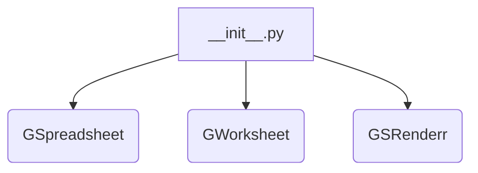
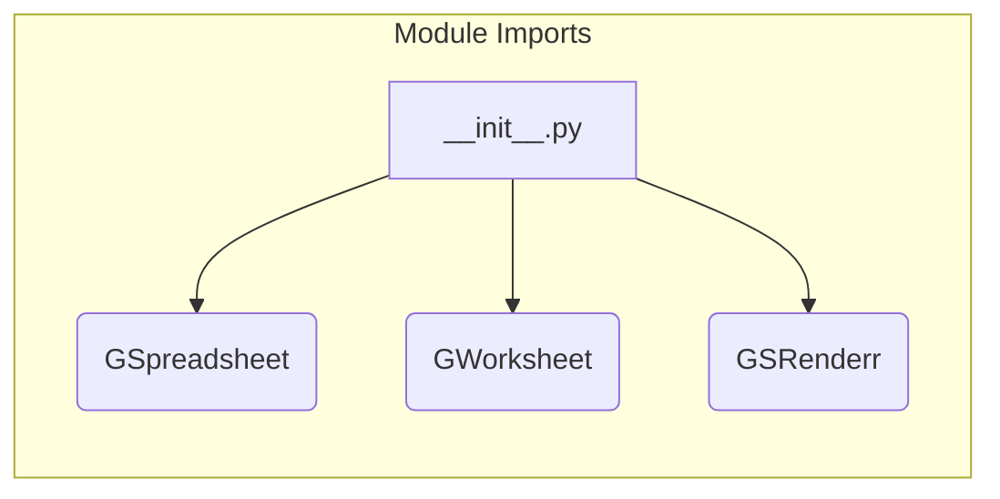

# Code Explanation for hypotez/src/goog/spreadsheet/bberyakov/__init__.py

## <input code>

```python
## \file hypotez/src/goog/spreadsheet/bberyakov/__init__.py
# -*- coding: utf-8 -*-\
#! venv/Scripts/python.exe
#! venv/bin/python/python3.12

"""
.. module: src.goog.spreadsheet.bberyakov 
	:platform: Windows, Unix
	:synopsis:

"""
MODE = 'dev'

from .gspreadsheet import GSpreadsheet
from .gworksheets import GWorksheet
from .grender import GSRenderr
```

## <algorithm>

This file appears to be an initialization module for a spreadsheet library.  Its primary function is to import and expose classes from submodules within the same package.  A step-by-step process is not applicable as there's no significant logic execution in this file. The workflow is fundamentally about importing and making classes/modules available for use.



## <mermaid>



This Mermaid diagram illustrates the import relationships.  `__init__.py` imports the `GSpreadsheet`, `GWorksheet`, and `GSRenderr` classes from their respective modules (`gspreadsheet.py`, `gworksheets.py`, and `grender.py`).


## <explanation>

### Imports

- `from .gspreadsheet import GSpreadsheet`: Imports the `GSpreadsheet` class from the `gspreadsheet.py` module within the same package (`bberyakov`). This implies that `gspreadsheet.py` likely contains the implementation of Google Spreadsheet functionalities.
- `from .gworksheets import GWorksheet`: Imports the `GWorksheet` class from the `gworksheets.py` module, likely related to handling individual sheets within a spreadsheet.
- `from .grender import GSRenderr`: Imports the `GSRenderr` class from the `grender.py` module.  `GSRenderr` potentially handles rendering functions for spreadsheet data.


### Variables

- `MODE = 'dev'`:  This variable likely defines the execution mode (e.g., development, production) for the spreadsheet library, potentially affecting configurations or logging.

### Classes (Implicit)

The file itself doesn't define any classes.  It merely imports existing classes from other files (`gspreadsheet.py`, `gworksheets.py`, `grender.py`) in the same package.  These imported classes likely handle interactions with Google Sheets API, spreadsheet data management, and visualization.  Detailed analysis of those classes would require examining those files.


### Functions (Implicit)

There are no functions defined.

### Potential Errors/Improvements

- **Missing Documentation**: While the code includes docstrings, more detailed explanations within the imported classes (`GSpreadsheet`, `GWorksheet`, `GSRenderr`) would be beneficial.
- **Dependency Management**: The `#! venv/Scripts/python.exe` and `#! venv/bin/python/python3.12` lines are shebangs specifying Python interpreter locations.  If the `venv` directory isn't present in the `PATH`, or the Python version conflicts with required libraries, these lines can cause errors.


### Relationship to other parts of the project

The `hypotez/src/goog/spreadsheet/bberyakov` package is likely part of a larger project focused on Google Sheets integration.  The relationship with other parts is inferred from the `src` prefix, implying that there are other modules in different packages with which this package interacts, for example, for data exchange or configuration.


**Overall Summary:**

This Python file serves as an initialization module for the `bberyakov` package related to Google Sheets.  It makes classes that likely handle various aspects of working with spreadsheets available for use in other parts of the project.  Further analysis of the imported files (`gspreadsheet.py`, `gworksheets.py`, `grender.py`) would provide a more complete understanding of the code functionality.