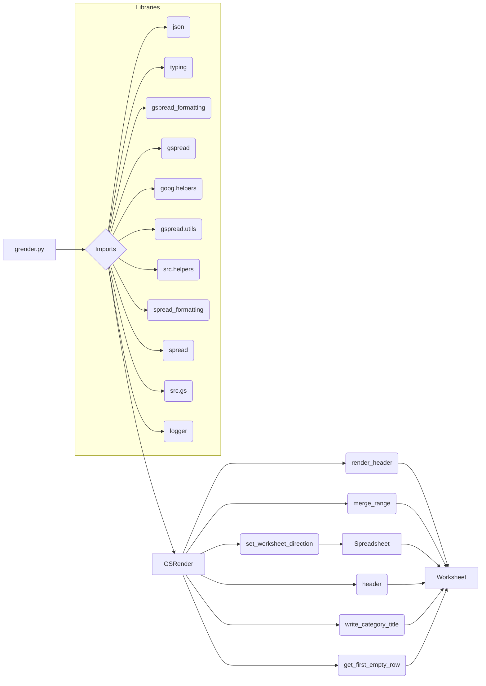

# Code Explanation for grender.py

## <input code>

```python
# ... (File Header and Imports) ...

class GSRender():
    # ... (Class Definition) ...

    def render_header(self, ws: Worksheet, world_title: str, range: str = 'A1:Z1', merge_type: str = 'MERGE_ALL'):
        # ... (Header Rendering Logic) ...

    def merge_range(self, ws: Worksheet, range: str, merge_type: str = 'MERGE_ALL'):
        # ... (Merge Range Logic) ...

    def set_worksheet_direction(self, sh: Spreadsheet, ws: Worksheet, direction: str = 'rtl'):
        # ... (Set Worksheet Direction Logic) ...

    def header(self, ws: Worksheet, ws_header: str | list, row: int = None):
        # ... (Header Function Logic) ...

    def write_category_title(self, ws: Worksheet, ws_category_title: str | list, row: int = None):
        # ... (Category Title Function Logic) ...

    def get_first_empty_row(self, ws: Worksheet, by_col: int = None):
        # ... (Get First Empty Row Logic) ...
```

## <algorithm>

The code defines a `GSRender` class for formatting and rendering Google Sheets.  The workflow follows these steps:

1. **Import necessary libraries:** `json`, `typing`, `gspread_formatting`, `gspread`, `goog.helpers`, and more.  These libraries provide functionalities for data handling, type hinting, sheet formatting, and other Google Sheets interactions.


2. **`GSRender` Class Initialization:** The `__init__` method is responsible for initializing the class.  It is currently incomplete (with `...`), implying the actual initialization might load schemas from JSON.

3. **`render_header` Method:**  This method formats a header row (e.g., A1:Z1) in a worksheet (`ws`) with a specified `world_title`. It sets background and text colors, alignment, boldness, and font size, and potentially merges cells (`merge_type`). It also handles conditional formatting based on values being greater than 50.


4. **`merge_range` Method:** This method merges cells within a specified `range` in the worksheet (`ws`) based on the `merge_type` (e.g., merging all cells, columns, or rows).


5. **`set_worksheet_direction` Method:** This method sets the direction of the worksheet to right-to-left (`rtl`) based on the user's specifications.

6. **`header` Method:** This function appends a header row to the worksheet, adding a title and applying formatting.
7. **`write_category_title` Method:** This function adds a category title row to the worksheet.
8. **`get_first_empty_row` Method:** This function finds the first empty row (or based on a specific column).


## <mermaid>




## <explanation>

### Imports:

* `src import gs`: Imports a module named `gs` from the `src` package.  The purpose of `gs` is likely related to Google Sheets interactions within the project but is not shown in the snippet.
* `from src.helpers import logger, WebDriverException, pprint`: Imports helpers from the `src.helpers` module.  `logger` for logging, `WebDriverException` for handling potential web driver issues (probably Google Sheets API related), and `pprint` for pretty printing data.
* `import json`: Used for handling JSON data, especially potentially used with render schemas (not fully implemented).
* `from typing import List, Type, Union`:  Import various type hints from the `typing` module to define variable and function parameter types (more robust type checking).
* `from spread_formatting import *`: Import all the formatting modules from `spread_formatting` package.
* `from spread import Spreadsheet, Worksheet`: Imports the `Spreadsheet` and `Worksheet` classes, likely core classes for managing Google Sheets data.
* `from goog.helpers import hex_color_to_decimal, decimal_color_to_hex, hex_to_rgb`: Imports helper functions for converting colors between hex and decimal formats (likely used for formatting Google Sheet cells).
* `from spread.utils import ValueInputOption, ValueRenderOption`: Imports from `spread.utils` for sheet data handling.

### Classes:

* **`GSRender`:** This class encapsulates methods for rendering Google Sheet data.  It interacts with `Worksheet` and `Spreadsheet` objects to apply formatting. The attributes `render_schemas` is a dictionary intended to store rendering schemas, but the code has placeholders.

### Functions:

* **`render_header`:** Takes a `Worksheet`, title, and range as input to apply formatting to the header row.  It demonStartes conditional formatting based on cell values.
* **`merge_range`:** Merges cells within a specific range (`range`) according to the merge type (`merge_type`) within the given worksheet.
* **`set_worksheet_direction`:** Sets the direction of a worksheet to right-to-left.  It interacts with the `Spreadsheet` class for applying the change.
* **`header`:** Appends a header row, handling both string and list inputs.
* **`write_category_title`:** Simlar to `header`, but for category titles.
* **`get_first_empty_row`:** Returns the first empty row index in a worksheet, supporting column-based search.


### Variables:

* `MODE`: A global string variable defining the current application mode, defaulting to 'dev'


### Potential Errors and Improvements:

* **Incomplete `__init__`:** The `__init__` method is incomplete.  It should load the render schemas.
* **Hardcoded colors:** Using hardcoded hex values (#FFAAAA, #AAAAAA) for colors is not ideal.  It would be better to use named colors or variable assignment for easier change and maintainability.
* **Conditional formatting:** The conditional formatting example is limited.  A more robust implementation could support various conditional rules.
* **Unnecessary Comments:** Some comments are redundant or provide simple explanations rather than crucial context.
* **`...` placeholders:** The `...` placeholders in various methods indicate missing code.  These need to be filled in to complete the class functionality.


### Relationships:

The code has dependencies on various `src` modules, including `gs` for Google Sheets interaction, `helpers` for utility functions, `spread`, `spread_formatting` for worksheet and formatting operations, and `goog.helpers` for color handling. The classes and functions in this file interact with the `Spreadsheet` and `Worksheet` objects to perform rendering operations on Google Sheets. The `src` folder appears to be the root folder where all the components reside.