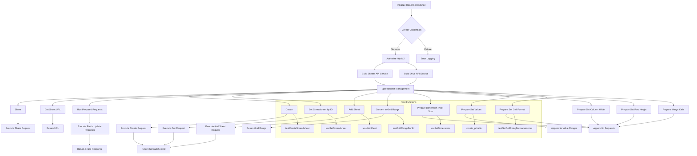

# ReachSpreadsheet Python Module Analysis

```python
## \file hypotez/src/goog/spreadsheet/reach_spreadsheet.py
# -*- coding: utf-8 -*-\
#! venv/Scripts/python.exe
#! venv/bin/python/python3.12

"""
.. module: src.goog.spreadsheet 
	:platform: Windows, Unix
	:synopsis:

"""


# Author: Ioann Volkov (volkov.ioann@gmail.com)
# This module uses Google Sheets API v4 (and Google Drive API v3 for sharing spreadsheets)

# (!) Disclaimer
# This is NOT a full-functional wrapper over Sheets API v4.
# This module was created just for https://telegram.me/TimeManagementBot and habrahabr article


import httplib2
import googleapiclient.discovery
import googleapiclient.errors
from oauth2client.service_account import ServiceAccountCredentials

import tempfile
import header
from src import gs
from src.utils import j_loads, j_dumps
from src.utils.printer import pprint
from src.logger import logger
```

### <algorithm>



### <mermaid>

```mermaid
graph LR
    subgraph Imports
        googleapiclient.discovery --> "Google Sheets API"
        googleapiclient.errors --> "Google API Errors"
        httplib2 --> "HTTP Library"
        oauth2client.service_account --> "Service Account Credentials"
        tempfile --> "Temporary File Handling"
        header --> "Custom Header Module"
        gs --> "Spreadsheet Utility Module"
        j_loads --> "JSON Loading"
        j_dumps --> "JSON Dumping"
        pprint --> "Pretty Printer"
        logger --> "Logging"
        src --> "Project Source Root"
        utils --> "Project Utilities Package"
    end
    
    ReachSpreadsheet --> googleapiclient.discovery
    ReachSpreadsheet --> oauth2client.service_account
    ReachSpreadsheet --> httplib2
    ReachSpreadsheet --> tempfile
    ReachSpreadsheet --> gs
    ReachSpreadsheet --> pprint
    ReachSpreadsheet --> logger
    ReachSpreadsheet --> utils
```

**Dependencies Explanation**:

- `googleapiclient.discovery`: Used for interacting with the Google Sheets API.
- `googleapiclient.errors`: Handles errors that might occur during API interactions.
- `httplib2`: A low-level HTTP client library.
- `oauth2client.service_account`: Used to authenticate with service accounts, crucial for accessing Google APIs without user intervention.
- `tempfile`: Used for temporary file handling (likely for the JSON key file).
- `header`: A custom module likely related to headers (e.g., for HTTP requests).
- `gs`, `j_loads`, `j_dumps`, `pprint`, `logger`: Part of the project's own utility modules.  `gs` likely manages file paths or credentials, while `j_loads` and `j_dumps` handle JSON data, `pprint` provides pretty printing, and `logger` is for logging.


### <explanation>

**Imports:**

The imports provide the necessary libraries for interacting with Google's Sheets and Drive APIs, managing files, and handling logging and output formatting.  `src` is the project's main source directory.  The relationships are typical for a larger project using packages for utilities and core functions.

**Classes:**

- `SpreadsheetError`: A base exception class for errors related to spreadsheet operations.
- `SpreadsheetNotSetError`, `SheetNotSetError`: Specific exceptions indicating that a spreadsheet or sheet hasn't been set, which are sub-classes of `SpreadsheetError`.
- `ReachSpreadsheet`: This class is the core of the module. It handles interactions with Google Sheets and Drive.
    - `__init__(self, debugMode=False)`: Initializes the class with a debug flag.  Crucially, it loads credentials from a temporary JSON file, essential for authenticated API access.  It also initializes necessary API services.
    - `create(self, title, sheetTitle, ...)`: Creates a new Google Sheet with specified properties.  Handles error cases.
    - `share(self, shareRequestBody)`: Shares a spreadsheet with specific users/roles.  Error handling for spreadsheet not being set.
    - `shareWithEmailForReading/Writing`, `shareWithAnybodyForReading/Writing`: Helper functions for sharing with specific emails.
    - `getSheetURL(self)`: Returns the URL of the spreadsheet.
    - `setSpreadsheetById(self, spreadsheetId)`: Sets the current spreadsheet based on an ID.
    - `runPrepared(self, valueInputOption="USER_ENTERED")`: Executes prepared requests in batches for efficiency, to avoid multiple calls.
    - `prepare_addSheet(self, sheetTitle, ...)`: Prepares the request to add a new sheet.
    - `addSheet(self, sheetTitle, ...)`: Adds a new sheet to the current spreadsheet, setting it as the active sheet, and returns its ID.
    - `toGridRange(self, cellsRange)`: Converts a string cell range (e.g., "A1:B2") to a dictionary containing sheetId and start/end indices for rows and columns.
    - `prepare_setDimensionPixelSize`, `prepare_setColumnWidth`, `prepare_setColumnsWidth`, `prepare_setRowHeight`, `prepare_setRowsHeight`: Prepare requests to modify column/row widths.
    - `prepare_setValues`: Prepares requests to set values in the spreadsheet.
    - `prepare_mergeCells`, `prepare_setCellStringFormatterormat`, `prepare_setCellStringFormatterormats`: Prepare requests for merging cells, formatting cells with style, and formatting multiple cells with style.

**Functions:**

- `htmlColorToJSON(htmlColor)`: Converts an HTML color string (e.g., "#FF0000") to a JSON-compatible dictionary.
- `test...`: Functions for testing various functionalities of the `ReachSpreadsheet` class.
- `create_pricelist`, `testCreateTimeManagementReport`:  These functions demonStarte use cases for creating specific spreadsheets with sample data, including formatting options (colors, fonts, etc.)


**Potential Errors/Improvements:**

- **Error Handling:**  The `try...except` blocks are crucial, but could be more specific to catch different types of errors (e.g., `googleapiclient.errors.HttpError` for API-related issues).
- **Code Clarity:** Some variable names might be improved for better readability (e.g., `shareRequestBody`).
- **Validation:**  Adding input validation to prevent unexpected behavior (e.g., checking the format of the `cellsRange` string in `toGridRange`) would make the code more robust.
- **Documentation:** While docstrings are present, more detailed explanations of the purpose of specific parameters and the format of the request bodies would be useful.

**Relationship Chain:**

The code interacts with various parts of a larger project. This includes `src` (likely a base package). It leverages several utilities like `gs` for managing file paths and credentials, `j_loads`, `j_dumps` for JSON handling, `pprint` for formatted output, and `logger` for recording events.  This suggests the code is part of a larger application framework for managing spreadsheets.