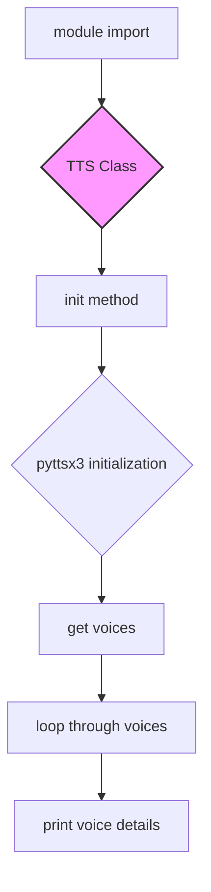

# <input code>

```python
## \file hypotez/src/goog/text_to_speech/__init__.py
# -*- coding: utf-8 -*-\
#! venv/Scripts/python.exe
#! venv/bin/python/python3.12

"""
.. module: src.goog.text_to_speech 
	:platform: Windows, Unix
	:synopsis: Google TTS 

"""
MODE = 'dev'

import header   

from attr import attr, attrs

import pyttsx3

from gtts import gTTS


class TTS():
    """ Google text to speach """
    def __init__(self,*args,**kwards):
        tts = pyttsx3.init()
        voices = tts.getProperty('voices')
        for v in voices:
            print(v)
    ...
_tts = TTS()
```

# <algorithm>

**Step 1:** Import necessary modules.

*   `header`:  Presumably contains configuration or other essential initializations for the project.
*   `attr`, `attrs`: Used for attribute management, likely related to class structure, though the implementation isn't fully shown.
*   `pyttsx3`: Python library for text-to-speech synthesis, providing engine control.
*   `gtts`:  A library providing Google Cloud Text-to-Speech API interface.

**Step 2:** Initialize the `TTS` class.

*   Create a `TTS` instance `_tts`.  This creates and configures a text-to-speech engine instance.
*   The class itself prints details about available voices.

**Data Flow:**

There's little data flow in this initial setup. Importing libraries provides necessary tools. The initialization of the `TTS` class doesn't involve any input or transfer of data; it's primarily setup work.

# <mermaid>



**Dependencies:**

*   `header`:  The nature of its dependency is not fully known, as no code or details are given.
*   `attr` and `attrs`: Used for class structure enhancements.
*   `pyttsx3`: Crucial for text-to-speech engine initialization.
*   `gtts`: Used for Google Cloud TTS functionality. This package is necessary for communication with Google Cloud's TTS service.

# <explanation>

**Imports:**

*   `header`: This import is crucial but its specific role isn't explained in the provided code snippet. It's likely used for importing necessary configurations, dependencies or functions that are not in the `text_to_speech` module, but still crucial to its operation.  The `#! venv/Scripts/python.exe` and `#! venv/bin/python/python3.12` shebang lines are typically used to specify the Python interpreter to use for the script.

*   `attr`, `attrs`: These imports are from the `attr` library.  These usually enhance the structure and interaction of the class. However, in this minimal example, there is not enough code to confirm their functionality.

*   `pyttsx3`:  A popular library for text-to-speech synthesis in Python. This provides the base engine for transforming text into audio.

*   `gtts`: The `gtts` library is potentially used for interacting with Google Cloud Text-to-Speech.

**Classes:**

*   `TTS`:  The `TTS` class is likely a base class for handling text-to-speech conversions, but the implementation is incomplete.  The `__init__` method initializes the `pyttsx3` engine and iterates over the available voices, printing their properties.

**Functions:**

*   `__init__`: The constructor for the `TTS` class.  It initializes the `pyttsx3` text-to-speech engine, which is necessary before processing text.  However, this example's implementation is limited. It does not include any actual text-to-speech conversion logic.


**Variables:**

*   `MODE`:  A global variable, likely a configuration setting.


**Potential Errors and Improvements:**

*   **Incomplete Implementation:** The `...` inside the `TTS` class indicates that the class is not fully defined.  This means there are missing functions for generating audio from text, handling errors, or implementing advanced features.

*   **Missing error handling:** The `pyttsx3` initialization and voice property access might encounter exceptions.  Robust error handling is essential for production-quality code.

*   **Lack of text-to-speech conversion:** The code snippet does not demonStarte how actual text is converted to speech.  This functionality is missing in the `__init__` method.


**Relationship with Other Project Parts:**

The relationships between `text_to_speech` and other parts of the project, like `goog` package, depend on the specifics of other modules in the project. The inclusion of `header` in the imports suggests it may provide global initialization and configuration information required by various parts of the project.