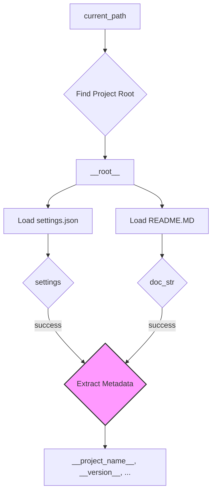

# Code Explanation for hypotez/src/goog/text_to_speech/header.py

## <input code>

```python
## \file hypotez/src/goog/text_to_speech/header.py
# -*- coding: utf-8 -*-\

#! venv/bin/python/python3.12

"""
.. module: src.goog.text_to_speech 
	:platform: Windows, Unix
	:synopsis:

"""


import sys
import json
from packaging.version import Version

from pathlib import Path
def set_project_root(marker_files=('__root__','.git')) -> Path:
    """
    Finds the root directory of the project starting from the current file's directory,
    searching upwards and stopping at the first directory containing any of the marker files.

    Args:
        marker_files (tuple): Filenames or directory names to identify the project root.
    
    Returns:
        Path: Path to the root directory if found, otherwise the directory where the script is located.
    """
    __root__:Path
    current_path:Path = Path(__file__).resolve().parent
    __root__ = current_path
    for parent in [current_path] + list(current_path.parents):
        if any((parent / marker).exists() for marker in marker_files):
            __root__ = parent
            break
    if __root__ not in sys.path:
        sys.path.insert(0, str(__root__))
    return __root__


# Get the root directory of the project
__root__ = set_project_root()
"""__root__ (Path): Path to the root directory of the project"""

from src import gs

settings:dict = None
try:
    with open(gs.path.root / 'src' /  'settings.json', 'r') as settings_file:
        settings = json.load(settings_file)
except (FileNotFoundError, json.JSONDecodeError):
    ...

doc_str:str = None
try:
    with open(gs.path.root / 'src' /  'README.MD', 'r') as settings_file:
        doc_str = settings_file.read()
except (FileNotFoundError, json.JSONDecodeError):
    ...


__project_name__ = settings.get("project_name", 'hypotez') if settings  else 'hypotez'
__version__: str = settings.get("version", '')  if settings  else ''
__doc__: str = doc_str if doc_str else ''
__details__: str = ''
__author__: str = settings.get("author", '')  if settings else ''
__copyright__: str = settings.get("copyrihgnt", '')  if settings else ''
__cofee__: str = settings.get("cofee", "Treat the developer to a cup of coffee for boosting enthusiasm in development: https://boosty.to/hypo69")  if settings else "Treat the developer to a cup of coffee for boosting enthusiasm in development: https://boosty.to/hypo69"
```

## <algorithm>

**Step 1**: Identify Project Root.
   - Input: `current_path` (current file's directory).
   - Logic: Traverses up the directory tree until a directory containing any of `marker_files` (e.g., `pyproject.toml`, `requirements.txt`, `.git`) is found.
   - Output: `__root__` (Path to project root directory).
   - Example: If `current_path` is `/home/user/project/src/goog/text_to_speech` and `/home/user/project` contains `pyproject.toml`, `__root__` will be `/home/user/project`.


**Step 2**: Load Project Settings.
   - Input: `__root__` (project root directory).
   - Logic: Attempt to open and load `settings.json` located within project root directory.
   - Output: `settings` (Dictionary containing project settings) or `None`.
   - Example: If `settings.json` exists and contains valid JSON, `settings` will contain the loaded data.


**Step 3**: Load Project Documentation.
   - Input: `__root__` (project root directory).
   - Logic: Attempt to open and read `README.MD` from project root directory.
   - Output: `doc_str` (String containing documentation content) or `None`.
   - Example: If `README.MD` exists and contains content, `doc_str` will contain its content.


**Step 4**: Extract Metadata.
   - Input: `settings` (project settings) and `doc_str` (project documentation).
   - Logic: Extracts metadata (e.g., `__project_name__`, `__version__`, `__doc__`) from `settings` and `doc_str` using `.get()` with default values.
   - Output: Various metadata variables.
   - Example: If `settings` has a key "project_name" with value "MyProject", `__project_name__` will be "MyProject".


## <mermaid>



**Dependencies Analysis:**

- `sys`: Provides access to system-specific parameters and functions.  (Essential for path management)
- `json`: Facilitates working with JSON data (used for loading settings).
- `packaging.version`: Handles version numbers.  (Used for potential future versioning logic)
- `pathlib`: Offers object-oriented way of working with file paths and directories.  (Crucial for file system interactions)
- `src.gs`: This import is crucial, likely from a different module within the project (`src`). The `gs` module likely contains classes or functions related to accessing project resources, particularly the path to the project root. This is vital for consistent access to project files and data.


## <explanation>

**Imports:**

- `sys`: Used for modifying the Python path, ensuring the project's modules are accessible.
- `json`: Used for loading the project's settings from `settings.json`.
- `packaging.version`: Used for managing version numbers, but in this specific case, it doesn't seem used beyond the import.
- `pathlib`: Used for working with file paths, making the code more object-oriented and readable.
- `src.gs`: Imports a likely internal module (`gs`), which is probably a module that defines tools for interacting with project resources (like file paths).

**Classes:**

- No classes defined directly in this file, only functions and variables.

**Functions:**

- `set_project_root()`: Takes a tuple of filenames or directory names as input (`marker_files`). This function iterates upwards from the current file's directory, looking for a directory containing any of the provided files. Returns the path to the root directory, if found, or the directory where the current script is located. This is crucial for managing project paths.  It's also crucial for keeping the project's directory structure independent of the current execution directory.


**Variables:**

- `MODE`: A string variable, likely controlling operation mode (e.g., 'dev', 'prod').
- `__root__`: A Path object, representing the root directory of the project. Crucial for relative path management.
- `settings`: A dictionary variable to hold project settings loaded from `settings.json`.
- `doc_str`: A string variable to store the project's documentation from `README.MD`.
- `__project_name__`, `__version__`, `__doc__`, `__details__`, `__author__`, `__copyright__`, `__cofee__`: String variables containing project metadata, retrieved from `settings.json` or provided as defaults.


**Potential Errors/Improvements:**

- **Error Handling:** The `try...except` blocks are good for handling `FileNotFoundError` and `json.JSONDecodeError`, preventing crashes if the configuration files are missing or invalid. However, consider adding more specific error messages within the `except` blocks for better debugging.
- **Readability:** The default values in the metadata assignment (`__project_name__`, etc.) could be placed in a constant dictionary or a configuration class for better readability.
- **Type Hinting:** Using type hints (`-> Path`) and type annotations (`:str`) enhances code clarity and maintainability by making the intent more explicit.

**Relationship Chain:**

This file (`hypotez/src/goog/text_to_speech/header.py`) depends on the `gs` module for accessing the project root (`gs.path.root`), making the `gs` module critical.  It also depends on `settings.json` and `README.MD` within the project root for configuration and documentation.  This script is potentially part of a larger project structure that uses a consistent approach to locating project resources and defining metadata.