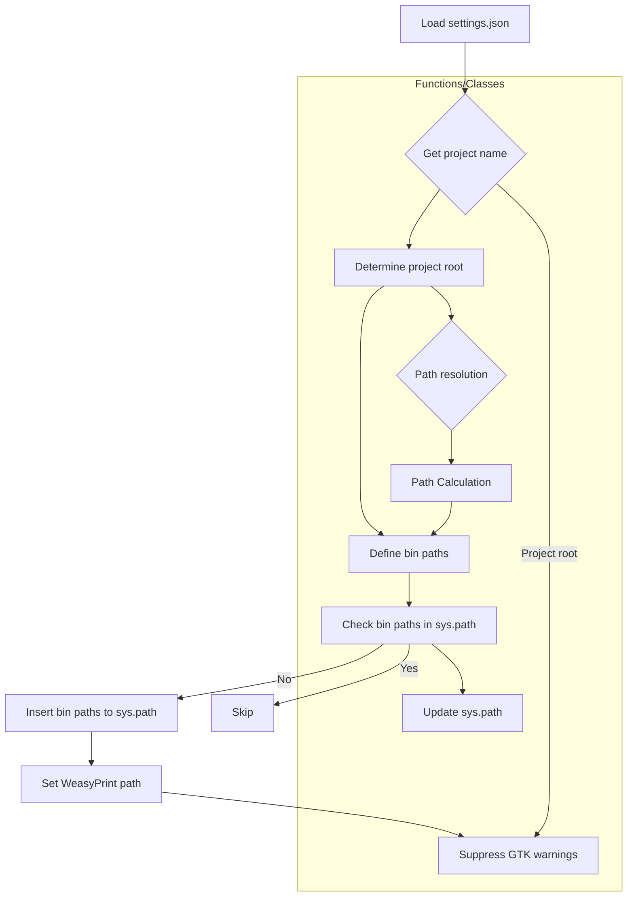

# Code Explanation: hypotez/src/gui/context_menu/header.py

## <input code>

```python
## \file hypotez/src/gui/context_menu/header.py
# -*- coding: utf-8 -*-\n\n#! venv/bin/python/python3.12\n\n"""\n.. module: src.gui.context_menu \n\t:platform: Windows, Unix\n\t:synopsis:\n\n"""\nMODE = \'dev\'\n\n"""\n\t:platform: Windows, Unix\n\t:synopsis:\n\n"""\n\n"""\n\t:platform: Windows, Unix\n\t:synopsis:\n\n"""\n\n"""\n  :platform: Windows, Unix\n\n"""\n"""\n  :platform: Windows, Unix\n  :platform: Windows, Unix\n  :synopsis:\n"""MODE = \'dev\'\n  \n""" module: src.gui.context_menu """\n\n\n\n""" Absolute path to modules and GTK & FFPMEG bin directory """\n\nimport json\nimport sys\nfrom pathlib import Path\n\n# Load the project name from settings.json\nwith open(\'settings.json\', \'r\') as settings_file:\n    settings = json.load(settings_file)\n    project_name = settings.get("project_name", "hypotez")  \n\n# Define the root path of the project\n__root__: Path = Path.cwd().resolve().parents[Path.cwd().parts.index(project_name)]\nsys.path.append(str(__root__))\n\n# Paths to bin directories\ngtk_bin_path = __root__ / "bin" / "gtk" / "gtk-nsis-pack" / "bin"\nffmpeg_bin_path = __root__ / "bin" / "ffmpeg" / "bin"\ngraphviz_bin_path = __root__ / "bin" / "graphviz" / "bin"\n\n# Update the PATH variable if the paths are missing\npaths_to_add = [gtk_bin_path, ffmpeg_bin_path, graphviz_bin_path]\ncurrent_paths = set(Path(p) for p in sys.path)\n\nfor bin_path in paths_to_add:\n    if bin_path not in current_paths:\n        sys.path.insert(0, str(bin_path))\n\n# Set the variable for WeasyPrint\nsys_path_env_var = "WEASYPRINT_DLL_DIRECTORIES"\nif sys_path_env_var not in sys.path:\n    sys.path.insert(0, str(gtk_bin_path))\n\n"""Suppress GTK log output to the console"""\nimport warnings\nwarnings.filterwarnings("ignore", category=UserWarning)\n```

## <algorithm>

1. **Load Project Settings:** Load project configuration from `settings.json`.
2. **Determine Project Root:** Determine the root directory of the project.
3. **Define Bin Paths:** Define paths to the GTK, FFmpeg, and Graphviz binary directories relative to the project root.
4. **Update System Path:** Add the bin directories to the system path if they are not already present. This allows importing modules from these directories.
5. **Add WeasyPrint Path (Optional):** If `WEASYPRINT_DLL_DIRECTORIES` is not already in the system path, add the GTK bin path.
6. **Suppress GTK Warnings:** Suppress GTK warnings from being printed to the console.

**Example:**

If `settings.json` contains:
```json
{
  "project_name": "myproject"
}
```
and the current working directory is `myproject/src/gui/context_menu`, the script would find the root path as `myproject/`.

## <mermaid>



**Dependency Analysis:**

- `json`: Used for parsing the `settings.json` file.
- `sys`: Used for modifying the system path.
- `pathlib`: Used for working with file paths in a more object-oriented way.


## <explanation>

- **Imports:**
    - `json`: Used to parse the `settings.json` file containing project information.
    - `sys`: Used to modify the Python system path, allowing access to modules installed in non-standard locations.
    - `pathlib`: Used to create and work with file paths in a more object-oriented way (Path objects are used for greater robustness than plain strings).

- **Classes:** There are no classes defined in this code, only variables and functions.


- **Functions:**
    - The code primarily uses function calls within the `if` and `for` loops to update system paths.


- **Variables:**
    - `MODE`: A string variable likely used for development mode vs. production mode settings, with the hardcoded value 'dev'.
    - `project_name`: A string variable, extracted from the `settings.json` file and represents the project name.
    - `__root__`: A `pathlib.Path` object representing the absolute root directory of the project.
    - `gtk_bin_path`, `ffmpeg_bin_path`, `graphviz_bin_path`: `pathlib.Path` objects that point to the respective binary directories.
    - `paths_to_add`, `current_paths`: A list and set of pathlib.Path objects used for checking and inserting binary paths in the system path variable.
    - `sys_path_env_var`: A string variable containing the name of the environment variable used for WeasyPrint.

- **Potential Errors/Improvements:**
    - **Error Handling:** The code lacks robust error handling. If `settings.json` is missing or improperly formatted, the code might raise exceptions.  Adding `try...except` blocks would make it more resilient.
    - **Explicit Error Handling (settings.json):** The code assumes the `project_name` exists and is string-based in `settings.json`. Consider handling cases where `settings.json` is malformed or doesn't have `project_name` to avoid unexpected behavior.
    - **Conciseness:** Could use a single line to check if a path is already in the system path for improved conciseness.
    - **Comments:** Comments are used to describe different segments of the code which helps in understanding the logic followed.  
    - **Dependency Management:** This script hard-codes paths to binaries. For better maintainability, a dedicated tools directory to install dependencies, or some configuration file (e.g., `requirements.txt`) that manages and installs dependencies from a centralized location would be better.


- **Relationships:**
    - This file is crucial for setting up the Python environment for the GUI parts. It ensures the necessary libraries (especially GTK, FFmpeg, etc.) are accessible.  It works in coordination with other Python scripts, especially those dealing with GUI components requiring external binaries, to load those necessary packages.