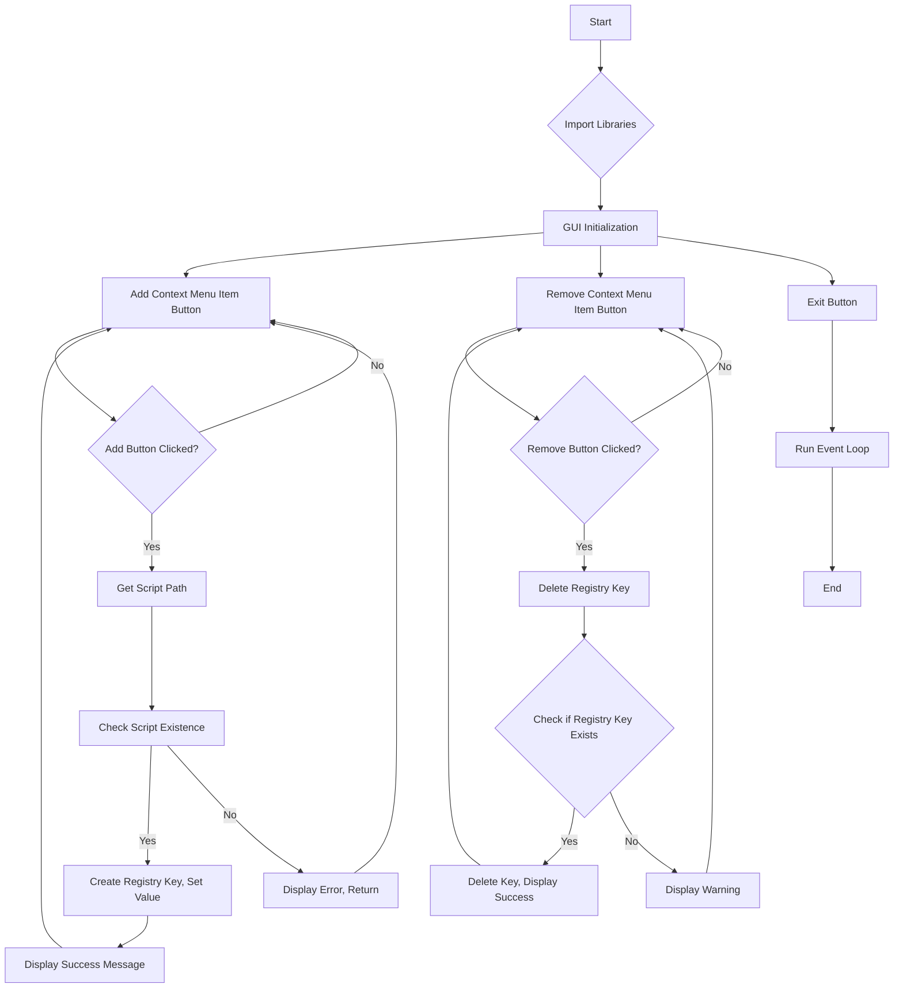

# Code Explanation: hypotez/src/gui/context_menu/tkinter/main.py

## <input code>

```python
## \file hypotez/src/gui/context_menu/tkinter/main.py
# -*- coding: utf-8 -*-\
#! venv/Scripts/python.exe
#! venv/bin/python/python3.12

"""
.. module: src.gui.context_menu.tkinter 
	:platform: Windows, Unix
	:synopsis:

"""
MODE = 'dev'

"""
	:platform: Windows, Unix
	:synopsis:

"""

"""
	:platform: Windows, Unix
	:synopsis:

"""


"""
  :platform: Windows, Unix

"""
"""
  :platform: Windows, Unix
  :platform: Windows, Unix
  :synopsis:
"""MODE = 'dev'
  
""" module: src.gui.context_menu.tkinter """


"""Module to add or remove context menu items for the desktop and folder background.

This module provides functions to add or remove a custom context menu item called 
'hypo AI assistant' for the background of directories and the desktop in Windows Explorer.
It uses the Windows Registry to achieve this, with paths and logic implemented to target
the right-click menu on empty spaces (not on files or folders).
"""

import winreg as reg  # Module for interacting with Windows Registry
import os  # Module for OS path manipulation and checks
import tkinter as tk  # Module for GUI creation
from tkinter import messagebox  # Submodule for GUI message boxes

import header  # Custom import, assuming it initializes settings or constants
from src import gs  # Custom import, likely for path settings or project structure


def add_context_menu_item():
    """Adds a context menu item to the desktop and folder background.

    This function creates a registry key under 'HKEY_CLASSES_ROOT\Directory\Background\shell' 
    to add a menu item named 'hypo AI assistant' to the background context menu in Windows Explorer.
    The item runs a Python script when selected.

    Registry Path Details:
        - `key_path`: Directory\Background\shell\hypo_AI_assistant
            This path adds the context menu item to the background of folders and 
            the desktop, allowing users to trigger it when right-clicking on empty space.
        
        - `command_key`: Directory\Background\shell\hypo_AI_assistant\command
            This subkey specifies the action for the context menu item and links it to a script 
            or command (in this case, a Python script).
    
    Raises:
        Displays an error message if the script file does not exist.
    """

    # Registry path for adding a menu item to the background of folders and the desktop
    key_path = r"Directory\\Background\\shell\\hypo_AI_assistant"

    try:
        with reg.CreateKey(reg.HKEY_CLASSES_ROOT, key_path) as key:
            reg.SetValue(key, "", reg.REG_SZ, "hypo AI assistant")  # Display name of the context menu item
            
            command_key = rf"{key_path}\\command"
            with reg.CreateKey(reg.HKEY_CLASSES_ROOT, command_key) as command:
                command_path = gs.path.src / 'gui' / 'context_menu' / 'main.py'
                if not os.path.exists(command_path):
                    messagebox.showerror("Ошибка", f"Файл {command_path} не найден.")
                    return
                reg.SetValue(command, "", reg.REG_SZ, f"python \\"{command_path}\\" \\"%1\\"")
        messagebox.showinfo("Успех", "Пункт меню успешно добавлен!")
    except Exception as ex:
        messagebox.showerror("Ошибка", f"Ошибка: {ex}")


def remove_context_menu_item():
    """Removes the 'hypo AI assistant' context menu item.

    This function deletes the registry key responsible for displaying the custom
    context menu item, effectively removing it from the background context menu.

    Registry Path Details:
        - `key_path`: Directory\Background\shell\hypo_AI_assistant
            This path targets the custom context menu item and deletes it from the 
            background context menu of the desktop and folders.
    
    Raises:
        Displays a warning if the menu item does not exist, and an error if the operation fails.
    """

    key_path = r"Directory\\Background\\shell\\hypo_AI_assistant"

    try:
        reg.DeleteKey(reg.HKEY_CLASSES_ROOT, key_path)
        messagebox.showinfo("Успех", "Пункт меню успешно удален!")
    except FileNotFoundError:
        messagebox.showwarning("Предупреждение", "Пункт меню не найден.")
    except Exception as e:
        messagebox.showerror("Ошибка", f"Ошибка: {e}")


def create_gui():
    """Creates a simple GUI for managing the custom context menu item.

    This function initializes a tkinter-based GUI with buttons to add, remove,
    or exit the menu manager. It provides user-friendly interaction for registry
    modifications.
    """

    root = tk.Tk()
    root.title("Управление контекстным меню")

    add_button = tk.Button(root, text="Добавить пункт меню", command=add_context_menu_item)
    add_button.pack(pady=10)

    remove_button = tk.Button(root, text="Удалить пункт меню", command=remove_context_menu_item)
    remove_button.pack(pady=10)

    exit_button = tk.Button(root, text="Выход", command=root.quit)
    exit_button.pack(pady=10)

    root.mainloop()


if __name__ == "__main__":
    create_gui()
```

## <algorithm>

```
[Start] --> [Import Libraries] --> [GUI Initialization] --> [Add Context Menu Item Button] --> [Remove Context Menu Item Button] --> [Exit Button] --> [Run Event Loop] --> [End]

[Add Context Menu Item Button Clicked] --> [Get Script Path] --> [Check Script Existence] --> [Yes: Create Registry Key, Set Value] --> [No: Display Error, Return] --> [Display Success Message] --> [Return to GUI]
[Remove Context Menu Item Button Clicked] --> [Delete Registry Key] --> [Check if Registry Key Exists] --> [Yes: Delete Key, Display Success] --> [No: Display Warning] --> [Display Error Message] --> [Return to GUI]
```

## <mermaid>



**Dependencies Analysis:**

* `winreg`: Provides functions for interacting with the Windows Registry.
* `os`: Provides functions for interacting with the operating system, such as file system operations (checking file existence).
* `tkinter`:  Provides the graphical user interface toolkit.
* `messagebox`: A submodule of `tkinter` for displaying message boxes.
* `header`: A custom module (not detailed in the provided code), likely for initializing settings or constants.
* `src.gs`: A custom module in the `src` package (not detailed in the provided code), likely for path settings, import management, or project structure.  Critically important for the proper operation of the application.


## <explanation>

* **Imports:**
    * `winreg`: Essential for interacting with the Windows Registry to manipulate the context menu.
    * `os`: Used to check if the script file exists.
    * `tkinter`:  Provides the GUI framework.
    * `messagebox`: A `tkinter` submodule for displaying error and success messages.
    * `header`:  Not fully detailed, but assumed to provide settings and constants.
    * `src.gs`:  Critical for managing file paths, potentially interacting with other parts of the project's data structure.


* **Classes:**
    * No classes are defined in this file.


* **Functions:**
    * `add_context_menu_item()`: Adds a custom context menu item to the Windows Explorer background.  It uses the Windows Registry to create the necessary entries.  Critically it checks if the script file exists before creating the registry entry. This prevents errors.  This is a crucial defensive programming technique.
    * `remove_context_menu_item()`: Removes the custom context menu item.  Uses the Registry's `DeleteKey` to remove the entry. This is robust; the code handles the case where the key may not exist.
    * `create_gui()`: Creates the Tkinter GUI. This function creates the main application window and places buttons to trigger the add/remove context menu operations.


* **Variables:**
    * `MODE`: A global constant, likely for development mode vs. production mode.
    * `key_path`: Registry key path.
    * `command_path`: The path to the Python script to be executed on context menu selection.  Crucially using `gs.path.src` to find the right relative path, and preventing potential errors.


* **Potential Errors/Improvements:**
    * **Error Handling:**  The error handling in `add_context_menu_item` and `remove_context_menu_item` is good, catching generic `Exception` and `FileNotFoundError`.  This is important in production code to prevent crashes.
    * **Error messages:** Error messages should be localized, not only displayed in Russian.  More informative error messages could be given, helping users understand the root causes of errors.
    * **File path validation:**  Validate `command_path` further, e.g., check for absolute paths.

* **Relationship Chain:**
    * This module interacts with `src.gs` for correct file path resolution; `src.gs` could potentially interact with other parts of the application that manage file paths and potentially application settings. This relationship shows how this module relies on other parts of the project.


**Overall:** The code is well-structured, reasonably well-documented (though lacking detailed documentation for `src.gs`), and effectively uses the Windows Registry to add/remove context menu items. The inclusion of input validation and error handling makes the code robust and less prone to crashes.